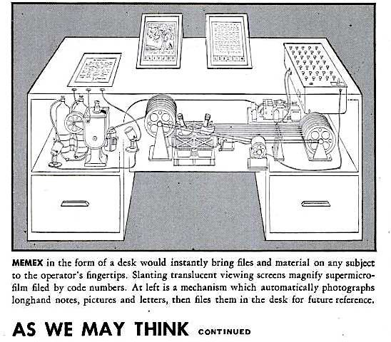

# Introduction to Multimedia

# Contemporary Multimedia
> The development, integration and delivery of any combination of text, graphics, animation sound or video through a digital processing device

# Forms of Multimedia

### Non-interactive
- User is an ***OBSERVER*** of information
- User has **no** control over the flow of the information
- Developer establishes the sequence of the media elements and how they are presented
- Examples:
    - Information kiosks
    - Digital animations

### Interactive
- User is a participant in the flow of information
- Basic Interactivity
    - Includes menu and buttons to access contents
    - Most of the websites are like this
- Adaptive or ***Intellimedia***
    - Adapts the information flow to the interests or needs of the users
    - Like AI to judge what you like
- Immersive
    - Draws the user into an alternate world
    - Like AR or VR

# Multimedia Visionaries

# Vannevar Bush
- Created 2 variations of the Memex
- 

### Memex I (1954)
> *As We May Think, 1945*
> > A hypothetical machine to make the work of scientists more effective and efficient in "grasping the growing mountain of research"

- Features:
    - Massive storage capacity
    - Multimedia input devices like
        - vocoder
            > *As We May Think, 1945*
            > > speak to it, and the corresponding keys move
        - cyclops camera
            > *As We May Think, 1945*
            > > One can now picture a future investigator in his laboratory, his hands are free, and he is not anchored. As he moves about and observes, he photographs and comments
            - (PS I assume this is a camera tied on the forehead from the sentence)
    - Automatic mathematical calculations and logical reasoning
    - New method to store and access information by associations

### Memex II (1959)
- Extends the original proposals of Memex I by considering new technical developments such as
    - Magnetic tape
    - Transistor
    - Digital computer
- Features
    - Professionally maintained associational database delivered by tape or facsimile
        - Facsimile -> an exact copy, especially of written or printed material
    - Trails are color-coded to reflect age and reinforced by repetitive use
    - Combined with a digital computer, Bush believed the Memex II could learn from experience and even demonstrate a form of judgement

# Alan Turing
- Proposed an abstract machine known as the [Turing Machine](#turing-machine)

### Turing Machine
- A means of defining an "effective procedure"
- It's an imaginary device that has three components
    - An **infinitely long tape** consisting of single row of squares
    - A **read/write head** that moved along tape one square at a time
    - A set of instructions

