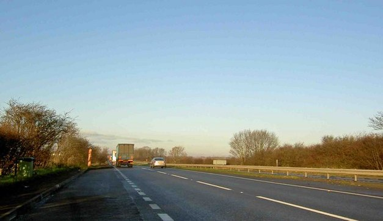
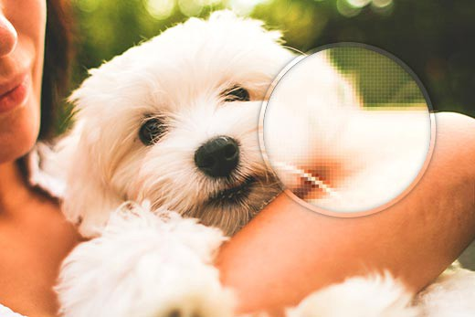

# Graphics
> Wide range of pictorial representations from simple line drawings to blue prints, charts, logos, paintings, photos, animation and movies
### My own take
> Graphics is an image/video representation of text. It is normally used to represent texts and the meanings that a person wants to convey. Graphics are generally easier to understand.

# Challenges of Computer Images
- Large file size
- Slow downloads and processing
- Possible inferior (lower) quality than the original
- File format compatibility
- Images are displayed differently on different monitors and printers

# Contone Image
- FUN FACT: Contone stands for ***Continuous Tone***
- Composed of ***CONTINUOUSLY VARYING SHADES*** of color
- A traditional black and white contone image is made up of continuously varying shades from white to gray to black

# Line art
- Combination of lines to make images
- Uses only ***TWO*** colors
    - 1 for the line (foreground)
    - 1 for the background

# Black and White Image Reproduction
> Images made with a series of ink dots

### Linescreen
- lines per inch
- designates the size of the dots and quality of resulting image
    - 150 lpi is better than 85 lpi

### Halftones
- Form image by ***CLUSTERING*** ink dots
- tight cluster of black and white dots are capable of creating dark gray
- loose cluster of black and white dots can create lighter gray

# Color Image Reproduction
> Uses a series of four-color dots with transparent inks

### CMYK
> Cyan, Magenta, Yellow and Key (usually black) (blame github for not supporting markdown colors)
- small dots of different color combinations can reproduce more different colors

### ***Subtractive***
- often used to form color images on printed surface
- Light is ***REFLECTED*** frome the printed surface
- Pigments that form the image absorbs some of the colors
- The remaining colors reach our eye to produce the image

### ***Additive***
- Often used to form color images on computer monitor
- the ***RGB (Red Green Blue)*** color model
- Varying amounts of Red, Green and Blue light are added together ro create the color

> Additive Color models (RGB) are converted to  Subtractive color models(CMYK) if the image is going to be printed

# 2D Computer Graphics

### Bitmapped graphics
- Created as a pattern of discrete elements
- Each element is a ***PIXEL*** or "picture element"
    - Pixel:
        - Small squares
        - Assigned a binary code to define the color
        - More bits assigned = more binary length = more color possibilities = more details
- Categories:
    - Line art 
        - Produced using 2 colors (usually black and white)
        - Advantages:
            - Clear, crisp image
            - Small file size
        - Uses:
            - Chart
            - Illustration
            - Diagrams
    - Grayscale
        - produced using shades of gray
        - generally ***8-bit*** images of 256 shades of gray
        - Advantages:
            - Nice representation of black and white photos
            - Smaller file size than full color
            - Lower printing cost than color
        - Uses: image that require more detail than line art
    - Color 
        - produced with patterns of colored pixels
        - ***BIT DEPTH***: 
            - number of bits used to encode each pixel
            - determines the color possibilities
        - photo-realistic color requires 24-bit color
    
# Making computer colors

### 2 ways in general:
- identify a table of possible colors for the computer
- specify varying amounts of Red, Green and Blue

### 8-bit color
- a specific range of colors in a table
- PCs and Macs use different tables
- ***Web-safe*** table provides color that will display the same on all platforms

### 24-bit color
- combines 8-bit values of red, green and blue to create the result
- 16.7 million color possibilities
    - FUN FACT: 48-bit color has 16-bit values with 281 TRILLION color possibilities

# Bitmapped Image Quality
> Depends on TWO factors (spatial resolution and color resolution)

### Spatial resolution
- density of pixels per inch
- measured in ***PPI(Pixels Per Inch)*** for monitor output
- measured in ***DPI(Dots Per Inch)*** for print output
- Higher spatial resolution
    - more detail (pixels are smaller and closely packed)
    - sharper and more accurate images are produced
    - LARGE file size but better image quality
- Lower spatial resolution
    - less detail (pixel are larger)
    - image appears to be fuzzy
    - small file size, but lower image quality
- Device dependence
    - dimensions of an image depend on the resolution of the output device. 
    - Monitors generally have lower spatial resolution (again, idk if this is still the case now)
        - Mac: 72ppi
        - PC: 9ppi
    - Printers generally have higher spatial resolution: 300dpi to 2400dpi
    - bitmapped images are device-dependent:
        - 300ppi image prints the original size on a 300ppi printer
        - 300ppi image is greatly enlarged on a 72ppi monitor

### Color resolution
- number of colors each pixel can display
- determined by bit depth
    - low bit depth = small file size = less color
    - high bit depth = large file size = more color
- low color resolution may cause ***COLOR BANDING*** and ***QUANTIZATION***
    - Color banding
        - a subtle form of ***POSTERIZATION***, which converts a continuous gradation of tone to several regions of fewer tones
        - while posterization is done for artistic effects, color banding is an unwanted artifact
        - caused by rounding of the color of each pixel to the nearest digital color levels (often because the limitation of the display device)
        - Color banding effect can be seen on the sky of the image below
        
    - Quantization
        - Happens when a range of values are being compressed into a single quantum value
        - may lead to break in shades of continuous tone images (like color banding)
- Indexing
    - Specific pallette of colors is identified to optimize the appearance of lower color resolution image
    - Methods:
        - Adaptive
        - Perceptual
- Dithering
    - Combine pixels of different colors to produce another color that is not available in the indexed palette
    - Improves image quality without increasing bit depth
    - Capable of solving the problem of quantization and color banding (by creating the transitional color on the hard stops [if this is chim sila ignore XD])
    
    - *if you zoom in on the photo you can see small dots on the dithered image*

# Resampling Bitmapped Image
> Process of increasing or decreasing the number of samples described in a file (changes the original image)
- Often used to control spatial resolution of bitmapped images (rmb how 300ppi image will be shown on a 72ppi monitor?)
    - 72ppi for web display
    - 300 ppi for laser output

### Upsampling
- Adds samples to the file
- Used to ***ENLARGE*** the physical dimensions of an image on a given device
- Softwares have special algorithms to ***interpolate*** the pixel and color to be added to the image, the interpolated pixels and colors are then ***CREATED*** by the software for the image
- The more data is added, the more the image is ***DEGRADED*** via upsampling
- It is just nearly impossible to blow a 72ppi image to 300ppi (now gt AI its not tht pain staking anymore tho but notes dh)

### Downsampling
- Reduces samples from the file
- Can produce smaller images but still maintain good quality

### Best practice
- Capture at ***HIGHEST*** possible spatial resolution when possible
- Only downsample as needed for different usages of the image

# Resize Without Resampling
> It is possible to resize a bitmapped image without resampling

### Enlarging a printout ***CAN*** produce acceptable results
- ***BUT:*** excessive enlargement will distort the image with ***blocky, mottled surface***

### Reducing the image size without resampling can produce high quality printouts
- Pixels are ***packed more closely*** to each other

### Resizing without resampling has no effect on monitor display of image

# Sources of Bitmapped Images

### Paint programs
- Specialized software for creating bitmapped images
    - Adobe Photoshop
    - MS Paint
    - GIMP
    - Inkscape
    - Krita

### Digital cameras
- Number of pixels sampled by the camera is the camera's spatial resolution
- Measured in megapixels

### Scanner
- Capture existing or original art image
- Capture 3D objects

### Clip art
- Royalty free
    - Once the initial use is permitted (some require you to pay for the initial usage, some is free), the subsequent uses are free (no matter how you use it)
    - Licensed usage (you may need to renew your license to use it on different fields)

### Screen grab (AKA Screenshot)
- Save image on a monitor to a bitmapped file
- Spatial resolution is generally low

# Bitmapped File Formats
- PICT
- PNG
- BMP
- GIF
- TIFF
- JPEG

### Compression
- Lossy
    - Removes redundant or unneeded details or informations or datas in the file, reducing the file size
    - File compression formats:
        - JPEG
        - MP3
- Lossless
    - Relies on statistical redundancy to store data without losing any information
    - Reversible
    - File compression formats:
        - PNG
        - GIF

[//]: # (Stopped at slide 30)
