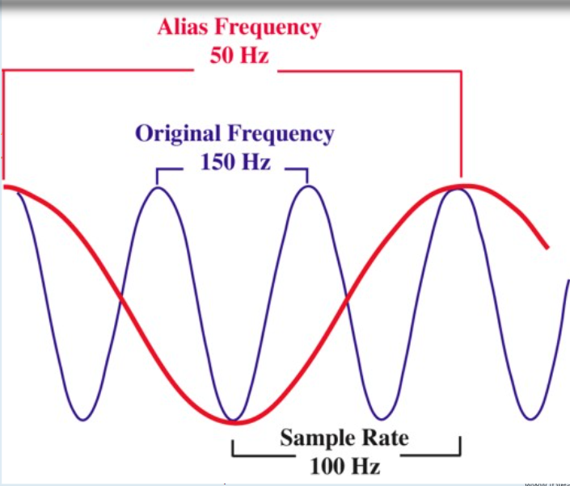
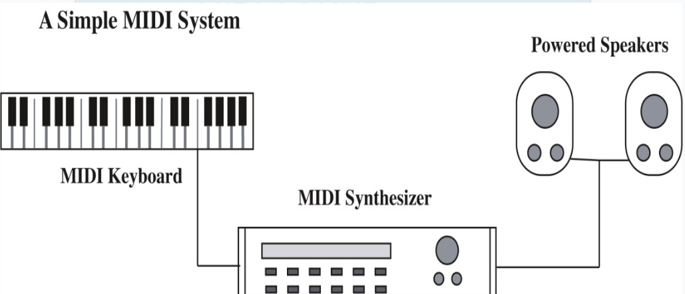
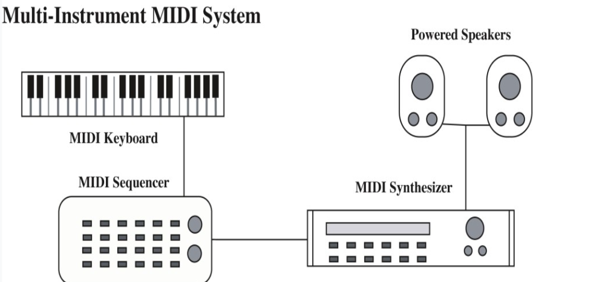
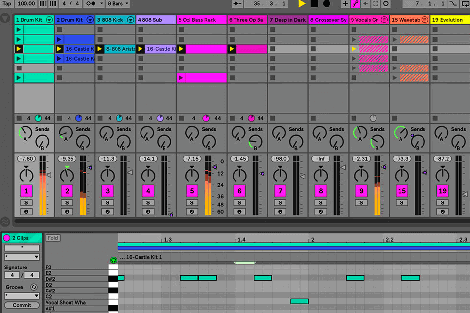

# Sound
> a form of mechanical energy transimitted as vibratiohns in a medium

# Sine wave
- Captures ***THREE*** features of sound
    - Amplitude -> volume (directly proportional)
    - Frequency -> Pitch (directly proportional)
    - Duration -> how long the sound lasts

# Traditional Sound Reproduction

### Analog sound capture
- Sound waves ***VIBRATE*** diaphragms of early microphones
- Vibration caused a stylus to inscribe a continuous pattern on tinfoil or on a wax cylinder

### Reproducing the analog sound
- Rotate a drum while in contact with a stylus
- Movement of stylus are electrically amplified to vibrate the drum of a speaker
- Changes in air pressure produced the sound

### High fidelity analog sound is still used for the final output stage of digital audio
- High Fidelity (Hi-Fi)
    - High quality reproduction of sound

# Digital Sound

### Two Major Types
- [Sampled Sound](#sampled-sound)
- [Synthesized Sound](#synthesized-sound)

### Sampled Sound
- Digital recording of previously existing analog sound wave
- File contains ***NUMERIC*** values to describe the amplitude of the sound wave at a particular time
- Used to capture and edit naturally occured sounds
- ***ADC (Analog to Digital Converter)***
    - Captures separate measures of sound amplitude
    - Samples recorded as digital numbers
- ***DAC (Digital to Analog Converter)***
    - Used to recreate the analog form from digital values
- Quality depends on:
    - Sampled resolution
        - Number of bits to encode the ***amplitude***
        - 8 bit resolution captures 256 (2<sup>8</sup>) amplitude levels
        - 16 bit (Common ***CD*** quality) captures 65,000 (2<sup>16</sup>) amplitude levels
        - 24 bit (Common ***DVD*** quality) captures over 16 million (2<sup>24</sup>) amplitude levels
    - Sampled rate
        - Number of samples taken in a fixed interval of time
        - Represents range of ***frequency*** that can be represented in a digital recording
        - Measured in thousands of Hertz, ***kilohertz (kHz)***
        - ***TWO*** measurements capture each cycle of the sound wave
            - ***HIGH*** value -> peak
            - ***LOW*** value -> trough
        - CD quality sound captures 44.1kHz to record frequencies as high as 22.05kHz (it's halfed because there are peaks and troughs in 1 cycle)

### Sampled Sound Distortions
- Quantization
    - Rounding a sample to the closest available value in the code being used
    - Produces ***hissing or grainy*** sound
    - Caused by ***LOW SAMPLE RESOLUTION***
    - To solve, record at ***HIGHER RESOLUTION*** (Use 16 bit rather than 8 bit)
- Clipping
    - Waveamplitude exceeds available sample values
    - Produces ***harsh, distorted*** sound
    - Causes:
        - Recording equipment unable to record at selected decibel (dB) range
        - Mixing tracks with amplitudes that ***EXCEED*** available range
    - Solutions:
        - Lower amplitute of source sound within the limits of the ***ADC circuitry***
        - Adjust volume of mixed tracks
        - Use higher sample resolution
- Aliasing
    - 
    - False representation of high frequencies as low frequencies
    - Caused by source frequency is higher than one-half the sample rate
    - Solutions:
        - Apply filters to source sound to eliminate frequencies ***ABOVE*** the sample rate
        - ***Oversample*** the source sound
            1. Use digital filters to eliminate the high frequencies
            2. Downsample to reduce the sample rate in the audio file

### Sampled Sound File Size
- It is large ;)
- 60 seconds of stereo CD quality sound = 10MB
```
fileSize = sampleRate(Hz) * sampleSize(bytes) * sampleTime(seconds) * 2(if stereo)
```
- Reduce file size and maintain quality
    - Select sample rate that matches the sound type
        - Human speech can be captured accurately at 11.025kHz with 8 bit resolution
    - Lower sample rate and resolution can reduce file size

### Sampled Sound Compression
- Best strategy to lower file size for sounds with wider range of frequencies and amplitudes
- ***Lossy codecs***
    - Uses various techniques to reduce sound file sizes
    - Psychoacoustics: ***ELIMINATE*** frequencies indistinguishable to the human ear
    - Variable bitrate encoding (VBR): ***ALTERS*** the number of bits to encode the sample depending on the complexity of the sound

### Sampled Sound File Formats
- AIFF: Apple computer
    - Uncompressed, high quality sound
- WAV: Microsoft and IBM standard
    - Uncompressed, high quality sound
- AU: Sun Microsystems
    - Internet transmission of lower quality sound files
- RealAudio: Real Media
    - Streaming audio at low bandwidths
- MP3: (MPEG-1, audio layer 3)
    - Significant compression of high quality sound
- AAC: Advanced Audio Coding
    - Successor to MP3 specified in the MPEG4 standard
    - Produce better quality sound than MP3 standard at comparable bitrates
- [Back to Type of Digital Sounds](#two-major-types)

### Synthesized Sound
- New Sound generated by the computer
- File contains ***INSTRUCTIONS*** for the computer to reproduce the sound
- Uses
    - Create original compositions
    - Produce novel sound effects
- Computer will send commands to a specialized electronic device called a ***SYNTHESIZER***

### MIDI (Musical Instrumental Digital Interface)
- Most common standard to code commands for synthesizers
- Codes provided for:
    - Specific instruments
    - Notes
    - Force and duration of note
    - Routing commands to different instrument channels
    - Specialized control functions
- Messages (or commands)
    - Can be sent to any one of the 16 channels
    - Voice or instruments are assigned to a channel
    - ***Multitimbral*** systems
        - Able to play multiple instruments 
        - Simulteanously processing commands in different channel
    - ***Polyphonic*** systems
        - Play more than one note at once
- Simplest MIDI system
    
    - Digital musical instrument to create the "messages"
    - Sound synthesizer inteprets the "messages"
    - Amplifier (Speaker) outputs the sounds
- Sequencer
    
    - Placed in between digital musical instrument and sound synthesizer
    - Controls the flow or sequencing of MIDI data to a multitimbral synthesizer
    - Can be hardware can be software (below is example of a software sequencer)
    - 
- MIDI on computer
    - Software and hardware emulates the MIDI sound system
    - Hardware
        - Soundcards + Synthesizers
        - Interface ports for MIDI input devices
    - Software
        - Sequencer software lets you to place notes on a musical scale (the first image on top of this)
        - Editing includes (for notes):
            - Change pitch
            - Change tempo
            - Change duration
            - Change volume
        - Allows arrangement and timing of instruments for more precise controls
- [Back to Type of Digital Sounds](#two-major-types)

# SAMPLED vs SYNTHESIZED

### Sampled
- Advantages
    - High quality
    - Easily created
    - Easily edited
    - Playback qualities are consistent
- Challenges
    - Large file sizes
    - Easily edited, but the editing controls aren't very rich

### Synthesized
- Advantages
    - Full featured editing controls
    - Small file size (as only commands (or "messages") are needed to be stored)
- Challenges
    - Need to be a musial expert to really stand out
    - Playback quality sin't consistent (depends on which software/hardware you use to process the commands)
    - Uneffective for natural sounds and human voices (they sound robotic if made with synthesizers)

# Advantages of DIGITAL SOUND
- Noise Reduction (can have softwares to process the sound)
- Accurate recording
- No generation decay
- Durable (kinda same as no generation decay)
- Random access 
    - You don't need to play through the entire thing to find the section you want to listen to (compared to analog sounds)
- Editing is easier and less expensive
- Easily distributed via digital mediums
    - CDs
    - Internet

# Digital Sound and the Internet

### Downloaded audio
- The complete audio file is transfered from the server to the client
- File remains on the client's computer for later use (replay or editing)

### Progressive downloads
- File saved to the client's computer
- Playes from RAM even when it is still downloading (like 3 mins sound, u downloaded 10secs and it will play what it has downloaded while continuing downloading the whole thing)

### Streaming audio
- Real time sound
- Played while it is being delivered
- Not saved on client computer
- Can sort of think about voice calls
- Requires special protocols, servers, special media formats and players
- Now relatively popular one is [webRTC (not just for audio tho)](https://webrtc.github.io/samples)

# Guidelines for use of sound
- Identify the purpose of the sound, use it for good reasons (sounds kinda familiar hmmmmmmm)
- Use high quality sound when available
- Conserve file space
- Think of the playback environment
- Avoid using too many sound (it's annoying :)) )
- Organize sound files and preserve (OR EVEN) credit the original sources
