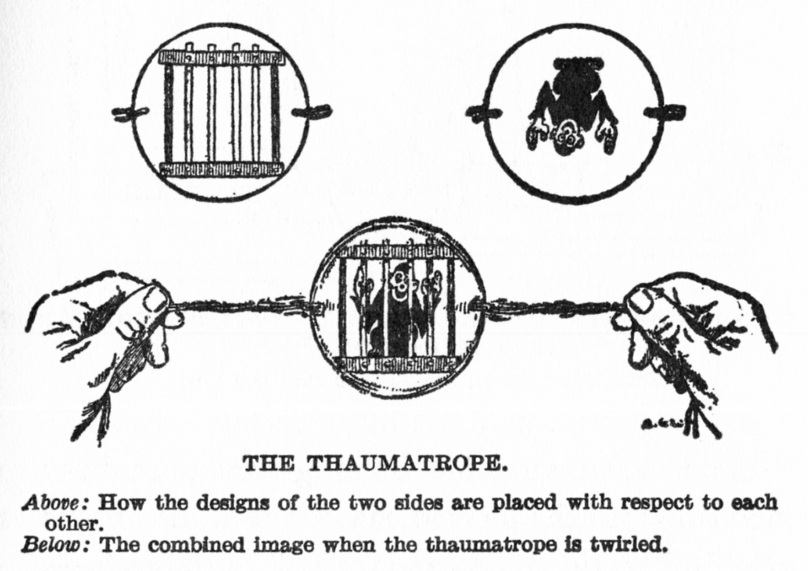
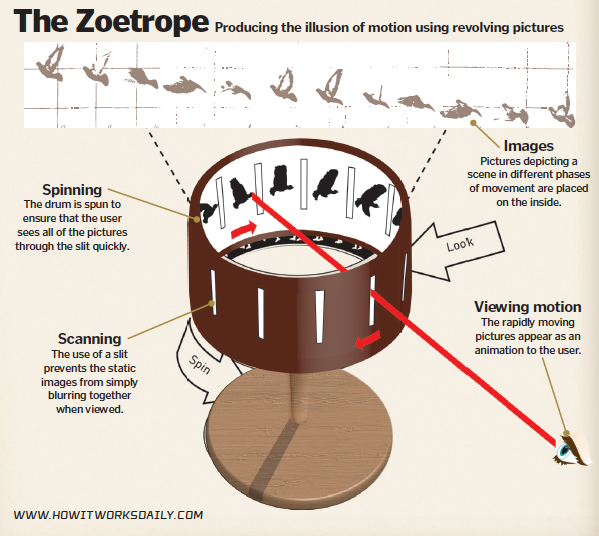

# Animation
> Animation can be considered as ***PINNACLE (peak)*** of multimedia

### Animation draws inspiration from each of the other medias

### Computer became a partner in creative expression
- Lowered costs
- Made creating animation easier
- Supports creative expressions through:
    - Interactivity
    - 3D sensory experience
    - Embodiment and implementation of rules of behavior

# Animation Basics

### Animation
> Rapidly displayed sequence of individual still images made possible by ***PERSISTENCE OF VISION***

### Persistence of vision
- Images formed on the retina persists for a short period of time after the stimulus has disappeared
- This physical memory of the retina will produce the illusion of motion if a bunch of connected still images are displayed fastly

### Early animating devices
- Thaumatrope

    

- Zoetrope

    

### Flipbook technique
- Still Images showing a different stage of a motion are created (drawn or printed) on different pages
- The pages are flipped through rapidly, and because of ***PERSISTENCE OF VISION*** our eye are being tricked to connect those still images and link them into a motion
- Animation basics used in flipbook:
    - Quality of motion -> based on rate of display
    - Speed -> based on the differences between images
    - Onionskinning -> a technique to draw new image based on the previous image via ways like tracing
    - Registration -> physically aligns images with one another

# Traditional Animation

### Film based process
- Images are photographed and recorded as separate frames on a long strip of transparent film
- With the help of a light source, the films are shown on a screen and when a series of films are shown in that way, the illustration of motion happens

### Film enhanced the possibilities of animation
- Multiple reels (like the big big wheel that has films wrapped around it) allowed longer animations
- Projectors are able to display the images at a reliable frame rate
- Animators could add sound to the motion

### Challenges of traditional animation
- Number of images to create very many
    - 24 frames per second requires 1440 still images for one minute of the animtion
    - Methods to generate images (and to solve this problem) include:
        - Shooting on two -> cuts number of images in half
        - Cycle ofimages are reused to extend repetitive motion
        - Holds -> produce sequence of identical drawings to extend a particular state of action
- Artistic strategies to create realistic world require:
    - Awareness of how things move in the real world
        - Ease-in (start slow end fast) and ease-out (start fast end slow) helps to address the physics of motion
        - Overshooting a resting point shows kinetic energy of motion (it's like you let the thing go over where it's supposed to go and then pull it back)
        - Overlapping motion -> different components move independently on its own
    - Exaggerate mjotion for dramatic effect
        - Different speeds are used
        - Stretch and squash technique are used -> the ball are squashed as it hits the ground and stretched when it's bounced back up

# Traditional motion techniques

[//]: # (stopped at slide 9)
