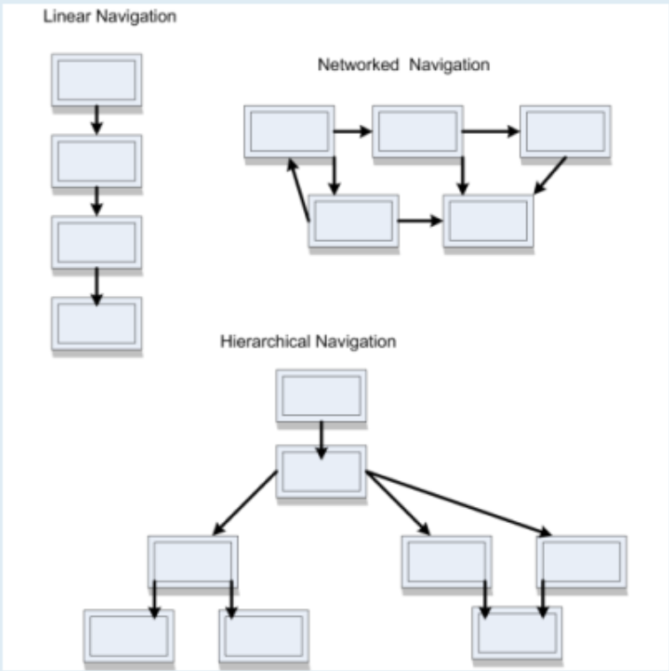

# Making Multimedia

# Table of Contents

# Methods to Integrate Media
- [Programming](#programming)
- [Authoring](#authoring)

# Programming
- Languages to specify how the media is presented and the user interactions are carried out
- Requires the knowledge of the commands of the language
- Time consuming

# Authoring
- Applications specially designed to integrate and present media elements
- Developers can concentrate on design, interactivity and functionality of the project

### Authoring Applications
- Software designed for creation of multimedia projects
- Aplications that are used to
    - Assemble media elements
    - Synchronize contents
    - Design user interface
    - Provide user interactivity

### Authoring metaphors
- Metaphors:
    - A ***COMPARISON*** of one thing to another to enhance understanding
    - Helps orient developers to how the software:
        - Organizes the media
        - Sequences events
        - Presents the final project
- Common metaphors
    - [Card](#card-metaphor)
    - [Icon](#icon-metaphor)
    - [Timeline](#timeline-metaphor)

### Card Metaphor
- Media organized in **SEQUENTIAL ORDER** on a ***STACK OF CARDS OR SLIDES***
    - Appropriate for static media that is normally experienced in sequence
- Have ***TWO*** layers:
    - **Background** Layer: Contains shared elements
    - **Foreground** Layer: Contains content specific to that card or slide
- Benefits:
    - Saves time: Background content is created only once
    - Consistent: The background layers have little change (or no change)
    - Small file size: Background elements are shared

[Back to Authoring Metaphors](#authoring-metaphors)

### Icon Metaphor
- Icons define the media and forms of interactivity
- Icons are graphic symbols that define media as well as different forms of interactivity
- Placed on a ***FLOWLINE*** to create the application structure
    - Each icon has a dialog box with properties and parameters specified by the developer
    - Flowlines:
        - A graphical representation of the relationships between the components of the application
        - Let developer visualize and adjust the structure of the application (smtg like flowchart)
- Branching routine add control to user interaction

[Back to Authoring Metaphors](#authoring-metaphors)

### Timeline Metaphor
- Organizes media and interactivity as sequence of frames
    - Each frame can have different layers
    - Layers define the stacking order of the content to be displayed
- Appropriate for dynamic media as the media can be synchronized precisely over time
- Popular timeline-based applications
    - Director
    - Flash
- Best used when animation or video is the central of the application

[Back to Authoring Metaphors](#authoring-metaphors)

### Authoring Process
> Series of interrelated tasks from project design to delivery
- [Application Design](#application-design)
- [Importing Content](#importing-content)
- [Create and Edit Content](#create-and-edit-content)
- [Integration, Synchronization and Playback](#integration-synchronization-and-playback)
- [Establishing Navigation](#establishing-navigation)
- [Programming](#programming)
- [Database Support](#database-support)
- [Preview, Test, Debug](#preview-test-debug)
- [Project Delivery](#project-delivery)

### Application Design
- Authoring apps will support the design process
    - Outline view in PowerPoint structures presentation
    - ***Storyboard***
        - A series of screen sketches to guide development process
        - Common in complex applications

[Back to Authoring Process](#authoring-process)

### Importing Content
- Media is generally created in media-specific applications and is then imported into the authoring environment
    - File formats for imported media is important (They have to be supported)
    - Conversion utilities within the application are sometimes useful

[Back to Authoring Process](#authoring-process)

### Create and Edit Content
- All authoring applications will include some tools to create and edit media contents
    - Text adjustments to font size and color
    - Paint tools to add shapes and edit image features
    - Sound adjustment on volume, duration
    - Animation changes to speed and duration

[Back to Authoring Process](#authoring-process)

### Integration, Synchronization and Playback
- Techniques for ***integration*** are based on the [Metaphors](#authoring-metaphors)
- Sounds, animations and transitions must be ***synchronized*** to present a unified flow of information
- ***Playback*** of the content is often dependent on hardware factors.
    - Timing controls can be established to ensure correct playback

[Back to Authoring Process](#authoring-process)

### Establishing Navigation
- Authoring software can establish the order of the content on playback
- Basic navigation structures:
    - Linear
        - Users navigate through the frames of information sequentially
        - Screens are viewed one after the other, like the pages in a book
        - Appropriate when information have to be presented in a certain order, like a recipe for baking a cake
    - Hierarchical
        - Starts from the top of a tree structure
        - User navigates along the branches of the tree structure, that is shap-ed by the content's natural logic
        - Appropriate for menu options
        - Authoring software is used to create hierarchical navigations like image maps
    - Networked
        - User navigate freely through the contents
        - The sequences and hierarchies are replaced by a variety of user options
    - Conditional
        - User may navigate freely, but there may be some constraints
        - The access to information depends on certain conditions like the user's responses or progress
        - Appropriate for tutorials
            - The application may want to prevent user from jumping to the last phase of the tutorial without competing the front ones
    - 

[Back to Authoring Process](#authoring-process)

### Programming
- Provides more flexibility and control
    - Used for projects with extensive interactiviy and custom features
- Two methods:
    - Scripting:
        - Series of commands that specifies the properties or behavior of an eloement in the project
        - Commands are interpreted as the project is executed
    - Icon (wtf? nvr heard before):
        - Dialog boxes allow the developer to specify parameters for the icon use
        - Does not require programming knowledge but the commands are limited to icon parameters

[Back to Authoring Process](#authoring-process)

### Database Support
- Some projects require access to a collection of related files to store and retrieve user input
    - Online Note-taking applications need databases
        - Users write the notes and save it to the database
        - Users retrieve the notes from the database in the future
- **Authorware** and **Director** applications offer an interface to a database

[Back to Authoring Process](#authoring-process)

### Preview, Test, Debug
- Projects created in the developement mode
    - The project has to be ***previewed*** before publishing it to the public and ***test*** the components of the screen to ensure nothing go wrong
    - Authoring applications often have a preview mode to test the assembled project during development
    - They have a ***debugger*** too
        - Debugger -> Helps identify errors in program code

[Back to Authoring Process](#authoring-process)

### Project Delivery
- Projects are published so they can be used outside the authoring environment
- Two Approaches
    - [Remote Delivery](#remote-delivery)
    - [Local Installation](#local-installation)

#### Remote Delivery
- Store the application and data on a server for access through a network, most often the WWW
- Advantages:
    - Content revisions are managed by server's database
    - Wide market access
    - Developers can track users and determine the patterns of usage, hence optimizing the application
- Limitations:
    - Not everyone has high bandwidths
    - Bandwidth restriction will be present depending on the user's location or network service
    - Browser applications are not neccessarily compatible with all the devices or applications out there
- [Back to Project Delivery](#project-delivery)

#### Local Installation
- Application is installed and maintained on the user's device
- Advantages:
    - Project does not neccessarily need a constant connection to a network
    - Developer can incorporate larger data files within the application (cuz thr's no bandwidth concern anymore)
- Limitations:
    - Platform dependency
        - Different platforms has different SDKs, so the app might not be compatible with all platforms
    - Version control and critical updates are user dependent
        - Since the whole app is at the user's place, it is up to them to install which version or update or not
    - Isn't a way to track demographics and pattern of use
- Approaches to provide the application:
    - Require a separate **player** program to present the multimedia content
        - Players include
            - QuickTime
            - Flash
            - MediaPlayer
    - Embed the player in the application
        - Larger file
        - Harder to develop
        - But can be used without installing other external applications
- [Back to Project Delivery](#project-delivery)

[Back to Authoring Process](#authoring-process)

### Choosing an authoring application

[//]: # (heheh stopped at page 26)