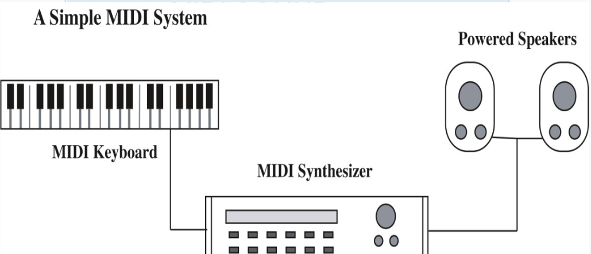
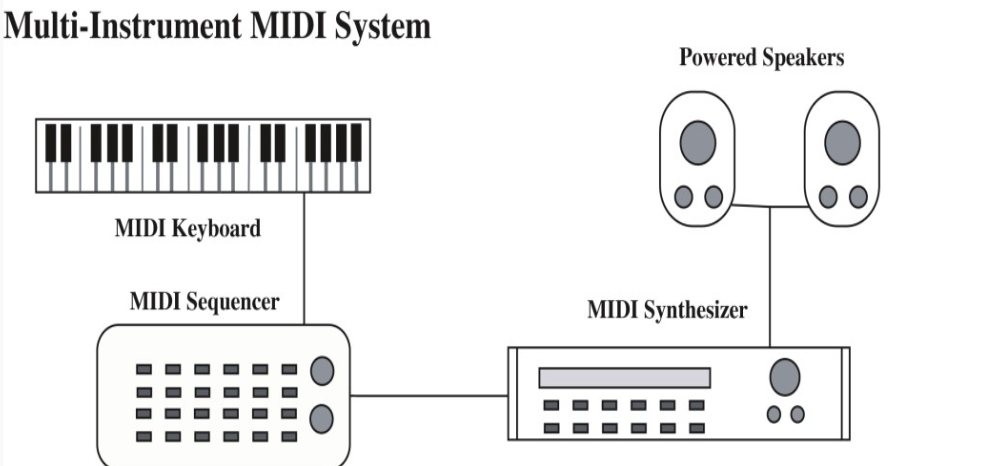

# Table Of Contents (All Chapters)
1. [Introduction to Multimedia](#introduction-to-multimedia)
2. [Text](#c1-text)
3. [Image Graphics](#c2-graphics)
4. [Sound](#c3-sound)
5. [Animation](#c5-animation)
6. [Video](#c6-video)
7. [Making Multimedia](#c7-making-multimedia)
8. [Trends in Multimedia](#c8-trends)

# Introduction to Multimedia

# Table Of Contents
1. [Contemporary Multimedia](#contemporary-multimedia)
2. [Forms of Multimedia](#forms-of-multimedia)
    - [Non Interactive](#non-interactive)
    - [Interactive](#interactive)
3. [Multimedia Visionaries](#multimedia-visionaries)
    - [Vannevar Bush](#vannevar-bush)
        - [Memex I & II](#memex-i-1954)
    - [Alan Turing](#alan-turing)
        - [Turing Machine](#turing-machine)
    - [Douglas Engelbart](#douglas-engelbart)
        - Interativity
    - [Theodore Nelson](#theodore-nelson)
        - Hypertext
        - Hypermedia
    - [Alan Kay](#alan-kay)
        - Dynabook
    - [Steve Jobs](#steve-jobs)
        - Apple
        - Macintosh
    - [Tim Beners-Lee](#tim-berners-lee)
        - Decentralized nodes
4. [World Wide Web](#world-wide-web-www)

# Contemporary Multimedia
> The development, integration and delivery of any combination of text, graphics, animation sound or video through a digital processing device

# Forms of Multimedia

### Non-interactive
- User is an ***OBSERVER*** of information
- User has **no** control over the flow of the information
- Developer establishes the sequence of the media elements and how they are presented
- Examples:
    - Information kiosks
    - Digital animations

### Interactive
- User is a participant in the flow of information
- Basic Interactivity
    - Includes menu and buttons to access contents
    - Most of the websites are like this
- Adaptive or ***Intellimedia***
    - Adapts the information flow to the interests or needs of the users
    - Like AI to judge what you like
- Immersive
    - Draws the user into an alternate world
    - Like AR or VR

# Multimedia Visionaries
- First Generation
    - [Vannevar Bush](#vannevar-bush)
        - [Memex I & II](#memex-i-1954)
    - [Alan Turing](#alan-turing)
        - [Turing Machine](#turing-machine)
- Second Generation
    - [Douglas Engelbart](#douglas-engelbart)
        - Interativity
    - [Theodore Nelson](#theodore-nelson)
        - Hypertext
        - Hypermedia
    - [Alan Kay](#alan-kay)
        - Dynabook
    - [Steve Jobs](#steve-jobs)
        - Apple
        - Macintosh
    - [Tim Beners-Lee](#tim-berners-lee)
        - Decentralized nodes
- Next Generation
    - Current innovators of multimedia

# Vannevar Bush
- Created 2 variations of the Memex
- 

### Memex I (1954)
> *As We May Think, 1945*
> > A hypothetical machine to make the work of scientists more effective and efficient in "grasping the growing mountain of research"

- Features:
    - Massive storage capacity
    - Multimedia input devices like
        - vocoder
            > *As We May Think, 1945*
            > > speak to it, and the corresponding keys move
        - cyclops camera
            > *As We May Think, 1945*
            > > One can now picture a future investigator in his laboratory, his hands are free, and he is not anchored. As he moves about and observes, he photographs and comments
            - (PS I assume this is a camera tied on the forehead from the sentence)
    - Automatic mathematical calculations and logical reasoning
    - New method to store and access information by associations

### Memex II (1959)
- Extends the original proposals of Memex I by considering new technical developments such as
    - Magnetic tape
    - Transistor
    - Digital computer
- Features
    - Professionally maintained associational database delivered by tape or facsimile
        - Facsimile -> an exact copy, especially of written or printed material
    - Trails are color-coded to reflect age and reinforced by repetitive use
    - Combined with a digital computer, Bush believed the Memex II could learn from experience and even demonstrate a form of judgement

# Alan Turing
- Proposed an abstract machine known as the [Turing Machine](#turing-machine)

### Turing Machine
- 
- A means of defining an "effective procedure"
- It's an imaginary device that has three components
    - An **infinitely long tape** consisting of single row of squares
    - A **read/write head** that moved along tape one square at a time
    - A set of instructions
- Single purpose Turing Machines
    - Carry out a specific set of instructions of "effective procedure"
- Universal Turing Machine (UTM)
    - Accept a description of a single purpose turing machine and imitates it's behavior
    - What is in Alan Turing's mind when he created this UTM
        - If we think of a way to do something, the computer can do it

# Douglas Engelbart
- Proposed practical applications of computers beyond the normal mathematical and sorting functions
- Developed interactivity in the ***NLS*** (oNLineSystem)
    - Mouse
    - Multiple screen areas for text editing
    - Email

# Theodore Nelson
- Coined terms
    - HyperText
        - Interactive text linked to other textual information
    - HyperMedia
        - Extends interactive linking to other media
        - Can sort of think like hypertext, but its images/sounds/videos/animations instead of text
- Initiated Xanadu Project
    - Dynamic, expanding hypertext library available to everyone
    - Supports collaborative editing, tracking changes, crediting and rewarding contributors

# Alan Kay
- Proposed a computer design that supports the ways people perceive, learn and create
- Dynabook
    - Designed as a personal computer
    - Tied to the mind and interests of the computer
    - A **modeless** multimedia computer
        - Users can move between graphics, sound and text seamlessly
- Introduced Graphical User Interface (GUI) as an intuitive interface for the Dynabook

# Steve Jobs
- Founded Apple (1976) with Steve Wozniak
- Macintosh computer
    - Introduced in 1984
    - Graphical desktop and Icons provide user interface
    - First mass produced computer
    - Built in sound support
    - Multimedia computing became the standard for modern computers

# Tim Berners-Lee
- Developed a decetralized information system of ***nodes*** linked together for easy access across a network
    - Nodes
        - Anyform of media
        - Anyone can add nodes
        - no centralized control over servers, documents or links
    
# World Wide Web (WWW)

### Basic Components
- Server Computer
- Client Computer
- Browser Software
- HTML scripting language

### WWW & Multimedia Computing
- Solves cross-platform compatibility problem
- Supports distribution of media beyond the CD-ROM storage
- Allowed instant distribution and inexpensive media creation

# Revolution continues
- Factors influencing the revolution
    - Technical breakthroughs in hardware and software
    - Integration of computers with other devicews
    - Digital merger of different technologies and industries
    - Future development of wireless communications and mobile devices
    - Expansion of creative opportunity

## [Back to All Chapters](#table-of-contents-all-chapters)

# C1 Text

# Table of Contents
1. [Power of Text](#power-of-text)
2. [Text Tradition](#text-tradition)
3. [Codes for computer Text](#computer-text)
4. [Font Technologies](#font-technologies)
5. [Multimedia Text](#multimedia-text)
6. [Guidelines For Use of Text](#guidelines-for-text-in-multimedia-applications)

# Power of Text
- Clarity
- Universality
- Efficiency
- Abstraction, engagement and suggestion

# Text Tradition

### Typeface
- Family of characters that share a common design
- Commonly categorized as
    - Serif
    - Sans Serif
    - Script
    - Symbols

### Style
- Appearance of characters:
    - **Bold**
    - *Italic*
    - <u>Underline</u> (sila kaki imagine if viewing from github, github no support underline)
- Point (pt)
    - Commonly used as a unit for font sizes
    - approximately 1/72 of an inch
- Pica
    - 12pt

### Font
- Complete set of characters of a particular typeface, style and size
- Monospaced fonts
    - all characters are of the same width
- Proportional fonts
    - width of the characters are adjusted based on the shape

### Case
- Uppercase
- Lowercase

### Weight
- Line thickness of the typeface
- Higher weight means more bolded words

### Kerning
- Adjust the spacing between ***SPECIFIC*** letters

### Tracking
- Adjust spacing between ***ALL*** characters

### Condensed/extended text
- Text with a ***narrow*** / ***wide*** width

### Leading
- Spacing between lines

### Alignment
- Position text relative to document's margins

### Justification
- Adjust line length to produce straight edges on left and right margins

# Computer Text
> Coding schemes assign a group of binary numbers to represent a digital character

### ASCII (American Standard Code for Information Exchange)
- 7-bit code -> 128 characters
- Extended ASCII (ASCII-8) -> 256 characters
- Understanded by ***ALL*** computers

### RTF
- Developed by Microsoft aiming for cross platform text files
- Able to reproduce the original file's formatting

### Unicode
- New standard of 16 bit code that provides more than 65,000 characters
- Goal is to include multilingual text in a single digital coding standard

# Font Technologies

### Bitmapped fonts
- a "mapping" of a character
- Pixels that make up the letter are described in a binary code
- Every character is stored as a bitmapped letter, number or symbol
- Requires large memory and storage capacity
- Advantages
    - Precise control over letter appearance
    - Letters can be edited at pixel level just like images
- Disadvantages
    - Letters cannot be easily scaled (quality will be ruined)
    - separate bitmaps are reuired for every different typefaces, styles and point sizes
    - requires large storage capacities
    - limited flexibility in use of text fonts to those stored on the computer

### Outlined fonts
- a ***DESCRIPTION*** of the character to be displayed is stored
    - Description: a series of command to create the letter on computer display
- Technologies
    - Adobe PostScript
    - TrueType (more common)
- Advantages
    - Can be scaled easily
    - little storage capacity is needed
- Disadvantage
    - Commands are hard to be edited to create unique characters
    - Font families are controlled through the license of Postscript and TrueType fonts

# Jaggies
- Jaggies are defined as text squares that display curve or diogonal lines produce a stair-stepped effect (the pixelated edges produced when u zoom in on a text alot)
- Jaggies produce an alias of the true character

### Anti-aliasing the jaggies
- Creates a smooth edge by blending the color of the text with the color of the background

# Installed Fonts

### Problems
- ASCII and UNICODE are standard
- Fonts installed locally are not standardized across computer platforms
    - if the font is not available on the computer, the computer will substitute another font in and may cause the result to be unacceptable

### Solutions
- Use only widely available fonts
- Package the unique font together with the application

# Multimedia Text

### Editable
- Text produced by word processor or text editors
    - Contents are easily altered
    - Spell check and search is available to use

### Graphics
- Image of a text that can be manipulated to produce a wide range of artistic effects
    - Original word picture can be made
    - Problems of installed fonts are solved
        - unique fonts don't need to be packaged as the text already exist as a picture

# Multimedia Text & Sound

### Speech recognition (AKA Speech To Text)
- Software analyzes human speech and converts words to editable text
- Specialized "intelligent" software is required
- Accuracy depends on training and the speaker's voice

### Speech synthesis (AKA Text To Speech)
- Software analyzes text and reproduces it as spoken words

# Text and Interactivity

### Hyperlink
- Linked text
- User interacts with links to trace relationships of words and ideas created by the author

### Structures
- Nodes (as in elements? I guess)
- Link anchor (as in the real link that the user will be navigated? I guess)
- Link markers (as in the thing to be pressed by the user to send the user to the Link anchor? I guess)

### Hypermedia
- Information structure based on linked media

# Text for the WWW

### HTML (HyperText Markup Language)
- Contains ***tags*** used to specify the structure of the document and formats the text and media
- Browsers have the ability to intepret the ***tags*** and display the page as the author intended on the client's device
- Limitations
    - limited set of tags to create a page (firendly reminder: this is not the case anymore now)
    - Hard to define a page appearance precisely
        - different browsers and computers may have different way of intepreting the tags and present the page differently

### CSS (Cascading Style Sheets)
- Addition to HTML
- Separate content of page from formatting codes
- Style the page to be more visual appealing
- Easier to edit and maintain the consistency of appearance of a site

### XHTML (eXtensible HTML)
- Blends HTML and XML
- XML allows powerful data manipulation
- Improves page display on mobile devices

# PDF (Portable Document Format)
> Maintains original formatting of documents across computer platforms
- Platform and application independant
- support multiple medias and user interaction
- requires a ***READER*** to view the file and an ***ENCODER*** to convert a document to PDF
    - Most web browsers now come with a built-in PDF reader
    - Adobe Acrobat Reader is a free reader
    - PDFCreator is a free and open sourced encoder

# Add Text to Multimedia Application
- Direct entry in a text box or text field
- Copy paste from existing text source
- File import for large text files
- Scan text with OCR application for text that only exist in printable media
    - ***OCR (Optimal Character Recognition)***: 
        - Scans for text in the ***source*** given and return you editable text
        - accuracy varies based on fonts and quality of source material

# Guidelines for Text in Multimedia Applications
- Be selective
- Be brief
- Make text readable
- Be consistent
- Be careful and respectful
- Combine text with other media
- Make text interactive

## [Back to All Chapters](#table-of-contents-all-chapters)

# C2 Graphics
> Wide range of pictorial representations from simple line drawings to blue prints, charts, logos, paintings, photos, animation and movies
### My own take
> Graphics is an image/video representation of text. It is normally used to represent texts and the meanings that a person wants to convey. Graphics are generally easier to understand.

# Table Of Contents
1. [Challenges](#challenges-of-computer-images)
2. [Contone Image](#contone-image)
3. [Line Art](#line-art)
4. [Black and White Image Reproduction](#black-and-white-image-reproduction)
5. [Bitmapped Graphics](#bitmapped-graphics)
    - [Compression](#compression)
6. [Vector Graphics](#vector-drawn-graphics)
7. [3D Computer Graphics](#3d-computer-graphics)
8. [Guidelines using graphics](#guidelines-using-graphics-in-multimedia)

# Challenges of Computer Images
- Large file size
- Slow downloads and processing
- Possible inferior (lower) quality than the original
- File format compatibility
- Images are displayed differently on different monitors and printers

# Contone Image
- FUN FACT: Contone stands for ***Continuous Tone***
- Composed of ***CONTINUOUSLY VARYING SHADES*** of color
- A traditional black and white contone image is made up of continuously varying shades from white to gray to black


# Line art
- Combination of lines to make images
- Uses only ***TWO*** colors
    - 1 for the line (foreground)
    - 1 for the background


# Black and White Image Reproduction
> Images made with a series of ink dots

### Linescreen
- lines per inch
- designates the size of the dots and quality of resulting image
    - 150 lpi is better than 85 lpi


### Halftones
- Form image by ***CLUSTERING*** ink dots
- tight cluster of black and white dots are capable of creating dark gray
- loose cluster of black and white dots can create lighter gray


# Color Image Reproduction
> Uses a series of four-color dots with transparent inks

### CMYK
> Cyan, Magenta, Yellow and Key (usually black) (blame github for not supporting markdown colors)
- small dots of different color combinations can reproduce more different colors

### ***Subtractive***
- often used to form color images on printed surface
- Light is ***REFLECTED*** frome the printed surface
- Pigments that form the image absorbs some of the colors
- The remaining colors reach our eye to produce the image

### ***Additive***
- Often used to form color images on computer monitor
- the ***RGB (Red Green Blue)*** color model
- Varying amounts of Red, Green and Blue light are added together ro create the color

> Additive Color models (RGB) are converted to  Subtractive color models(CMYK) if the image is going to be printed

# 2D Computer Graphics

### Bitmapped graphics
- Created as a pattern of discrete elements
- Each element is a ***PIXEL*** or "picture element"
    - Pixel:
        - Small squares
        - Assigned a binary code to define the color
        - More bits assigned = more binary length = more color possibilities = more details
- Categories:
    - Line art 
        - Produced using 2 colors (usually black and white)
        - Advantages:
            - Clear, crisp image
            - Small file size
        - Uses:
            - Chart
            - Illustration
            - Diagrams
    - Grayscale
        - produced using shades of gray
        - generally ***8-bit*** images of 256 shades of gray
        - Advantages:
            - Nice representation of black and white photos
            - Smaller file size than full color
            - Lower printing cost than color
        - Uses: image that require more detail than line art
    - Color 
        - produced with patterns of colored pixels
        - ***BIT DEPTH***: 
            - number of bits used to encode each pixel
            - determines the color possibilities
        - photo-realistic color requires 24-bit color
    
# Making computer colors

### 2 ways in general:
- identify a table of possible colors for the computer
- specify varying amounts of Red, Green and Blue

### 8-bit color
- a specific range of colors in a table
- PCs and Macs use different tables
- ***Web-safe*** table provides color that will display the same on all platforms

### 24-bit color
- combines 8-bit values of red, green and blue to create the result
- 16.7 million color possibilities
    - FUN FACT: 48-bit color has 16-bit values with 281 TRILLION color possibilities

# Bitmapped Image Quality
> Depends on TWO factors (spatial resolution and color resolution)

### Spatial resolution
- density of pixels per inch
- measured in ***PPI(Pixels Per Inch)*** for monitor output
- measured in ***DPI(Dots Per Inch)*** for print output
- Higher spatial resolution
    - more detail (pixels are smaller and closely packed)
    - sharper and more accurate images are produced
    - LARGE file size but better image quality
- Lower spatial resolution
    - less detail (pixel are larger)
    - image appears to be fuzzy
    - small file size, but lower image quality

### Color resolution
- number of colors each pixel can display
- determined by bit depth
    - low bit depth = small file size = less color
    - high bit depth = large file size = more color
- low color resolution may cause ***COLOR BANDING*** and ***QUANTIZATION***
    - Color banding
        - a subtle form of ***POSTERIZATION***, which converts a continuous gradation of tone to several regions of fewer tones
        - while posterization is done for artistic effects, color banding is an unwanted artifact
        - caused by rounding of the color of each pixel to the nearest digital color levels (often because the limitation of the display device)
        - Color banding effect can be seen on the sky of the image below
        
    - Quantization
        - Happens when a range of values are being compressed into a single quantum value
        - may lead to break in shades of continuous tone images (like color banding)
- Indexing
    - Specific pallette of colors is identified to optimize the appearance of lower color resolution image
    - Methods:
        - Adaptive
        - Perceptual
- Dithering
    - Combine pixels of different colors to produce another color that is not available in the indexed palette
    - Improves image quality without increasing bit depth
    - Capable of solving the problem of quantization and color banding (by creating the transitional color on the hard stops [if this is chim sila ignore XD])
    - 
    - *if you zoom in on the photo you can see small dots on the dithered image*

### Device dependence
- dimensions of an image depend on the resolution of the output device. 
- Monitors generally have lower spatial resolution (again, idk if this is still the case now)
    - Mac: 72ppi
    - PC: 9ppi
- Printers generally have higher spatial resolution: 300dpi to 2400dpi
- bitmapped images are device-dependent:
    - 300ppi image prints the original size on a 300ppi printer
    - 300ppi image is greatly enlarged on a 72ppi monitor

# Resampling Bitmapped Image
> Process of increasing or decreasing the number of samples described in a file (changes the original image)
- Often used to control spatial resolution of bitmapped images (rmb how 300ppi image will be shown on a 72ppi monitor?)
    - 72ppi for web display
    - 300 ppi for laser output

### Upsampling
- Adds samples to the file
- Used to ***ENLARGE*** the physical dimensions of an image on a given device
- Softwares have special algorithms to ***interpolate*** the pixel and color to be added to the image, the interpolated pixels and colors are then ***CREATED*** by the software for the image
- The more data is added, the more the image is ***DEGRADED*** via upsampling
- It is just nearly impossible to blow a 72ppi image to 300ppi (now gt AI its not tht pain staking anymore tho but notes dh)

### Downsampling
- Reduces samples from the file
- Can produce smaller images but still maintain good quality

### Best practice
- Capture at ***HIGHEST*** possible spatial resolution when possible
- Only downsample as needed for different usages of the image

# Resize Without Resampling
> It is possible to resize a bitmapped image without resampling

### Enlarging a printout ***CAN*** produce acceptable results
- ***BUT:*** excessive enlargement will distort the image with ***blocky, mottled surface***


### Reducing the image size without resampling can produce high quality printouts
- Pixels are ***packed more closely*** to each other

### Resizing without resampling has no effect on monitor display of image


# Sources of Bitmapped Images

### Paint programs
- Specialized software for creating bitmapped images
    - Adobe Photoshop
    - MS Paint
    - GIMP
    - Inkscape
    - Krita

### Digital cameras
- Number of pixels sampled by the camera is the camera's spatial resolution
- Measured in megapixels

### Scanner
- Capture existing or original art image
- Capture 3D objects

### Clip art
- Royalty free
    - Once the initial use is permitted (some require you to pay for the initial usage, some is free), the subsequent uses are free (no matter how you use it)
    - Licensed usage (you may need to renew your license to use it on different fields)

### Screen grab (AKA Screenshot)
- Save image on a monitor to a bitmapped file
- Spatial resolution is generally low

# Bitmapped File Formats
- PICT
- PNG
- BMP
- GIF
- TIFF
- JPEG

### Compression
- Lossy
    - Removes redundant or unneeded details or informations or datas in the file, reducing the file size
    - File compression formats:
        - JPEG
        - MP3
- Lossless
    - Relies on statistical redundancy to store data without losing any information
    - Reversible
    - File compression formats:
        - PNG
        - GIF

# Vector drawn graphics

### Vector
- A line with length, curvature and direction

### Vector graphics
- Images created from ***mathematically defined*** shapes 

### Advantage
- Can be enlarged without distortion
- Smaller file size

### Draw programs
- Program used to draw vector graphics
- Tools that resembles those of a draftsman
    - Fixed shapes
    - Bezier curves
    - Pen
- Objects are layered on each other and grouped to form complex images
    - Grouping joins individual shapes
    - Ungrouping separates the groups back into individual shapes
    - 
    - *to the left is the illustration, to the right are the layers (This vector is created via combining diff layers)*

### Device Independence
- Vector graphics can be used on different devices without altering the image dimension (deep down vector is just a mathematical formula after all, and is calculated on the spot when it is used)
- Printers and monitors preserve the original dimension of the image

# Vector to Bitmapped & Back

### Autotracing
- Softwares analyzes a bitmapped image for shapes and converts the image into a vector graphic

### Rasterizing
- Samples the vector image and saves it in bitmapped form
- Can think of like sort of "screenshot-ing ~~(or screen grab in terms of notes)~~" the vector graphic displayed on screen

# Vector graphic file formats

### Native format
- Depends on the application used

### General purpose
- Vector-only:
    - EPS (Encapsulated Postscript)
    - PDF (Portable Document Format)
- Metafiles:
    - SVG (Scalable Vector Graphics)

# Advantages (Bitmapped VS Vector)

### Bitmapped Images
- Represent complex contones
- Full featured photo editing
- Wide range of artistic effects
- Precise Editing

### Vector Images
- Smooth scaling and reshaping
- Ease of editing objects in layers
- Small file size
- Device independent

# Disadvantages (Bitmapped VS Vector)

### Bitmapped Images
- Large file size
- Precision are lost when the image/shape is scaled or rotated
- Device dependent

### Vector Image
- Inaccurate, incomplete represent of complex contone images
- No photo-editing capability
- Limisted artistic control/effects

# 3D Computer Graphics

### Four steps
1. [Modeling](#modeling)
2. [Surface definition](#surface-definition)
3. [Scene Composition](#scene-composition)
4. [Rendering](#rendering)

# Modeling
- Process of specifying the shape of the 3D object
- Two approaches
    - Combine ***PRIMITIVE*** objects to form a new shape
        - ***PRIMITIVE*** Objects -> 3D shapes supplied by the 3D graphic programs
    - Use a ***MODELER*** to create shapes directly
- Modelling with primitives (extended ver.)
    - Use basic shapes to create complex 3D models
- ***Parametric primitives***
    - Objects that can be changed by specifying parameters like radiu
    - Primitives can be scaled, rotated, moved and combined
    - CSG (Constructive Solid Geometry)
        - Primitives are joined, subtracted from or intersected with using Boolean operators

### Modelling techniques
- [Polygon modeling](#polygon-modeling)
- [Spline modeling](#spline-modeling)
- [Metaball modeling](#metaball-modelling)
- [Formula modeling](#formula-modelling)

### Polygon modeling

- Object defined as pattern of straight-edged polygons
- Similar to bitmapped graphics in that the object is defined by fixed number of elements
    - Fixed number of polygons for 3D
    - Fixed number of pixels for 2D
- Advantages
    - High quality, realistic surfaces
    - Precise editing control
- Disadvantages
    - Large file sizes
    - Scaling distortions
- [Back to modelling techniques](#modelling-techniques)

### Spline modeling

- Use ***CURVES*** to create objects
- Similar to 2D vector graphics
- ***NURB*** Approach
    - Non-Uniform Rational B-spline (not in notes, google best)
    - Define an image using ***MATHEMATICAL*** formulas
    - Able to be adjusted to various shape and sizes
- Advantages:
    - Small file sizes
    - Flexible objects
    - NURBs are easily scaled
- Disadvantages:
    - Less editing control
- [Back to modelling techniques](#modelling-techniques)

### Metaball Modelling

- Objects created as combination of elements called ***BLOBS***
    - BLOBS
        - ***Positive*** Blobs add to the object
        - ***Negative*** blobs subtract from the object
        - Smooth like lumps of clay
- Good for objects with soft edges
- [Back to modelling techniques](#modelling-techniques)

### Formula Modelling

- Create object by specifying ***MATHEMATICAL*** formulas, and is then drawn by computer
- Requires knowledge of programming and advanced mathematics
- [Back to modelling techniques](#modelling-techniques)
- [Back to Modeling Steps](#four-steps)

# Surface Definition
- Textures applied to the model's surface
- Menu choices surfaces include wood, glass, metal, skin
- Appearance of surfaces can change via altering the color, opacity and reflectivity
- Custom surfaces
    - Image maps
    - Bump maps
- [Back to Modeling Steps](#four-steps)

# Scene Composition
- Objects are arranged
- Backgrounds are defined
- Environmental effects added
- Lighting established
    
    - Lighting choices
        - Omni lights (also called point lights)
        - Directional lights
        - Spot lights
        - Volumetric light (also called ambient light or global illumination)
- Adjust lightig with brightness, color and attenuation
- [Back to Modeling Steps](#four-steps)

# Rendering
- Computer processes the scene specified by the artist
- Two main approaches
    - Pre-rendering
        - Render first into picture/video then use later
        - Used for:
            - Graphics
            - Animation
            - Video with limited interactivity
    - Real-time rendering
        - Renders realtime (as the name implies)
        - Used for
            - 3D applications like video games
- Forms of rendering to create test scenes
    - Wireframe rendering
        - A series of ***LINES*** used to define the shape of an object is displayed, the surface is not shown
        - Useful to test for basic geometry and placement of an object
        - 
- Surface rendering
    - Applies lighting and shaders to the object
    - ***Flat Shader***
        - Imperfect but fast render process
    - ***Smooth Shader***
        - Better quality surface
    - ***Ray tracing***
        - Traces every rays of light as it interacts with objects on a scene
    - ***Radiosity***
        - Recreates the changes that result from interaction of different wavelength of light
    - 
- ***Final*** Render
    - Translates 3D information to a 2D image
    - ***Rendering Engines*** apply effects to the finished products (shadows, bumps, reflections, transparencies and lighting taken into account)
    - Requires processing power, time and artistic talent to be successfull
- [Back to Modeling Steps](#four-steps)

# Creating Worlds
- 3D graphics are powerful to create reproduction of the world around us
- Fantasy worlds come alive with the help of creative artists and software applications like Maya, Blender, ZBrush #D StudeioMax

# Guidelines Using Graphics in Multimedia
- Identify the purpose of the graphic
- Choose best format for each image
- Match graphic design to purpose
- Locate graphics (? I don't really understand but it's in notes)
- Preserve the quality of image
- Economize (? I don't really understand but it's in notes)
- Organize and store graphic files for later use

## [Back to All Chapters](#table-of-contents-all-chapters)

# C3 Sound
> a form of mechanical energy transimitted as vibratiohns in a medium

# Table Of Contents
1. [Sine Wave](#sine-wave)
2. [Traditional Sound Reproduction](#traditional-sound-reproduction)
3. [Digital Sound](#digital-sound)
    - [Sampled](#sampled-sound)
    - [Synthesized](#synthesized-sound)
4. [Advantage of Digital Sound](#advantages-of-digital-sound)
5. [Guidelines for Digital Sound](#guidelines-for-use-of-sound)

# Sine wave
- Captures ***THREE*** features of sound
    - Amplitude -> volume (directly proportional)
    - Frequency -> Pitch (directly proportional)
    - Duration -> how long the sound lasts

# Traditional Sound Reproduction

### Analog sound capture
- Sound waves ***VIBRATE*** diaphragms of early microphones
- Vibration caused a stylus to inscribe a continuous pattern on tinfoil or on a wax cylinder

### Reproducing the analog sound
- Rotate a drum while in contact with a stylus
- Movement of stylus are electrically amplified to vibrate the drum of a speaker
- Changes in air pressure produced the sound

### High fidelity analog sound is still used for the final output stage of digital audio
- High Fidelity (Hi-Fi)
    - High quality reproduction of sound

# Digital Sound

### Two Major Types
- [Sampled Sound](#sampled-sound)
- [Synthesized Sound](#synthesized-sound)

# Sampled Sound
- Digital recording of previously existing analog sound wave
- File contains ***NUMERIC*** values to describe the amplitude of the sound wave at a particular time
- Used to capture and edit naturally occured sounds
- ***ADC (Analog to Digital Converter)***
    - Captures separate measures of sound amplitude
    - Samples recorded as digital numbers
- ***DAC (Digital to Analog Converter)***
    - Used to recreate the analog form from digital values
- Quality depends on:
    - Sampled resolution
        - Number of bits to encode the ***amplitude***
        - 8 bit resolution captures 256 (2<sup>8</sup>) amplitude levels
        - 16 bit (Common ***CD*** quality) captures 65,000 (2<sup>16</sup>) amplitude levels
        - 24 bit (Common ***DVD*** quality) captures over 16 million (2<sup>24</sup>) amplitude levels
    - Sampled rate
        - Number of samples taken in a fixed interval of time
        - Represents range of ***frequency*** that can be represented in a digital recording
        - Measured in thousands of Hertz, ***kilohertz (kHz)***
        - ***TWO*** measurements capture each cycle of the sound wave
            - ***HIGH*** value -> peak
            - ***LOW*** value -> trough
        - CD quality sound captures 44.1kHz to record frequencies as high as 22.05kHz (it's halfed because there are peaks and troughs in 1 cycle)

### Sampled Sound Distortions
- Quantization
    - Rounding a sample to the closest available value in the code being used
    - Produces ***hissing or grainy*** sound
    - Caused by ***LOW SAMPLE RESOLUTION***
    - To solve, record at ***HIGHER RESOLUTION*** (Use 16 bit rather than 8 bit)
- Clipping
    - Waveamplitude exceeds available sample values
    - Produces ***harsh, distorted*** sound
    - Causes:
        - Recording equipment unable to record at selected decibel (dB) range
        - Mixing tracks with amplitudes that ***EXCEED*** available range
    - Solutions:
        - Lower amplitute of source sound within the limits of the ***ADC circuitry***
        - Adjust volume of mixed tracks
        - Use higher sample resolution
- Aliasing
    - 
    - False representation of high frequencies as low frequencies
    - Caused by source frequency is higher than one-half the sample rate
    - Solutions:
        - Apply filters to source sound to eliminate frequencies ***ABOVE*** the sample rate
        - ***Oversample*** the source sound
            1. Use digital filters to eliminate the high frequencies
            2. Downsample to reduce the sample rate in the audio file

### Sampled Sound File Size
- It is large ;)
- 60 seconds of stereo CD quality sound = 10MB
```
fileSize = sampleRate(Hz) * sampleSize(bytes) * sampleTime(seconds) * 2(if stereo)
```
- Reduce file size and maintain quality
    - Select sample rate that matches the sound type
        - Human speech can be captured accurately at 11.025kHz with 8 bit resolution
    - Lower sample rate and resolution can reduce file size

### Sampled Sound Compression
- Best strategy to lower file size for sounds with wider range of frequencies and amplitudes
- ***Lossy codecs***
    - Uses various techniques to reduce sound file sizes
    - Psychoacoustics: ***ELIMINATE*** frequencies indistinguishable to the human ear
    - Variable bitrate encoding (VBR): ***ALTERS*** the number of bits to encode the sample depending on the complexity of the sound

### Sampled Sound File Formats
- AIFF: Apple computer
    - Uncompressed, high quality sound
- WAV: Microsoft and IBM standard
    - Uncompressed, high quality sound
- AU: Sun Microsystems
    - Internet transmission of lower quality sound files
- RealAudio: Real Media
    - Streaming audio at low bandwidths
- MP3: (MPEG-1, audio layer 3)
    - Significant compression of high quality sound
- AAC: Advanced Audio Coding
    - Successor to MP3 specified in the MPEG4 standard
    - Produce better quality sound than MP3 standard at comparable bitrates
- [Back to Type of Digital Sounds](#two-major-types)

# Synthesized Sound
- New Sound generated by the computer
- File contains ***INSTRUCTIONS*** for the computer to reproduce the sound
- Uses
    - Create original compositions
    - Produce novel sound effects
- Computer will send commands to a specialized electronic device called a ***SYNTHESIZER***

### MIDI (Musical Instrumental Digital Interface)
- Most common standard to code commands for synthesizers
- Codes provided for:
    - Specific instruments
    - Notes
    - Force and duration of note
    - Routing commands to different instrument channels
    - Specialized control functions
- Messages (or commands)
    - Can be sent to any one of the 16 channels
    - Voice or instruments are assigned to a channel
    - ***Multitimbral*** systems
        - Able to play multiple instruments 
        - Simulteanously processing commands in different channel
    - ***Polyphonic*** systems
        - Play more than one note at once
- Simplest MIDI system
    
    - Digital musical instrument to create the "messages"
    - Sound synthesizer inteprets the "messages"
    - Amplifier (Speaker) outputs the sounds
- Sequencer
    
    - Placed in between digital musical instrument and sound synthesizer
    - Controls the flow or sequencing of MIDI data to a multitimbral synthesizer
    - Can be hardware can be software (below is example of a software sequencer)
    - 
- MIDI on computer
    - Software and hardware emulates the MIDI sound system
    - Hardware
        - Soundcards + Synthesizers
        - Interface ports for MIDI input devices
    - Software
        - Sequencer software lets you to place notes on a musical scale (the first image on top of this)
        - Editing includes (for notes):
            - Change pitch
            - Change tempo
            - Change duration
            - Change volume
        - Allows arrangement and timing of instruments for more precise controls
- [Back to Type of Digital Sounds](#two-major-types)

# SAMPLED vs SYNTHESIZED

### Sampled
- Advantages
    - High quality
    - Easily created
    - Easily edited
    - Playback qualities are consistent
- Challenges
    - Large file sizes
    - Easily edited, but the editing controls aren't very rich

### Synthesized
- Advantages
    - Full featured editing controls
    - Small file size (as only commands (or "messages") are needed to be stored)
- Challenges
    - Need to be a musial expert to really stand out
    - Playback quality sin't consistent (depends on which software/hardware you use to process the commands)
    - Uneffective for natural sounds and human voices (they sound robotic if made with synthesizers)

# Advantages of DIGITAL SOUND
- Noise Reduction (can have softwares to process the sound)
- Accurate recording
- No generation decay
- Durable (kinda same as no generation decay)
- Random access 
    - You don't need to play through the entire thing to find the section you want to listen to (compared to analog sounds)
- Editing is easier and less expensive
- Easily distributed via digital mediums
    - CDs
    - Internet

# Digital Sound and the Internet

### Downloaded audio
- The complete audio file is transfered from the server to the client
- File remains on the client's computer for later use (replay or editing)

### Progressive downloads
- File saved to the client's computer
- Playes from RAM even when it is still downloading (like 3 mins sound, u downloaded 10secs and it will play what it has downloaded while continuing downloading the whole thing)

### Streaming audio
- Real time sound
- Played while it is being delivered
- Not saved on client computer
- Can sort of think about voice calls
- Requires special protocols, servers, special media formats and players
- Now relatively popular one is [webRTC (not just for audio tho)](https://webrtc.github.io/samples)

# Guidelines for use of sound
- Identify the purpose of the sound, use it for good reasons (sounds kinda familiar hmmmmmmm)
- Use high quality sound when available
- Conserve file space
- Think of the playback environment
- Avoid using too many sound (it's annoying :)) )
- Organize sound files and preserve (OR EVEN) credit the original sources

## [Back to All Chapters](#table-of-contents-all-chapters)

# C5 Animation
> Animation can be considered as ***PINNACLE (peak)*** of multimedia

### Animation draws inspiration from each of the other medias

### Computer became a partner in creative expression
- Lowered costs
- Made creating animation easier
- Supports creative expressions through:
    - Interactivity
    - 3D sensory experience
    - Embodiment and implementation of rules of behavior

# Table of Contents
1. [Animation Basics](#animation-basics)
2. [Traditional Animation](#traditional-animation)
3. [CEL Animation](#cel-animation)
4. [2D animation](#2d)
    - Keyframe and Tween (Under [Animation Software and 2D in general](#2d))
    - [Programmed](#programmed-animation)
5. [3D animation](#3d)
    - [Motion Capture](#motion-capture)
    - [Kinematics](#forward-kinematics)
    - [Animating With Physics](#animating-with-physics)
6. [Guidelines for Animation](#animation-tips-and-guidelines)

# Animation Basics

### Animation
> Rapidly displayed sequence of individual still images made possible by ***PERSISTENCE OF VISION***

### Persistence of vision
- Images formed on the retina persists for a short period of time after the stimulus has disappeared
- This physical memory of the retina will produce the illusion of motion if a bunch of connected still images are displayed fastly

### Early animating devices
- Thaumatrope

    

- Zoetrope

    

### Flipbook technique
- Still Images showing a different stage of a motion are created (drawn or printed) on different pages
- The pages are flipped through rapidly, and because of ***PERSISTENCE OF VISION*** our eye are being tricked to connect those still images and link them into a motion
- Animation basics used in flipbook:
    - Quality of motion -> based on rate of display
    - Speed -> based on the differences between images
    - Onionskinning -> a technique to draw new image based on the previous image via ways like tracing
    - Registration -> physically aligns images with one another

# Traditional Animation

### Film based process
- Images are photographed and recorded as separate frames on a long strip of transparent film
- With the help of a light source, the films are shown on a screen and when a series of films are shown in that way, the illustration of motion happens

### Film enhanced the possibilities of animation
- Multiple reels (like the big big wheel that has films wrapped around it) allowed longer animations
- Projectors are able to display the images at a reliable frame rate
- Animators could add sound to the motion

### Challenges of traditional animation
- Number of images to create very many
    - 24 frames per second requires 1440 still images for one minute of the animtion
    - Methods to generate images (and to solve this problem) include:
        - Shooting on two -> cuts number of images in half
        - Cycle ofimages are reused to extend repetitive motion
        - Holds -> produce sequence of identical drawings to extend a particular state of action
- Artistic strategies to create realistic world require:
    - Awareness of how things move in the real world
        - Ease-in (start slow end fast) and ease-out (start fast end slow) helps to address the physics of motion
        - Overshooting a resting point shows kinetic energy of motion (it's like you let the thing go over where it's supposed to go and then pull it back)
        - Overlapping motion -> different components move independently on its own
    - Exaggerate motion for dramatic effect
        - Different speeds are used
        - Stretch and squash technique are used -> the ball are squashed as it hits the ground and stretched when it's bounced back up

# Traditional motion techniques

### Strategies for achieving motion has been applied to
- Paper cut-outs
- Clay figurines
- Puppets
- Natural objects photographed, reposed, then re-photographed again

# CEL Animation

### CEL Animation is perfected and made popular by Disney studios

### This technique directly influenced development of digital animation

### CEL
- Drawings made on sheets of celluloid
- Drawings were then photographed to produce the animated film

### Advantages
- Artists save drawing time
    - ***Fixed*** components of a scene were drawn once and ***LAYERED*** on the bottom of a stack of celluloid sheets
    - ***Moving*** components are drawn separately and then placed on top of the fixed scene components
- Precise control over elements
    - Individual cel layers can reproduce ***independent, complex*** motions
- Encouraged division of labor and promoted high artistic standards
    - Master artists draw the ***key frames or the extremes***
        - Key frames or extremes -> The state of the character and the scene at a certain time
    - Assistants draw the ***tweens***
        - Tweens -> The transition frames between two keyframes
    - Inkers transfer the drawings from paper to celluloid
    - Opaquers apply colors to the celluloid
    - Other specialists
        - Producer
        - Directors
        - Script writers
        - Audio specialists
        - Camera operators
        - Checkers

### To produce CEL animation
- Cost and complexity of creating animation requires a carefully defined process
- Storyboard
    - Sequence of drawings that sketches out content of major scenes in production
- Pencil Test
    - Series of simple sketches that are photographed and projected to test the design of animated sequences
- Scratch track
    - Draft of animation's audio track
- Leica reel
    - Working draft of the complete animation
- Uses ***specialized*** equipment in production
    - Specialized paints to convey proper hue (or color)
    - Specialized camera and lighting to capture cels
    - Specialized device to
        - Track changes in paths of animated characters
        - Align and hold the cels for camera shots
        - Synchronize and edit the final film
- Cel animation is a complex, demanding and expensive animation
    - The appearance of computer improved the process

# Digital Animation

### Two different forms
- [2D](#2d)
- [3D](#3d)

# 2D
- Evolved from traditional animation techniques
- Produced by mimicking basic traditional animation techniques like
    - Flipbook technique
    - Cutout animation technique
    - Rotoscoping
    - [CEL animation](#digital-cel-animation)
- Paint/draw programs are used to create the components
- [Animation softwares](#animation-softwares) can sequence, set timing, transitions and produce the final animation

### Digital CEL Animation
- Animations are a series of individual frames
- Synchronized to one or more sound tracks
- Graphics arranged on layers
- Major changes identified in keyframes
- Illusion of motion produced as series of tweens
- [Go Back](#2d)

### Animation Softwares
- Elements of Flash organization
    - Timeline: Horizontal row of frames
    - Frames: Multiple layers in columns
        - Layers stack and have order
            - Lower layer: Background elements
            - Higher layer: Changing elements
    - Keyframes: Major changes in a frame
    - Tweens: Frames created automatically by software (although this two applies to Flash, it's actually the same thing, just that the Flash will help you create Tweens)
    - Onionskinning: Assists in drawing changes from one frame to the next
- Frame-by-frame animation
    - Each frame is manually drawn to reflect motion sequence
    - Detailed control of each motion
    - Very VERY time consuming
- Tween animation:
    - Computer generates the frames between two keyframes
    - Some examples are (lazy explain if out then unlucky or just memorize)
        - Motion tween
        - Path based tween
        - Shape tween (morphing)
        - Size tween
        - Color tween (I giv color tween eh example, applies to other tween as well)
            - Computer generates in between, transition color from the first color to the second color specified by the keyframe
        - Transparency tween
- Provides tools to support animation process
    - Image editing tools
    - Alignment tools and grids
        - To control placement
    - Text tools
    - Basic sound control
    - Strategies to support interactivity
- [Go Back (to 2D)](#2d)

### Programmed animation
- Animators write commands
- The computer generates the animation based on the commands
- Requires knowledge of programming and mathematical techniques to specify the motion
- Advantages
    - Smaller file size
    - Animations load and play faster
    - Reduces bandwidth and processor demands
    - Efficient in creating different versions of animated sequence
    - Supports complex forms of interactivity
        - Computer can receive input from the user and animate the game objects on the spot
- Scripting languages frequently used to generate programmed animations
    - Lingo
    - JavaScript
    - ActionScript

[Back to Forms of Digital Animation](#two-different-forms)

# 3D
- Exploited capabilities unique to computer
- Elements of 3D animation that can be set in motion
    - Objects
    - Sounds
    - Camera
    - Light
- Techniques are similar to 2D animation:
    - Keyframes
    - Tween motion
- Complex motion may involve using models of humans or animals

### Motion Capture
- Also called *performance animation*
- Technique of recording motion of real life objects, then map them to a computer generated character
- Performers will have sensors dedicated to track the motion of various body parts as they create the action sequences
- Primararily used to capture motions that are hard to be created

### Forward Kinematics
- ***Kinematics*** (same applies to [Inverse Kinematics](#inverse-kinematics))
    - Study of motion of bodies or system of bodies
    - Motion of one part generates related motion in other parts
- Animators will need to adjust all motion in all related parts of the body
- Advantages
    - Models easily defined
    - Computer processing is minimal
    - Simple to implement
- Disadvantages
    - Quality of motion depends on animator's skill
    - Very time consuming

### Inverse Kinematics
- Software knows and applies the knowledge of anatomical motion
- Advantages
    - More realistic than Forward Kinematics
    - Simplifies animator's work and ensures consistent motion
    - Reduces work of animator
- Disadvantages
    - Requires innovative programming
    - Requires more power than forward kinematics

### Animating with Physics
- Software generate motions based on properties of object and law of physics
- Frees animators from tedious tasks of 3D animation and can produce more realistic content
- Animators will only need to focus on developing stories and characters

### Rendering
- Final step to complete the animation
- Applies
    - The modelings
    - Surface definitions (or textures)
    - Scene compositions as specified by the animator
- Options
    - Prerender
        - Require large processing resources and time for animated movies
        - Computer carry out complex calculations to implement object properties, lighting, camera angles and motions
    - Realtime rendering
        - Computer produces animation immediately
        - Used in video games and highly interactive 3D animations

[Back to Forms of Digital Animation](#two-different-forms)

# Animation Tips and Guidelines
- Prepare for a learning curve
    - Animation programs are difficult to master
- Design for delivery
    - Minimize the file size if the delivery is for the Web
- Consider clip animation to reduce cost (I have no idea what is Clip Animation also)
- Consult the tradition in developing motion
    - Cycles
    - Holds
    - Shooting on twos
    - Tweening
    - Stretch and squash
    - Overshoot and overlap motions

## [Back to All Chapters](#table-of-contents-all-chapters)

# C6 Video

### Video can be perceived as ***MOVING PICTURES***
- Much like animation, videos or films are a series of rapidly displaying pictures
- Each picture captures an instance of a motion
- ***PERSISTENCE OF VISION*** helps in perception of flow of motion.

# Table of Contents
1. [Analog](#analog)
2. [Digital Video](#digital-video)
    - [Quality](#digital-video-quality)
    - [Compression](#compression-method)
3. [Video Codecs](#common-video-codecs)
4. [Source of Digital Video](#sources-of-digital-video)
5. [Original Digital Video](#original-digital-video)
    - [Shooting](#shooting)
    - [Editing](#editing)
    - [Rendering](#rendering)
6. [Guidelines](#guidelines-for-video)

# Analog

### Analog ***FILM*** records images on transparent medium that is later projected onto a screen to replay the video

### Analog ***VIDEO*** records images as continuously varying electric voltages that produce images on a CRT or projection screen
- CRT -> Cathode Ray Tube (F5 physics eh thing I don't rlly rmb also liao but I rmb mcm has smtg to do with electrons and magnetic fields)

# Digital Video

### Digital Video Challenges
- Large file size
    - Every ***SECOND*** requires about 30MB of storage
- Hardware Performance
    - Computer processors, memory and bus size must deliver digital video to the screen at full motion frame rate
- Distribution methods
    - DVD Players
    - High speed network bandwidth
> However, it is made possible by compression algorithms, DVD storage and bandwidth as high as Gigabit

### Digital Video Quality
- 3 Factors
    - [Screen Resolution](#screen-resolution)
    - [Frame Rate](#frame-rate)
    - [Compression method](#compression-method)
- These 3 factors can be adjusted by the developer to optimize the delivery of a digital video

### Screen Resolution (Output resolution)
- Number of horizontal and vertical pixels used to present the video image
- Impacts processing, storage and transmission requirements
- High quality Digital Video(DV) format is **720x480** (or 350,000 pixels at rate of 30 FPS)
- CD Rom and Internet are too ***SLOW*** to deliver that much data
    - Solution: Reduce resolution (or display size) which will reduce the number of pixels to output
- [Back to Digital Video Quality](#digital-video-quality)

### Frame Rate
- Number of individual video frames (or images) displayed per second
- Standard frame rate for broadcast video is 30 Frames Per Second (FPS)
- Reducing the frame rate reduces the data to be transferred
- Videos on the Internet is often deivered at **15fps**
    - ***WHY?*** -> 15 fps is the threshold for a smooth motion video
- Lowering frame rate will 
    - Slow delivery of individual images (I don't understand but might as well just include)
    - Drop out frames of video
    - Result in "jerky"(or laggy) motion
- [Back to Digital Video Quality](#digital-video-quality)

### Compression method
- Algorithms used to compress and decompress the video
- Compression is ***KEY*** to successful delivery of digital video
- Compression method are chosen based on
    - Output destination
        - DVD
        - Internet
        - Mobile Device
    - Editing capability
        - Detailed editing tasks 
        - Limited editing tasks
    - Type of images in video
        - Complex scenes
        - Similar scenes

#### Three strategies for compressing video
- Intra-frame
    - Re-encodes within the frame
    - ***LOSSLESS*** strategy: RLE
        - RLE -> Run-Length Encoding
        - Results in smaller and more efficient file with all the original data
    - ***LOSSY*** strategy: M-JPEG
        - M-JPEG -> Motion JPEG
        - Individual images are compressed and linked together as motion sequences
        - Best for video editing as every frame is preserved despite data being lost from each separate frame
    - M-JPEG 2000
        - Successor to M-JPEG
        - Preserves intra-frame advantages and scalability
- Inter-frame
    - Eliminates intervening (intermediary) frames and saves only the changes between the frames
    - Known strategy: MPEG compression
    - MPEG compression:
        - (A bit confusing for I-frames and Intra frames, seems like they are sorta connected)
        - [Intraframes VS Interframes](https://www.youtube.com/watch?v=ss8Re56zozY)
        - I-frames (Intra frames): Complete compressed frames
        - P-frames (Predictive Frames): Records significant changes
        - B-frames (Bidirectional frames): Records smaller changes between the I-frame and P-Frames (some use B-frames some don't)
        - So it's like it will take the compressed using Intraframes, and look down to the future frames, identifying what's changing and what's not, and take advantage of that to reduce the file size
    - Decoding MPEG
        - Processor reassembles dropped frames by using I-Frames as a reference to recreate the intervening frames with the changes stored in P-frames and B-frames
    - Good for distributing video
    - Not good for recording and editing video
- Variable bit rate (VBR)
    - VBR assigns more bits to complex scenes and fewer bits to simpler scenes
    - Common option in video editing softwares
    - CBR (Constant bit rate)
        - Assigns same number of bits per second to all parts of the video
- [Back to Digital Video Quality](#digital-video-quality)

# Common Video Codecs
- MPEG
    - MPEG-1 -> short videos on Video CD
    - MPEG-4 -> Videos over the web
- MJPEG
    - Less compressed higher quality files without the loss suffered from interframe compression
- RealVideo
    - Proprietary codex for straming video on the Web
- Flash Video
    - (Once) Popular Internet video standard
- QuickTime
    - Cross-platform format supporting variety of codecs and screen resolutions
- Windows Media Video
    - Highly compressed streaming video format from Microsoft
- SDTV
    - Digital format that uses roughly the same resolution as analog TV
- HDTV
    - Uses 16:9 aspect ratio and progressing scanning
- AVCHD
    - A variant of MPEG-4 compression recording at 1080i, 1080p or 720p
- MJPEG 2000
    - Produces smaller files at hiher quality
    - Uses Intra-frame compression
    - Visually lossless
    - Can be lossy or mathematically lossless compression

# Sources of Digital Video 
- Convert existing analog to digital
- Create or purchase digital footage

# Original Digital Video

### Steps
- [Shooting](#shooting)
- [Editing](#editing)
- [Rendering](#rendering)

# Shooting
- Requires planning for
    - Intended uses of video
    - List of shots required
    - Weather and lighting conditions
    - Availability of personnel
    - How the video will be integrated (used) in the project
- Shooting to Record
    - Captures ultimate form of video as shooting is done
    - No editing is applied later
    - Used to capture event and immediately share with others
- Shooting to Edit
    - Captures source video with editing in mind
    - Shoots a variety of video clips that will later be edited (like trimmed, re-ordered or blended) into a single video

### Digital Video Camera Considerations
- CCD (Charge-Coupled Device)
    - Generates levels of electric voltage based on the variation of light intensity striking the surface
    - Converts voltages to digital values to store data about each pixel in the image
    - Size varies from 1/16 to 1/2 inch
    - Larger CCDs are more expensive
- Number of CCDs
    - One single CCD: Light is filtered and level of each filtered color is recorded
    - Three CCDs: Light is split in to three channels (Red Green Blue) and each CCDs records the separate levels of the RGB
        - Clearer and more accurate color
- Resolution of CCD
    - Higher resolution = More accurate images
    - Let motion capture math the resolution to the format (I no understand)
    - Camera selection should always based on resoltuion of CCD, not digital enlargement ratings
- Lens
    - Look for high quality lens from better vendors
    - Ignore software zoom capabilities
- Light sensitivity
    - Lower ***LUX*** ratings indicates the camera can operate in lower light conditions
        - LUX(lx) -> SI unit for illuminance
    - DV camcorders vary from 2 to 8 lux
    - Supplemental lighting may be needed for dimly lit conditions
- Microphones
    - Omni-directional: Optimized for broad range of background sound
    - Unidirectional: Record from narrowly defined location
    - Placement on handle toward front of camera is preferred to avoid the sound coming from the camera itself
    - Headphones give direct feedback of microphone effectiveness
- Storage Media
    - Tape
        - Advantages
            - Inexpensive archive format
            - DV and HDV formats are well established
        - Disadvantages
            - Sequential access demanding
            - Transfer of video to another device is time consuming
    - Optical Media & Solid State Media (BIAS EH ALL IN NOTES IS ADVANTAGES NIA)
        - Random access to video
        - Rapid transfer from camera to another device
        - Light weight
        - Low power consumption
        - Ease of exchange and transport
        - Lower cost
        - Increased capacities
- File format
    - Source video footage should be captured at highest resolution possible and not be highly compressed (for editing capabilities and High res sharing)
    - DV Format
        - Limits compression to 5:1
        - Relatively high resolution
        - Uses M-JPEG compression
    - HD & 3D Format
        - New formats lai
        - HD formats increase processor demand during editing if using inter-frame compression

### Shooting basics
- Framing a shot
    - Rule of thirds
        - Widely embraced guideline for framing a video shot
        - Preserves its interest
        - Meaningfully relates it to action taking place
        - Ensures adequate side and headroom
- Minimize camera motion
    - Use a tripod or a steady surface to support the camera
    - Keep the camera still
- Camera controls to generate motion
    - Pan: Move camera side-to-side
    - Zoom: Enlarge with the camera lens
- Take care of time code
    - Format: hours, minutes, seconds, frames
    - Timecode will become the frame's address when accessing it
    - Editing softwares uses time code for splits, trims and transitions
    - Camera will record the code but
        - Code can be lost if the user shifts to VCR mode to view video and advances to new location to continue shooting
        - Look for camera's ***"End Search"*** control to restart the code
    - Less important if optical & solid state recording formats are used
- Get the right shots
    - Source video needs to cover all the important elements of the subject
    - Variety of shot techniques can be used to tell the story
        - Close up shot (CU)
        - Medium shot (MS)
        - Wide shot (WS)
        - Establishing shot
        - Cutaway
        - Point of view shot
        - Reverse angle shot
        - Over the shoulder shot

[Back to Steps](#steps)

# Editing
- Software Options
    - Consumer packages
    - Prosumer applications (Prosumer is whom produces and consumes)
    - Specialized video and film production
- Features
    - Capture video from external source
    - Arrange separate video clips
    - Split and trim clips
    - Add transition and special effects

### Capture / Importing Video
- Transfer video from camera to computer through USB, FireWire or Thunderbolt connection
- Transfers include
    - Video images & audio
    - Time code
    - Date stamp
    - Scene Detection
    - Geotagging
- Editing can use the changes in data to identify different recording sessions

### Batch capture
- Transfer only a selected portions of a source tape
    - Portions are pre-selected by "in" and "out" points
- Editing software transfers only the marked video scenes to the computer's hard drive
- Clips are labeled with names and time codes in a library window

### Basic Video Editing
- Captured clips are used as the ***SOURCE VIDEO*** to create the finished product
- Source video clips are arranged on a construction window
    - The clip is now a part of the ***MASTER VIDEO***
        - Master Video 
            - the segments being developed in the editing environment
            - A series of instructions and pointers for performing operations on the original source footage
- Editing software
- 
    - Library Window
        - Clips transferred to the computer
    - Preview Window
        - Source Video
    - Construction Window
        - Assembled clips (or master video)
    - Timeline
        - Duration of video's multiple tracks
- Editing Operations
    - Splitting
        - Divides clips into multiple parts
    - Trimming
        - Removes unwanted frames from the clips
    - Transitions
        - Special effects to move into or out of a clip
            - Cut
            - Fades
            - Dissolve
            - Wipe

[Back to Steps](#steps)

# Rendering
- Process of applying all the editing operations specified in the master video to produce a new independent video file
- A processor intensive and time consuming process
- Output options should base on video's intended use
    - Output options:
        - Video compression method
        - Resolution (screen size)
        - Frame rate and video data rate
        - Audio data rate and audio format

### Rendering Decisions
- Choice of a codec
    - Videos must be compressed
    - Choice determines the quality of the resulting video
        - VBR can be better than CBR
- Choice of screen resolution
    - Depends on mode of delivery
        - DVD: 720x480
        - CD: 320x240
        - Web: 240x180
        - Cell Phones: 176x144
- Choice of frame rate
    - Impacts size of video file
    - Web video should be significantly reduced for a wide viewing audience
- Choice of video data rate
    - Low quality web video: 20 - 30 KB/s
    - Typically set in codec software preferences
    - DVD high quality video: 9MB/s
    - Blu-ray disc: 48 MB/s
- Choice of audio compression and data rate
    - If file size is not critical, use PCM format
        - PCM -> Pulse-Code Modulation
            - A method used to digitally represent sampled analog signals
    - Well-known alternatives:
        - MP3
        - Dolby Digital AC-3
- Choice of computer hardware
    - The complexity of video can make render time over 1 hour for 1 minute of video
    - CPU speed, amount of RAM, size of hard drive can save time
        - Multi-core processors and distributed processing can also reduce the time for rendering
        - Now got GPU rendering technology d

[Back to Steps](#steps)

# Guidelines for Video
- Shooting
    - Choose camera carefully
    - Steady the camera
    - White balance prior to shooting
    - Avoid shooting into light and backlit scenes
    - Limit the number of pans and zooms
    - Frame the subject
        - Popular way: Rules of Third
    - Make inventory of required shots
    - Use highest resolution possible
    - Add external microphones
    - Use headphones to monitor sound quality
    - Record background sound for use in editing
    - Don't break the time code
- Editing
    - Protect source video
    - Save a copy of the master video before rendering
- Rendering
    - Match for intended use and delivery medium:
        - Codec
        - Resolution
        - Frame rate
        - data rate
    - Use VBR encoding when available

## [Back to All Chapters](#table-of-contents-all-chapters)

# C7 Making Multimedia

# Table of Contents
1. [Methods to Integrate Media](#methods-to-integrate-media)
    - [Programming](#programming)
    - [Authoring](#authoring)
        - [Authoring Applications](#authoring-applications)
        - [Authoring Metaphors](#authoring-metaphors)
        - [Authoring Process](#authoring-process)
2. [Development Team](#development-team)
    - [Team Members](#team-members)
    - [Media Speicialists](#media-specialists)
3. [Development Plan](#development-plan)
    1. [Definition](#stage-1-definition)
    2. [Design](#stage-2-design)
    3. [Production](#stage-3-production)

# Methods to Integrate Media
- [Programming](#programming)
- [Authoring](#authoring)

# Programming
- Languages to specify how the media is presented and the user interactions are carried out
- Requires the knowledge of the commands of the language
- Time consuming

# Authoring
- Applications specially designed to integrate and present media elements
- Developers can concentrate on design, interactivity and functionality of the project

### Authoring Applications
- Software designed for creation of multimedia projects
- Aplications that are used to
    - Assemble media elements
    - Synchronize contents
    - Design user interface
    - Provide user interactivity

### Authoring metaphors
- Metaphors:
    - A ***COMPARISON*** of one thing to another to enhance understanding
    - Helps orient developers to how the software:
        - Organizes the media
        - Sequences events
        - Presents the final project
- Common metaphors
    - [Card](#card-metaphor)
    - [Icon](#icon-metaphor)
    - [Timeline](#timeline-metaphor)

### Card Metaphor
- Media organized in **SEQUENTIAL ORDER** on a ***STACK OF CARDS OR SLIDES***
    - Appropriate for static media that is normally experienced in sequence
- Have ***TWO*** layers:
    - **Background** Layer: Contains shared elements
    - **Foreground** Layer: Contains content specific to that card or slide
- Benefits:
    - Saves time: Background content is created only once
    - Consistent: The background layers have little change (or no change)
    - Small file size: Background elements are shared

[Back to Authoring Metaphors](#authoring-metaphors)

### Icon Metaphor
- Icons define the media and forms of interactivity
- Icons are graphic symbols that define media as well as different forms of interactivity
- Placed on a ***FLOWLINE*** to create the application structure
    - Each icon has a dialog box with properties and parameters specified by the developer
    - Flowlines:
        - A graphical representation of the relationships between the components of the application
        - Let developer visualize and adjust the structure of the application (smtg like flowchart)
- Branching routine add control to user interaction

[Back to Authoring Metaphors](#authoring-metaphors)

### Timeline Metaphor
- Organizes media and interactivity as sequence of frames
    - Each frame can have different layers
    - Layers define the stacking order of the content to be displayed
- Appropriate for dynamic media as the media can be synchronized precisely over time
- Popular timeline-based applications
    - Director
    - Flash
- Best used when animation or video is the central of the application

[Back to Authoring Metaphors](#authoring-metaphors)

### Authoring Process
> Series of interrelated tasks from project design to delivery
- [Application Design](#application-design)
- [Importing Content](#importing-content)
- [Create and Edit Content](#create-and-edit-content)
- [Integration, Synchronization and Playback](#integration-synchronization-and-playback)
- [Establishing Navigation](#establishing-navigation)
- [Programming](#programming)
- [Database Support](#database-support)
- [Preview, Test, Debug](#preview-test-debug)
- [Project Delivery](#project-delivery)

### Application Design
- Authoring apps will support the design process
    - Outline view in PowerPoint structures presentation
    - ***Storyboard***
        - A series of screen sketches to guide development process
        - Common in complex applications

[Back to Authoring Process](#authoring-process)

### Importing Content
- Media is generally created in media-specific applications and is then imported into the authoring environment
    - File formats for imported media is important (They have to be supported)
    - Conversion utilities within the application are sometimes useful

[Back to Authoring Process](#authoring-process)

### Create and Edit Content
- All authoring applications will include some tools to create and edit media contents
    - Text adjustments to font size and color
    - Paint tools to add shapes and edit image features
    - Sound adjustment on volume, duration
    - Animation changes to speed and duration

[Back to Authoring Process](#authoring-process)

### Integration, Synchronization and Playback
- Techniques for ***integration*** are based on the [Metaphors](#authoring-metaphors)
- Sounds, animations and transitions must be ***synchronized*** to present a unified flow of information
- ***Playback*** of the content is often dependent on hardware factors.
    - Timing controls can be established to ensure correct playback

[Back to Authoring Process](#authoring-process)

### Establishing Navigation
- Authoring software can establish the order of the content on playback
- Basic navigation structures:
    - Linear
        - Users navigate through the frames of information sequentially
        - Screens are viewed one after the other, like the pages in a book
        - Appropriate when information have to be presented in a certain order, like a recipe for baking a cake
    - Hierarchical
        - Starts from the top of a tree structure
        - User navigates along the branches of the tree structure, that is shap-ed by the content's natural logic
        - Appropriate for menu options
        - Authoring software is used to create hierarchical navigations like image maps
    - Networked
        - User navigate freely through the contents
        - The sequences and hierarchies are replaced by a variety of user options
    - Conditional
        - User may navigate freely, but there may be some constraints
        - The access to information depends on certain conditions like the user's responses or progress
        - Appropriate for tutorials
            - The application may want to prevent user from jumping to the last phase of the tutorial without competing the front ones
    - 

[Back to Authoring Process](#authoring-process)

### Programming
- Provides more flexibility and control
    - Used for projects with extensive interactiviy and custom features
- Two methods:
    - Scripting:
        - Series of commands that specifies the properties or behavior of an eloement in the project
        - Commands are interpreted as the project is executed
    - Icon (wtf? nvr heard before):
        - Dialog boxes allow the developer to specify parameters for the icon use
        - Does not require programming knowledge but the commands are limited to icon parameters

[Back to Authoring Process](#authoring-process)

### Database Support
- Some projects require access to a collection of related files to store and retrieve user input
    - Online Note-taking applications need databases
        - Users write the notes and save it to the database
        - Users retrieve the notes from the database in the future
- **Authorware** and **Director** applications offer an interface to a database

[Back to Authoring Process](#authoring-process)

### Preview, Test, Debug
- Projects created in the developement mode
    - The project has to be ***previewed*** before publishing it to the public and ***test*** the components of the screen to ensure nothing go wrong
    - Authoring applications often have a preview mode to test the assembled project during development
    - They have a ***debugger*** too
        - Debugger -> Helps identify errors in program code

[Back to Authoring Process](#authoring-process)

### Project Delivery
- Projects are published so they can be used outside the authoring environment
- Two Approaches
    - [Remote Delivery](#remote-delivery)
    - [Local Installation](#local-installation)

#### Remote Delivery
- Store the application and data on a server for access through a network, most often the WWW
- Advantages:
    - Content revisions are managed by server's database
    - Wide market access
    - Developers can track users and determine the patterns of usage, hence optimizing the application
- Limitations:
    - Not everyone has high bandwidths
    - Bandwidth restriction will be present depending on the user's location or network service
    - Browser applications are not neccessarily compatible with all the devices or applications out there
- [Back to Project Delivery](#project-delivery)

#### Local Installation
- Application is installed and maintained on the user's device
- Advantages:
    - Project does not neccessarily need a constant connection to a network
    - Developer can incorporate larger data files within the application (cuz thr's no bandwidth concern anymore)
- Limitations:
    - Platform dependency
        - Different platforms has different SDKs, so the app might not be compatible with all platforms
    - Version control and critical updates are user dependent
        - Since the whole app is at the user's place, it is up to them to install which version or update or not
    - Isn't a way to track demographics and pattern of use
- Approaches to provide the application:
    - Require a separate **player** program to present the multimedia content
        - Players include
            - QuickTime
            - Flash
            - MediaPlayer
    - Embed the player in the application
        - Larger file
        - Harder to develop
        - But can be used without installing other external applications
- [Back to Project Delivery](#project-delivery)

[Back to Authoring Process](#authoring-process)

### Choosing an authoring application
- No single authoring tool is suitable for all use cases
    - Consider the subject
        - Static or dynamic media
    - Consider the media
        - Source file formats compatible
    - Consider delivery
        - Where is the application used
        - Means ofdistribution
    - Consider the maintenance
        - Expertise needed to revise content
        - Frequent update cycles

# Development team

### Team of experts is important for a project
- They produce high quality media
- They contribute to the development of ideas in the project cycle

### Development is both
- Interactive
    - Team members share expertise and ideas during the development cycle
- Iterative
    - Revision of results from development feedback is needed

# Team Members

### Project manager
- Responsible for delivering the product with promised features, on time and on budget
- Oversees the business aspects of the development process
- Organized, focused, task oriented

### Project designer
- Responsible for overall structure of content (user interface)
    - Look
    - Feel
    - Functionality

### Content expert
- Has detailed understanding of the topic
- Some projects rely on the client to provide content

### Writers
- Creates original text for the project
- Provides written requirements of the project
    - Documentation
    - Contracts
    - Help screens
- Technical writing skills are useful

# Media Specialists
> Responsible for preparation of individual elements in a multimedia application

### Graphics specialist
- Artists skilled in design principles and most current digital technology

### Sound specialist
- Trained in traditional sound production and has a working knowledge of a sound studio
- Familiar with digital tools for creating and editing sounds

### Animation artist
- Understands the principle of composition and color and is able to produce drawings
- Understands the elements of motion and can envision (predict) action sequences
- Knows computer animation programs and techniques

### Video specialist
- Videographers who have knowledge of film techniques, writing, sound and digital video production and editing

### Programmer 
- Responsible for computer code that unites the media elements and provides the product's functionality

### Acquisitions specialist
- Knowledgeable aout sources of copyright-protected content and process of securing permissions
- Establishes agreements to protect the creative work of the project developers

# Development Plan
> Development is an iterative process, earlier stages are reshaped as development progresses
- Address three essential tasks
    - [Definition](#stage-1-definition)
    - [Design](#stage-2-design)
    - [Production](#stage-3-production)

- Progress markers or *rewards* are identified at each stage
- *Deliverables* are sent to the client as project takes shape
- Payment schedules are often tied to deliverables

# Stage 1: Definition
- Identify the project goal or purpose
- Identify the audience
- Identify the role of multimedia in this project
    - Advantages of multimedia to help accomplish the goal
    - Media elements it requires
    - Forms of interactivity to provide
    - Delivery method and cost estimate

### Key Documents
- Preliminary Proposal
    - Short description of the proposed application
    - Includes
        - Project goal
        - Audience
        - Outcomes
        - Description of media
        - Types and uses of interactivity
        - Preliminary cost estimate
    - Often includes a *flowchart*
        - A simple box diagram with brief description of project contents
- Storyboard
    - Series of sketches of major screens
    - Rough drawings of media elements such as photos, animations, videos that are sketched in
    - Navigation sides are identified
    - Used to
        - Communicate with the client during definition stage
        - Communicate project goals and requirements to the development team
    - 
- Functional specification
    - Detailed description of the elements and performance of multimedia project
    - Basis of a detailed business contract
        - Developer and client understand what has been promised and the procedures to follow if changes are made in specifications

# Stage 2: Design

### Purpose
- Create a ***prototype***
    - Prototype -> An incomplete working model of the project
    - First media elements are created
    - Interface is designed
    - Elements are combined and prototype is created

### Media creation
- Required media identified in a content inventory list
    - Content inventory list
        - Contains list of required media
        - Important as it serves as an early reality check (Can the required medias be produced in a timely and cost-effective manner?)
        - Will be futher refined as the design process continues and the media elements are modified, removed or added to the project.
        - Helps guiding the work of team members during production phase of the project
- Media preproduction, production, postproduction are carried out
    - Preproduction
        - Prepares media for editing
            - Scan photos or other graphics
            - Digitalizing an analog sound or video
            - Perform file conversions
    - Production
        - Asset is edited using softwares that has been selected
            - Photoshop, SoundForge, Final Cut
    - Postproduction
        - Media edited in other software to achieve desired effects
            - After Effects add animated text or special visual effects like portals, smokes or fire to the video

### User Interface design
- User interface defines how the user experiences the content on the screen
- Goal:
    - Engage the user
    - Support the project goals, match expectations and abilities of audience
    - Establish appropriate tone determined by style of media elements and controls
- Features:
    - Intuitive
        - Immediately understood by the user
        - Common strategy is to use a [metaphor](#authoring-metaphors)
    - Consistent
        - Common backgrounds and consistent location of user controls
    - Predictable and reliable
        - Similar actions should produce similar results
        - Identical actions should produce identical results

### Prototype (extended ver {Functions})
- Refine the definition of the product
- Used to test the product itself
    - Test proposals
    - Test assumptions of definistion and design stage
    - Test product to see if it performs as anticipated
    - Test navigation of the product
    - Obtain internal and external product review
- Guide subsequent work to complete the project

# Stage 3: Production
- Remaining elements of product are created and integrated into the application
- Includes quality assurance testing with bug reports and corrective measures
    - ***Alpha*** version
        - Released to a small portion of people for testing
        - Includes most media elements but also many bugs
    - ***Beta*** version
        - Released to a wider portion of people but also for testing
        - Includes all media but still has a few bugs
    - ***Gold master***
        - Complete, bug-free application
- Completion of
    - Release notes
    - Manuals
    - Packaging
- Project materials are systematically **ARCHIVED**
    - Archived files may resolve disputes (arguments) between client and developers
    - Project may need revisions that use archived files
    - Copyrighted materials may be used in future projects

## [Back to All Chapters](#table-of-contents-all-chapters)

# C8 Trends

# Table Of Contents
1. [Multimedia Today](#multimedia-today)
    - [Business and Industry](#business-and-industry)
    - [Education](#education)
    - [Entertainment](#entertainment)
    - [Government and Politics](#government-and-politics)
    - [Medicine and Nursing](#medicine-and-nursing)
2. [Multimedia from 1989 to 2019](#multimedia-1989-to-2019)
3. [Evolution of Multimedia](#evolution-of-multimedia)
4. [Future Development Trend](#future-development-trend)
    - [Multimedia + AR](#multimedia--ar)
    - [Multimedia + AI](#multimedia--ai)
    - [Multimedia + communication technology](#multimedia--communcation-technology)
    - [Multimedia + cloud computing environment](#multimedia--cloud-computing)
    - [Minimise waste](#minimise-waste)

# Multimedia Today
- Used in **5** sectors
    - [Business and Industry](#business-and-industry)
    - [Education](#education)
    - [Entertainment](#entertainment)
    - [Government and Politics](#government-and-politics)
    - [Medicine and Nursing](#medicine-and-nursing)

# Business and Industry

### Merchandising Kiosks
- Shop for shoes by style, size and color by touching the screen and following voice instructions
- Often includes a keyboard to let user enter their personal infos to help arrange shipping

### Video Merchandising
- FastTakeVideo kiosks
- Lets user preview movie trailers, search titles and order movies for next day delivery

### Virtual Shopping
- Provides consumers with convenient shopping in any store connected to an online service
- Provides all the latest information
- Manufacturer able to compile and analyze customer's habits and buying trends, letting the vendor market spcific products directly to the consumers

### Comparison Shopping
- Traditionally, we would compare prices between products in a shopping mall to make sure we get the best price by walking through 2 to 3 stores
- In online shopping, we use online comparison shopping services
- Some big companies like amazon or trivago have different price points for the same product

### Video Conferencing
- Transportation and time spent travelling to meeting is high cost
- Video conferenicing allow meeting to be held online

### Multimedia Travel System
- Allow companies to show more detailed information about
    - Where they will travel
    - What their accommodations will be like
    - What they will be able to do at their destination
- This helps the company to make sure the customer will enjoy the trip and take their service again

### Financial Services
- Current effects can have dramatic effects on the day-to-day value of the volatile stocks
- Financial industry is able to use multimedia to provide on screen windows that display broadcast videos and news
- Brokers can buy or sell quickly when the news are displayed

### Real Estate
- Multimedia computers allow buyers to visit many properties virtually, by 
    - Viewing on screen photos of homes
    - Inspect floor plans
    - View street maps
    - Study neighborhood demographics
- Minimize the number of actual visits required

### Corporate Training
- Reduce the training costs to improve an employee's productivity
- CBT (Computer Based Training)

### Day Trading
- Use of Internet to track the value of individual stocks and buy or sell them based on how the market goes
- Buy a stock when the value is rising, hoping the value will continue climbing for the secods or minutes we own the stock
- Possible to make a lot of money day trading, may also lose a lot

# Education

### Arts
- Bookes -> Pictures are static and unconnected
- Multimedia -> Able to display more than 16 million colors lets the computer exhibit the art works in true colors that are comparable to those printed on a page

### Biology
- Make advantage of multimedia ability to bring classrooms to life with animations, full motion video clips and stereo sound
- Includes
    - Animal dissection
    - Genetics
    - Cell biology

### Chemistry
- Students don't have enough time to conduct experiment
- Chemicals can cause cancers or unwanted reaction between the chemicals and human body
- Chemicals are expensive
- Multimedia helps solve all these

### Civics
- Civics Textbooks only describe the contents (students don't feel involved)
- Multimedia lets teacher bring Civics to life
    - Google Drive (Videos)
    - Online congress ()
    - Online access to government agencies and offices

### Foreign Languages
- Books can teach grammar and vocabulary, but it can't interact with us
- Multimedia computers are perfect tools for teaching a new language
    - Provide pronunciation
    - Full motion video put students in real-life situations

### Geography
- Online maps

### Music
- Learn computer music applications
    - Music recording
    - Editing
    - Arranging
    - Printing

### Mathematics
- Most highly developed multimedia application areas
- Sets the guidelines for teaching and learning
- Students investigate meaningful problems

### Reading and Writing
- Multimedia computers enhance the teaching and learning of reading and writing
- Motivates students to read
- Makes it easy for students to learn writing at an early age

### Categories of Education
- Computer-Based Training
    - Learn with instrutional software
    - Receives instant feedback
    - Also called Computer-Aided Instruction (CAI)
- Web-Based Training
    - Employs the technique of Internet and the WWW
    - Consists of self-directed, self-paced instruction on a topic
- Distance Learning
    - Delivers education from one location while the learning takes place at other location
    - Kinda like lecturer give lectures at home, students listen to lecture at home also

# Entertainment

### Morphing
> A computer technique used for graphics and in films, in which one image is gradually transformed into another image without individual changes being noticable in the process

### Superimposition
> Placement of an image or video on top of an already-existing image or video, usually to add to overall image effect or conceal something

### Animation
> We have a whole chapter for this :))) [Animation](#animation)

[//]: # (The Animation link will not work until all the chapters are combined into one markdown (i hope tht time it will work cuz thr's no way to be sure))

### Virtual Reality
> A computer generated environment with scenes and objects that appear to be real, making the user feel like they are immersed in their surroundings

# Government and Politics

### Public Service Kiosks
- Gives information to the tourists or people in the country with the help of multimedia
- Addresses
- Points of interest shops
- Restaurants
- Public transportations
- Hour of operation
- Guided tours
- Museums

### Electronic Town Meeting
- Make meeting virtual with the help of Internet
- People are no longer bounded by time and place

# Medicine and Nursing

### Medical Training
- Anatomy and Physiology
- Virtual Surgery
- Videoconferencing
- Online Resources

# Multimedia (1989 to 2019)

### Late 1990s
- Multimedia: Combination of different forms of contents
    - Text
    - Images
    - Audio
    - Animation
    - Video
    - Interactive content

### Today
- Multimedia: Internet and new IT + Content Advertising, publishing, digital marketing, computer engineering and web development

# Evolution of Multimedia

### Evolution of Multimedia in the future
- People communicate in whatever way they like
    - Customer's communication preferences
- 50% searches are done by voice search
- Smart watches, smart speakers objects are connected (IoE)
- Automate specific tasks in homes
    - Google Assistant and Cortana
- IoT
- Virtual Reality

### Marketing technology
- Automation of marketing & Technology
    - Exponential amount of data collected
    - Right information to the right people
    - Data + multimedia = useful delivery

### Predictive Analysis
- Data analysis
    - Competitive advantage
- Astronomical quantities of data
    - Predict consumer behavior

### Multimedia + Business World
- Collect, process and disseminate(spread) data
    - Impacts business and B2B 
        - B2B (Business to business)
            - Transaction between business or between companies
            - Like transaction between manufacturer and wholsaler
- Automation + deep learning + AI
    - Achieve better results
    - Data facilitating decision making
- Complexity of analysing large amounts of data
    - Handled by machines aboh too overwhelming

### Edge Computing
- Definition
    - Distributed, open IT architecture
    - Decentralised processing power
    - Enable mobile computing
    - IoT (Internet of Things)
- Data is processed by the device itself
    - Local computer or server
    - Not data center
- Collect customers' data + business process
- Needed for technology innovations
    - Reduced cloud data collection latency
    - Redeuced analysis latency
    - Reduced action latency
- Delivers better perfomrance
    - Use less inbound and outbound network data
    - Reduced storage and infrastructure cost
    - Delete collected and useless data

# Future development trend
- [Multimedia + AR](#multimedia--ar)
- [Multimedia + AI](#multimedia--ai)
- [Multimedia + communication technology](#multimedia--communcation-technology)
- [Multimedia + cloud computing environment](#multimedia--cloud-computing)
- [Minimise waste](#minimise-waste)

### Multimedia + AR
- AR -> Augmented Reality
    - Interactive experience of a real world environment
    - Objects that reside in the real world are enhanced by computer-generated perceptual information
    - Sometimes across multiple sensory modalities
- Development of virtual reality technology
    - Like entered another world
    - More focused
- Good for education purposes
    - Enjoy completing tasks
    - Interesting
    - No forcing needed

[Back to Future Development Trend](#future-development-trend)

### Multimedia + AI
- Different visual and auditory experience
    - Understand the information deeply
    - Analyze the behavior
    - Produce intelligent system

[Back to Future Development Trend](#future-development-trend)

### Multimedia + Communcation Technology
- With the popularization and development of 4G technology (5G d lo now), the connection of communication technology and Internet technology is becoming more and more closer

[Back to Future Development Trend](#future-development-trend)

### Multimedia + Cloud Computing
- Build a multimedia platform that is suitable for the needs of its own development, based on its own development needs

[Back to Future Development Trend](#future-development-trend)

### Minimise waste
- Save environment (no joke this is all the notes have)
- I think is like humans are trying to do what they can to save the Earth, so waste must be minimized and more effective solutions for multimedia will be developed

[Back to Future Development Trend](#future-development-trend)

## [Back to All Chapters](#table-of-contents-all-chapters)
