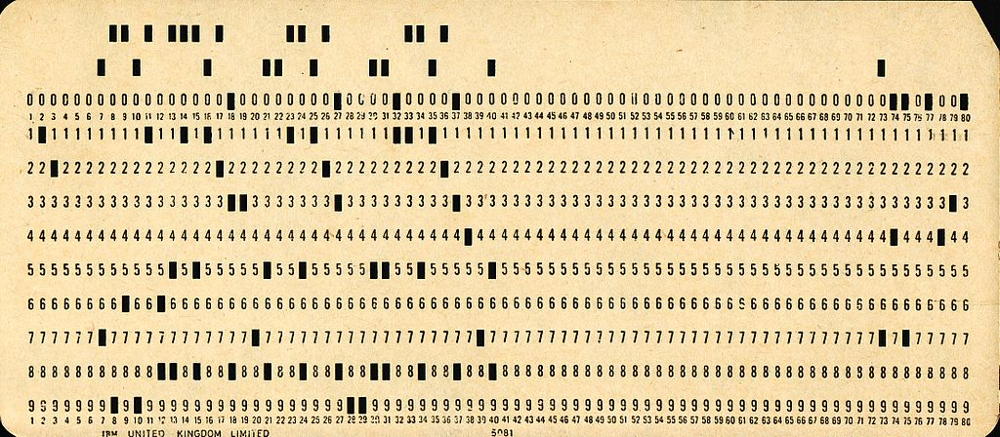
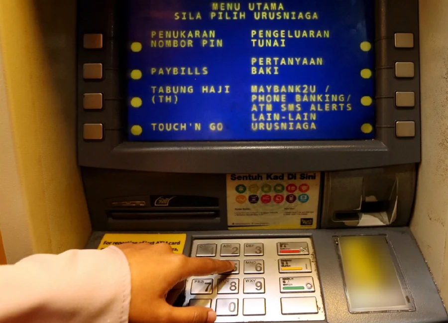
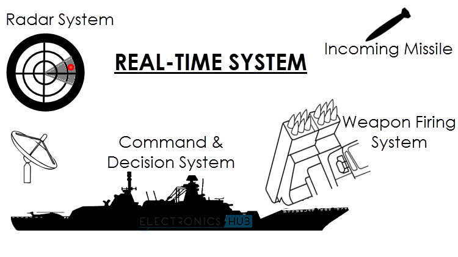
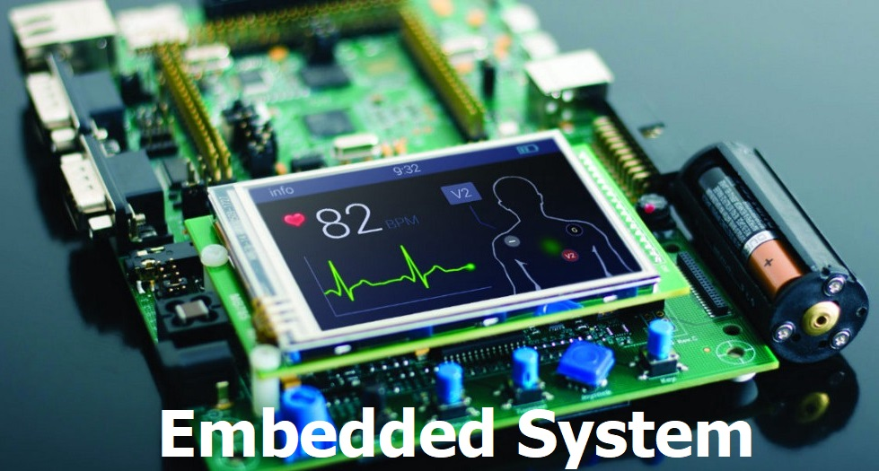

# C1 Introduction to Operating System

# Table of Contents
1. [Overview of OS](#overview-of-os)
    - [What is OS](#what-is-os)
    - [Functions](#functions-of-an-os)
2. [Computer System Components](#computer-system-components)
3. [Characteristics of OS](#characteristics-of-an-os)
4. [Essential Managers of OS](#essential-managers-of-os)
    - [General task handled by each managers](#task-performed-by-each-managers-applies-to-all-managers)
    - [Processor Manager](#processor-manager)
    - [Memory Manager](#memory-manager)
    - [Device Manager](#device-manager)
    - [File Manager](#file-manager)
5. [Categories of OS](#characteristics-of-an-os)
    - [Batch Systems](#batch-systems)
    - [Interactive Systems](#interactive-systems)
    - [Real Time Systems](#real-time-systems)
    - [Hybrid Systems](#hybrid-systems)
    - [Embedded Systems](#embedded-systems)
6. [Examples of OS](#examples-of-os)

# Overview of OS

### What is OS?
> A program that acts as an intemediary between the **user** of a computer and the computer's **hardware**
- From the **user** point of view
    - OS should have a GUI (Graphical User Interface)
    - Easy to use but waste CPU cycles
- From the **system** point of view
    - OS should be command based
    - Harder to use but saves CPU cycles and memory

### Functions of an OS
- Makes the computer system easy to use
    - GUI
- Allocate resources
    - Allocate CPU cycles and memory to the program
- Use the computer hardware in an efficient matter
- Controls execution of user programs and I/O (Input/Output) operations
    - Program execution
    - Error Detection
- I/O operations
- File System Manipulation
- Error Detection
- Controls 
    - every file
    - every device
    - every section of the Memory Module
    - every moment of processing time
    - who uses the computer and how

# Computer System Components

### Hardware
> Provides basic computer resouces (CPU, RAM, I/O devices)

### Operating System
> Controls and coordinates the use of computer hardware for various applications for different users

### Application program
> Defines how the computer hardware are used to solve computing problems of the user (Games, Compilers etc)

### Users
> Includes peoples, machines and other computers

# Characteristics of an OS

### Concurrency
- To ensure that two or more processes/applications can run at the same time

> I am quoting this from the speaker's notes of the lecture notes
> > Concurrency addresses the objective of CPU Utilisation. Although this is not a major objective in the design of the to days single-user operating  systems on PC and Workstation platforms, they still are of major importance on General Purpose Operating Systems such as Client –Server Environments, Servers, Real-time Systems such as FIS1 and TPS1 , Multi-access, etc.  In a Concurrent environment, the number of Competing Processes  is always more than the number of the Processors available. Therefore a Single  Processor is Switched among the Competing Runnable 1Processes and each is given a short interval of time called  Time Slice  “TS” or Quantum Run Time “QRT”  to hold the CPU Control and RUN. These time slices are so small that are not sensible by human user. The Switching is in order of 10s of thousands per second and time interval (QRT or TS) is usually a fraction of a second. Because they are switched so fast and in such a sort time, they appear to the end user (who observes their effects in a much longer time interval), that all are running in parallel at the same time. But because there is only one processor, the processes can only  run one-at-a-time.

### Sharing
- To ensure different user can share the same resource (memory, CPU, I/O devices etc)

### Long term storage
- To ensure the files and programs can be stored permanently

### Non-determinacy
- Able to respond to events that are unpredicted

# Essential managers of OS

### Task performed by each managers (applies to ALL managers)
- Monitor it's resources
- Enforce the policies that **who** gets **what**, **when** and **how much**
- Allocate the resources when appropriate
- Deallocate the resources when stuffs are no longer needed (to reclaim it)

### Non-networked OS
- Processor manager
- Device Manager
- File Manager
- Memory Manager
- User Interface

### Networked OS
- Processor manager
- Device Manager
- File Manager
- Memory Manager
- Network Manager

### Processor manager
- Allocate CPU time
- Keep tracks of process status
    - Waiting
    - Running
- Sets up neccessary registers and tables
- Reclaims the processor when job is finished or the time for the job has finished
- Responsibilities
    - Accepts or Rejects the incoming jobs (handled by the job scheduler)
    - Decides which process gets the CPU and how long (handled by the process scheduler)

### Memory manager
- Checks validity of each request for memory space
- If it is a legal request, allocates a portion of memory that isn't in use
- Sets up a table to keep track of who is using which section of memory
- Deallocates memory blocks once the program completes execution
- Protects OS memory space so that it cannot be altered by other programs

### Device manager
- Monitors every device, channel and control unit
- Allocate in the most efficient manner for all of the system's devices based on a scheduling policy chosen by the system's designers
- Deallocate the devices when the job done
- Start the operation of devices

### File Manager
- Keep track of each file in the system
- Allocate resources (opening files)
- Deallocate resources (closing files)
- Uses access policies to enforce who has access to the files
    - Examples:
        - Restrictions:
            - System only
            - User only
            - Group only
            - general access
        - User Restriction:
            - Read only
            - Write only
            - Allowed to create/delete file

# Categories of OS
- [Batch Systems](#batch-systems)
- [Interactive Systems](#interactive-systems)
- [Real Time Systems](#real-time-systems)
- [Hybrid Systems](#hybrid-systems)
- [Embedded Systems](#embedded-systems)

### Batch Systems

- Jobs processed serially without needing user interaction
- Efficiency measured in throughput (the number of jobs finished in a given time)
- Do similar jobs
- Unable to process jobs parallely
- Used for preparation of a weekly payroll
    - Time cards are collected
    - Data entered and processed
    - Paychecks and reports are then printed
- Best for repeating tasks

[Back To Categories of OS](#categories-of-os)

### Interactive Systems

- User interacts directly with the OS with the commands entered from the keyboard
- OS provides immediate feedback to the user
- Response time can be measured in fractions of a second
- User friendly
- Used for ATMS or information kiosks
    - ATMs
        - Provides cash and transaction details almost immediately to it's users when commands are entered
- Best used for interactive environments

[Back To Categories of OS](#categories-of-os)

### Real Time Systems

- Extremely fast response time
- Minimal delay or no delay at all
- Have strict deadline, if it can't finish a job on time, loss will incur
- Used for time critical operations like 
    - Stocks monitoring/trading
    - Missle System

[Back To Categories of OS](#categories-of-os)

### Hybrid Systems
- Low demand times
- Can support most of the CPU architectures in the market
- Can be used in wide variety of devices
- Can take advantage of the free time between high demand usage and low demand times
- Most laptop or desktop operating systems like Windows is hybrid system

[Back To Categories of OS](#categories-of-os)

### Embedded Systems

- Computers placed inside other products to add features and capabilities
- High stability
- Mostly used in electrical appliances

[Back To Categories of OS](#categories-of-os)

# Examples of OS

### Windows
- Widely used in the PC arena
- Provided by Microsoft in various versions

### Mac OS
- Provided by Apple
- Used in Macs and Solaris (Used to be developed by Sun Microsystems, now owned by Oracle)

### Linux
- Developed by Linus Torvalds as a toy project
- Originally developed by computer enthusiasts noncommercially
- Now available through many commercial sources including IBM (International Business Machines)

### Unix
- Popular choice for larger computer systems as well as PCs
