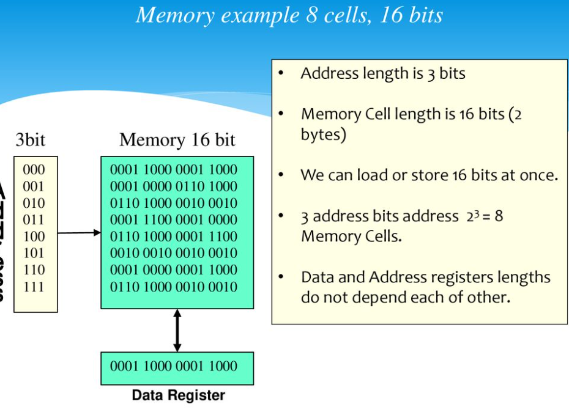

# C2 Basic Elements of an Operating System

# Table Of Contents
1. [Basic Unit of Data Representation](#basic-unit-of-data-representation)
2. [Memory](#memory)
    - [Memory Address](#memory-address)
    - [Memory Operations](#operations-of-memory)
    - [Data Transfers](#data-transfers)
    - [Fetch](#fetch)
    - [Store](#store)
    - [Cache Memory](#cache-memory)
3. [Processor](#processor)
    - [Components](#components-of-a-processor)
4. [Input/Output](#inputoutput-io)
5. [Memory Capacity & Processor Speed](#memory-capacity--processor-speed)
    - [Processor Speed](#processor-speed)
    - [Memory Capacity](#memory-capacity)

# Basic unit of Data Representation
- **Bits** grouped together to form **bytes**, which are then grouped together to form **words**
- Bits
    - Representation of computer information, which is encoded in 0s and 1s
    - Just a symbol whose meaning depends on the current application
        - Somtimes patterns of bits can be numeric values
        - Sometimes alphabet characters
        - Sometimes punctuations
        - Sometimes images
        - Sometimes sounds
- Computer memory is organized in a managable unit called **cells** each **cells** are typically 8 bits, so each cells typically has the capacity of 1 byte (8 bits = 1 byte)
- 2 bytes = 1 word

# Memory
- Holds active programs and data
- A program must be stored in memory before it runs
- Data must be stored in memory before the computer can manipulate them
- Memory **Write** -> ***destructive***
- Memory **Read** -> ***not destructive***
- Based on the computer, bytes or words can be the basic addressable units of memory

### Memory Address
- Consists of a number of locations (cells)
- Each location has a number called address (mostly is an unsigned integer (but in programming it's of the "pointer" type which points to the memory address of the variable (some languages (rust, go, C/C++) have this feature, most not)))
- Used to retrieve the data / programs at that memory location
- If a memory has **n** locations (cells), they will have the addresses 0 up to n-1
- All locations have the same number of bits
- Some data items require more than one cell
    - Like an **int** data type -> 4 cells (bytes)
- If a location has **k** bits, it can hold any one of 4 (if k = 4) different bit combinations
    - **k** bits = 2<sup>k</sup> combinations
- An address used to reference the memory need at least 4 bits to express all the numbers from 0 up to 11
- ***Storage Capacity***
    - B (byte) -> 2<sup>3</sup> bits -> 8 bits
    - Kb (Kilo bits) -> 2<sup>10</sup> bits -> 1024 bits
    - Mb (Mega bits) -> 2<sup>20</sup> bits -> 1,048,576 bits
    - Gb (Giga bits) -> 2<sup>30</sup> bits -> 1,073,741,824 bits
    - 1KB (Kilo Byte) = 8Kb (Kilo Bit) (same goes to MB->Mb, GB->Gb)
- 
    - From this picture, we can identify that:
        - Memory address length is 3bit (that means we can go from 0 to 7)
        - Memory Cell Length is 16bits
        - The number of cells of memory is 8

### Operations of Memory
- MAR + MDR -> interface between CPU and memory
- MAR (Memory Address Register)
    - Connected to the address bus
    - Contain the RAM address for the instruction that the CPU needs for the next read/write (fetch/store) operations
    - Address Decoder is needed to decode the address in MAR
- MDR (Memory Data Register)
    - Connected to data bus
    - Holds the data needed to be written to the RAM or has been read from the RAM
- ***Decoding the address in MAR***
    - Put simply, binary address is stored in MAR
    - The job is to convert the binary address into base 10
    - Or the chim way: memory unit translates the N-bit address stored in the MAR into the set of signals needed to access that one specific memory cell

### Data Transfers
- Instructions
    - FETCH: to read the content of a memory location
    - STORE: to write a value to a memory location
- Special Registers
    - MAR: Contains the address of the memory location
    - MDR: Contains the data to be written to / read from the memory
- Decoders are used to select individual cells
    - FETCH/STORE decoder

### Fetch
```go
/// please don't mind the coding style and logic im just writing the steps for the operation in pseudocode (in go smh)
/// Copies the contents at memory location `a` into the MDR, and it can then be read and used in a program
func Fetch(a Addr) {
    marObj := MAR.Load(a)  // load address into MAR
    address := marObj.Decode()  // decode the address
    cell := SelCel(address)  // selects the cell with the decoded address
    MDR.Copy(cell.GetData())  // copy the content retrieved into MDR
}
```

### Store
```go
/// please don't mind the coding style and logic im just writing the steps for the operation in pseudocode (in go smh)
/// Stores the given data `d` into the memory location `a`
func Store(a Addr, d Data) {
    marObj := MAR.Load(a)  // load address into MAR
    MDR.Copy(d)  // copy the data into MDR
    address := marObj.Decode()  // decode the address
    cell := SelCel(address)  // selects the cell with the decoded address
    cell.SetData(MDR.GetContent())  // gets the stored content from MDR and store it on the selected cell
}
```

### Cache Memory
- Quickly accessible memory that stores a copy of the frequently used data in an easily accessible memory area instead of the main memory
- Memory access is slow when compared to processing time
- Fast memory is too expensive to be used for all the memory cells

# Processor
- Manipulates data stored in memory under the control of a program that is also stored in memory
- A program is just a series of instructions
- Each instruction has an operation code and one or more operands
- Example of instruction
    - ADD 100, 104
    - ADD is the operation code
    - 100 and 104 are the operands
- #### Components of a processor
    - ALU
        - Arithmetic Logic Unit
        - Performs calculations and comparisons
    - CU
        - Control Unit
        - Performs fetch/execute cycle
        - Moves data to and from CPU registers and other hardware components
        - Accesses program instructions and issue commands to the ALU
        - Subparts
            - Memory Management Unit
                - Supervises fetching instructions and data
            - I/O Interface
                - Combined with memory management unit into Bus Interface Unit
    - Registers
        - Example
            - Program Counter (PC)
            - Instruction Pointer
                - Determines next instruction for execution
    - Buses
        - Wire connecting up different parts of CPU and CPU to other components

# Input/Output (I/O)
- Application programs issue logical requests to start input or to start output
- #### IOCS (Input/Output Control System)
    - Communicates directly with the computer's peripheral devices (mouse, keyboard, mic etc)
- The IOCS accepts these logical I/O requests and generates the *primitive commands* (commands that are understood by the hardwares) needed to physically control the peripheral devices
- Logical I/O
    - Programmer's view logical record
- Physical I/O
    - Transfer of a physical record between memory and a peripheral device
- *Offtopic*: Command Processor
    - Accepts, interprets and carry out commands

# Memory Capacity & Processor Speed
- On most systems, the internal components are designed around a common word size
- On a 32 bit computer, 
    - The processor manipulates the 32 bit numbers
    - Memory and register store 32 bit words
    - Data and instruction moves move between the components over a 32 bit bus
- A computer's word size affects
    - Processing speed
    - Memory Capacity
    - Precision
    - Instruction set size
    - Cost

### Processor Speed
- A 32 bit bus contains 32 wires and thus can only carry 32 bits at one time
- A 16 bit bus has only 16 wires and can only carry 16bits at one time
- A 32 bit bus moves twice amount of data at the same time when compared with a 16 bit bus, the 32 bit machine is clearly faster
- The bigger the word size, the faster the computer is

### Memory Capacity
- To access memory, the processor must transmit over a bus the address of the desired instruction or data element
- A 32 bit address (approximately 4 billion in decimal terms) can be transmitted on a 32 bit machine
- A 16 bit address (about 64,000) can be transmitted on a 16 bit machine
- The bigger the word size, the more memory a computer can address
