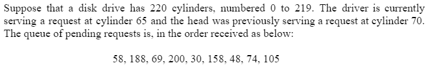
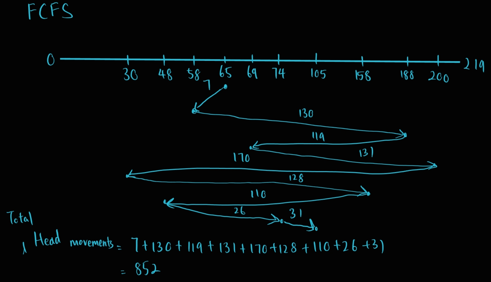
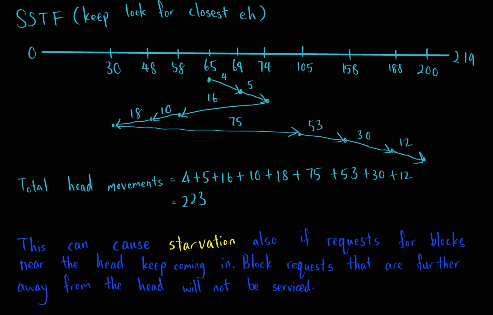
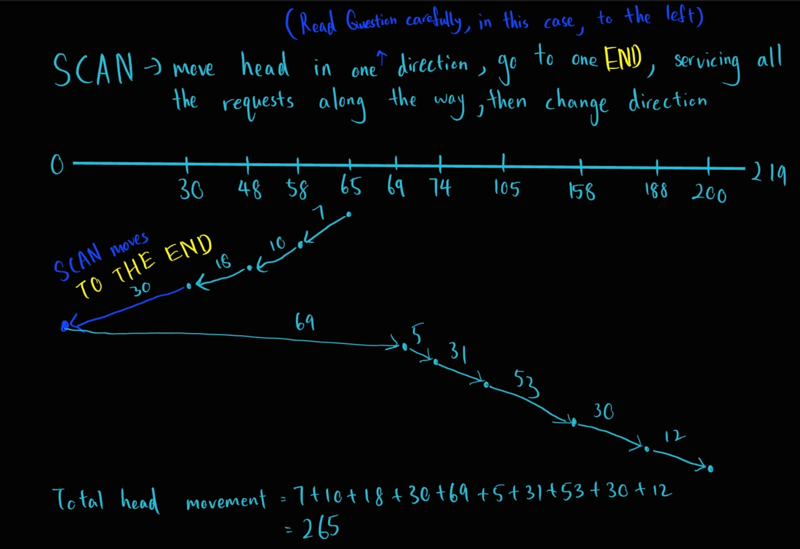
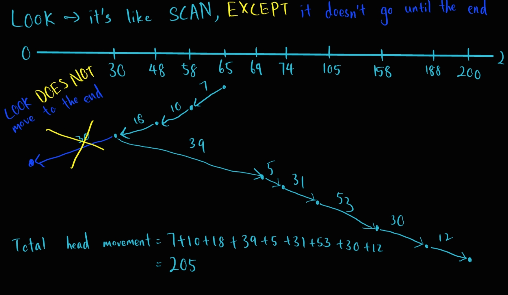
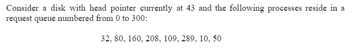
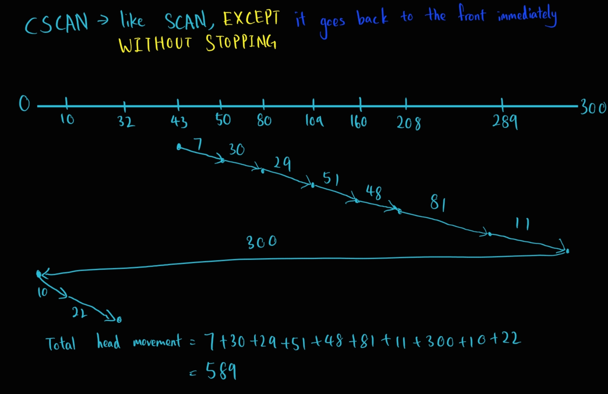

# C4 Device Management

# Table Of Contents
1. [Device Management Functions](#device-management-functions)
2. [System Devices](#system-devices)
    - [Dedicated devices](#dedicated-devices)
    - [Shared Devices](#shared-devices)
3. [Sequential Storage Access Media](#sequential-access-storage-media)
4. [Direct Storage Access Devices (DASD)](#direct-random-access-storage-devices)
    - DASD with [Fixed READ/WRITE head](#fixed-head-disks)
    - DASD with [Movable READ/WRITE head](#movable-head-drums-and-disks)
5. [Factors Influencing Access To A File](#factors-influencing-time-required-to-access-a-file)
    - [Seek Time](#seek-time)
    - [Search Time](#search-time)
    - [Transfer Time](#transfer-time)
6. [Device Handler Scheduling Strategies](#device-handler-seek-strategies)
    - [FCFS](#first-come-first-serve-fcfs)
    - [SSTF](#shortest-seek-time-first-sstf)
    - [SCAN](#scan)
    - [CSCAN](#cscan)
    - [LOOK](#look)
7. [Communication Among Devices](#communication-among-devices)
8. [I/O Operation Techniques](#io-operation-techniques)
    - [Polling](#polling)
    - [Interrupt](#interrupt)
    - [Direct Memory Access (DMA)](#direct-memory-access-dma)

# Device Management Functions
- Track usage and status of the devices
- Allocate devices to the processes
- Deallocate the devices when not used
    - When I/O commands are executed and the device is temporarily released (process level)
    - When the process finishes and the device is permanently released
- Use **preset policies** to determine which process gets access to the device for how long

# System Devices

### Differences among System's peripheral devices
- Functions of the devices
- Characeteristics of the devices
- How well they are managed by the **Device Manager**
- Most Important
    - Speed
    - Degree of sharability

### A system's overall efficiency can be improved by minimizing the variance among the devices

### Dedicated Devices
- Assigned to **ONLY ONE** job at a time
- The job is served as long as it is active
- The device will only be released when the job is done
- Examples
    - Tape drives
    - Printers
    - Plotters
- Disadvantages
    - Well, it can only be allocated to one job at a time
    - It is quite a waste of resource especially when the job can't use 100% of the device

### Shared Devices
- Can be assigned for several different tasks
- Examples
    - Disk
    - Any DASD (Direct Access Storage Device)
- The devices are shared between processes by  **interleaving** their requests
- However, this interleaving must be handled by the device manager carefully
- Conflicts like both process A and process B need access to the same device must be resolved using the predetermined policies, deciding which process gains access to the device first

# Sequential Access Storage Media

### Magnetic tapes
- Used for secondary storage on early computer systems
    - Now used for routine archiving and storing backup data
- Records are stored serially (one after another)
- Each record can be found by its position on the tape
- To access a single record, the tape is mounted and is "fast-forwarded" until the desired location is reached
- Usually has nine tracks
    - Eight for storing data bits
    - Ninth track is for storing parity bit
        - Parity bit -> Used for routine error checking
- Number of data that can be recorded is determined by the density of the tape, or BPI (Bits Per Inch)

### Storing Record on Magnetic Tapes
- Records can be stored individually or by block
- IRG (InterRecord Gap)
    - About 1/2 inch long (no care it separate eh data eh length)
    - Used to separate records to prevent one set overwriting another set
    - Used as a marker for end of data
- IBG (InterBlock Gap)
    - Also about 1/2 inch long
    - Used to separate blocks
    - Usually 10 records in a block

### Blocking
- Performed when the file is created
- The process of grouping records into blocks
- Pros
    - Fewer I/O operation is needed
        - One READ command can move the entire block into the main memory
    - Less tape wasted because the physical size of the records are bigger than the gap size
- Cons
    - Overhead and software routine is requires for blocking, deblocking and record keeping
    - Buffer space will be wasted if you only require one logical record but you still need to read in the whole block

### Magnetic Access Time Vary Widely
- Benchmarks
    - Maximum Access Time: 2.5 min
    - Average Access Time: 1.5 min
    - Sequential Access Time: 3ms
- This variable access time make magnetic tapes a poor medium for secondary storage except files with high sequential activity

# Direct (Random) Access Storage Devices
- Devices that can directly read or write to a specific location on the disk
- Categories
    - DASD with [Fixed READ/WRITE head](#fixed-head-disks)
    - DASD with [Movable READ/WRITE head](#movable-head-drums-and-disks)

### Fixed Head Disks
- Covered with magnetic films that are formatted, usually on both sides, into concentric circles (circles with the same center)
- Each circle is a track
- One head for each track
- Data is recorded serially by the fixed read/write head positioned over it
- Used when speed is very important
- Pros
    - Very **FAST**, faster than those with movable head disks
- Cons
    - High cost
    - Smaller storage space
        - Tracks must be positioned further apart to accomodate the width of the read/write heads

### Movable Head Drums And Disks
- Movable head drums have only a few read/write heads that will move from track to track to cover the entire surface of the drum
- One read/write head floating across the surface of the disk
- Disks can be
    - Individual units -> used with many PCs
    - Part of a Disk Pack -> Part of a stack of disks

# Factors Influencing Time Required to Access a File

### Seek Time
- Slowest among the 3 factors
- Time required to move the head to the correct track

### Search Time
- Rotational delay
- Time it takes to rotate the DASD until the requested data is under the head

### Transfer Time
- Fastest among the 3 factors
- Time that the data are actually being transfered from the DASD into the main memory

### seek time + search time + transfer time = access time

# Device Handler Seek Strategies
- The predetermined policy that the device manager uses to allocate access to a device among the processes that requests access
- Purpose is to minimize the seek time
- Commonly used strategies
    - Do not require to know where the head was previously serving
        - [FCFS](#first-come-first-serve-fcfs)
        - [SSTF](#shortest-seek-time-first-sstf)
    - Need to know where the head was previously serving and the direction the head was moving in
        - [SCAN](#scan)
        - [CSCAN](#cscan)
        - [LOOK](#look)

### Below all examples will be using this:

### First Come First Serve (FCFS)

### Shortest Seek Time First (SSTF)

### SCAN

### LOOK

### CSCAN
- CSCAN deserves a different example because the head always only move in one direction, it will directly go back to the first block after reaching the end
- CSCAN almost only serves in the (to the right) direction

# I/O Subsystem

### I/O Subsystem: I/O Channel
- Keeps up with I/O requests from the CPU and pass them down to the I/O Control Units
- Synchronizes the high speed of the CPU with the slow speed of the I/O devices
- Make it possible to overlap I/O operations and processor operations so that CPU and I/O can process concurrently
- Uses **Channel program** to specify the actions to be performed by devices and control data transfer between main memory and control units

### I/O Subsystem: I/O Control Unit
- Interprets the signal sent by the I/O Channel
    - One signal is for one function

### I/O Command Informations
- At start of the I/O command, informations are passed from CPU to channel
    - The command (READ/WRITE/REWIND etc)
    - Channel number
    - Address of physical record to be tranfered (from or to secondary storage)
    - Starting address of a memory buffer for which the data to be read is located or to where the data has to be written

# Communication Among Devices

### Device Manager MUST:
- Know which device is free or busy
    - Solved by **structuring interaction** between units
- Accommodate the incoming requests during heavy I/O traffic times
    - Solved by **Queueing requests**
- Accommodate disparity of speed between the CPU and I/O devices
    - Solved by **Buffering records**

### Hardware Flags
- Used to communicate when a device has finished its operation
- Made up of **3 bits**
    - One for Channel
    - One for Control Unit
    - One for Device
- Each bit is switched on/off to indicate status
    - Changed from 0 to 1 to indicate the device is busy
- Lives in the CSW (Channel Status Word)
    - Channel Status Word
        - A predefined location in memory
        - Contains info about channel status

# I/O Operation Techniques
- [Polling](#polling)
- [Interrupt](#interrupt)
- [Direct Memory Access (DMA)](#direct-memory-access-dma)

### Polling
- Use special machine instruction to test the flag
    - Periodically tests the channel status bit in the CSW
- If polling is used too frequently, CPU waste time to test the flag just to find out that the channel is busy
- If polling is done too seldom, the channel is not utilized fully and can be idle for long periods of time

### Interrupt
- More efficient way to test flag
    - Processor no need to wait long periods of time for the I/O modules
    - Processor don't need to check for the flag frequently
- Every machine instruction executed by the CPU will trigger to test flag
- If channel is busy flag set, the current sequence of instruction will be automatically interrupted
- The control is transferred to the interrupt handler, which lives in a predefined location in the main memory
- NOT suitable for reading sales transaction
    - Every transfer of the data will trigger interrupt
    - Processor time wasted on I/O events
    - Processor time is not used to execute the processes

### Direct Memory Access (DMA)
- A technique that allows a control unit to access the main memory **directly**
- Once reading or writing begins, the transfer of the data to and from main memory can be done without CPU intervention
- To achieve this, the CPU sends enough data to the control unit to initiate transfer of data
- CPU can go to other task while the control unit transfers the data independently
- Once transfer of data ended, an interrupt signal will be sent to the CPU telling it has done its job
- To initiate a DMA, device driver sets up the DMA channel's address and **count registers** together with the direction of the data transfer (read or write)
    - Count registers -> contains the number of bytes to be transferred by the DMA, will be decremented for every byte transferred
