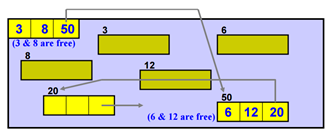
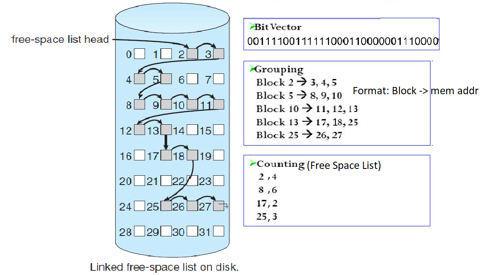

# C5 File Management

# File Manager
> Controls every file in a system

### Efficiency Depends on:
- How system's files are organized (Sequential/Direct/Indexed Sequential)
- How files are stored (Contiguous/Non-contiguous/Indexed file storage allocation)
- How files are structured (fixed-length/variable length)
- How the files should be accessed (permissions)

### Responsibilities
- Track where each files are stored
- Determine where the file will be stored and how it will be stored
    - Tied to efficiency
        - Use available storage space efficiently
        - Provide efficient access to a file
- Allocate a file when the user has opened it, and record its use
- Deallocate a file when the user closed the file, and the file is returned to the storage
- Communicate the file's availability with other programs that request the file access and are waiting for the file to be available
- (kaki think eh notes dh) Track which permissions a file has

# Important Definitions ~~AKA Chim Words~~
- [Field](#field)
- [Record](#record)
- [File (Flat File)](#file-flat-file)
- [Database](#database)
- [Program Files](#program-files)
- [Data Files](#data-files)
- [Directory](#directory)

### Field
- A group of related bytes that can be identified by the user with name, type and size

### Record
- A group of related field together

### File (Flat File)
- A group of related record together that can be used by some softwares to generate reports

### Database
- Group of related files that are interconnected to give flexible access to users
- Appears to the file manager a type of a file

### Program Files
- Files that contains executable codes or instructions that can be runned

### Data Files
- Files that are only used to store data

### Directory
- Can think of a folder
- Contains a list of the program and data files, with their file name and attributes

### Every piece of computer software **IS** a file
### File manager treats all the files exactly the same, as far as storage is concerned, the usage of the file depends on the operating system

# Interacting With File Manager
- [Embedded Commands (Programs)](#embedded-commands)
- [Interactive Commands (User)](#interactive-commands)
- [Device Independence](#device-independence)

### Embedded Commands
- Issued by programs
- OPEN & CLOSE
    - Gives information of the accessibility of the file to the program invoking it
- READ & WRITE
    - I/O commands (does exactly as it reads)
- MODIFY
    - Special WRITE command that allows the data files to be appended/rewritten with records

### Interactive Commands
- Issued by user
- CREATE & DELETE
    - Deals with the system's knowledge of the file
- SAVE
    - When SAVE is used for the first time, the file is actually created
- OPEN NEW
    - When used within a program, implies that a file MUST be created
- OPEN ... FOR OUTPUT
    - Creates file by 
        - Making space for it in the directory
        - Finding space for it in the secondary storage
- RENAME
    - Allow user to change the file name of an existing file name
- COPY
    - Allow user to duplicate an existing file

### Device Independence
- Interface commands are designed to be device independent and easy to use
    - They do not need to have knowledge about low level stuffs like the physical memory address (cylinders, surface, sectors)
    - They do not need to have knowledge about the device medium (tape, disk, drive etc.)
    - They do not require knowledge about network
- Every logical command can be broken down into a sequence low level signals that
    - Triggers step by step actions performed by a device
    - Supervise progress of operation by testing the device's status
- Eg. READ command
    - MOVE read/write head to the cylinder
    - WAIT for search time (rotation delay)
    - Activate the appropriate head, READ the record
    - Send a flag indicating the device is free for processing another request

# Physical File Organization
- On magnetic disks, files can be organized as
    - [Sequential](#sequential-record-organization)
    - [Direct](#direct-record-organization)
    - [Indexed Sequential](#indexed-sequential-record-organization)
- Characteristics to be in mind when choosing a physical file organization method
    - Volatility of data
        - Number or addition and deletion to a file
    - Activity of file
        - Percentage of records that are being processed in each run
    - Size of file
    - Response time
        - The waiting time the user are willing to wait before the request is done

### Sequential Record Organization
- Easiest to implement
    - Files are stored and retrieved serially (or sequentially), one after another
- Files need to be searched from the beginning until it is found
- Some optimizations may be built in to the system
    - Select key fields from the records and sort them before storing
    - Original order must be preserved everytime the record is rewritten
- Mostly used in batch applications

### Direct Record Organization
- Uses direct access files
    - Only can be implemented on DASDs
- Gives flexibility to access any records on any order
- Record search do not need to be done from the beginning of the file
- Records are identified by their relative addresses
- [Logical Address](#logical-address-physical-address-and-mmu) are computed everytime when a record is stored and computed again when retrieved
- User will identify a field to be used as the key field
- The program that is used to store the data will run a hashing algorithm to generate the record's logical address (ususally a number) based on the key field selected by the user
- The logical address will be passed to the file manager to determine it's [Physical Address](#logical-address-physical-address-and-mmu), preserving the file organization
- Advantages
    - Fast record access
    - Still able to access the files sequentially by starting at the beginning and increment the logical address for the next record
    - Updating records are faster than sequential access
    - No preservation of order
        - Adding, Deleting stuffs are quick
- Disadvantages
    - Hashing Algorithm Collision
        - There are chances that the hashing algorithm will generate tiok the same logical address, causing two records attempt to insert into the same location
        - Colliding records will be stored in the **overflow** area using links
        - When there are too many records in the overflow area, maximum file size is established and created
        - File manager handles the physical allocation of the spaces
        - Programmers must rewrite and reorganize the files

### Logical Address, Physical Address and MMU
- Logical Address
    - Address generated by the CPU
    - Known as virtual address
        - This address doesn't really exist physically
    - Used as a reference by the CPU to access the physical address
- Physical Address
    - Represents the physical location (the actual memory address) of the required data in the main memory, or RAM
    - The memory address represents the real location of the data inside the RAM
    - Computed by the MMU
- Memory Management Unit (MMU)
    - A hardware device
    - Used to translate logical address into physical address and vice versa
    - Limit Register
        - Contains the range of logical addresses
        - Logical Address cannot be bigger than the value in the Limit Register
    - Relocation Register
        - Contains the smallest value of the Physical Address
        - Logical Address + value in the Relocation Register = physical address
    - Used to protect process from 
        - Accessing each other's memory
        - Changing operating system's code and data

### Indexed Sequential Record Organization
> ***TL;DR*** Sequential + Direct Access
- Index Sequential Access Method (ISAM)
    - Creates computer files of data
    - Maintains computer files of data
    - Manipulates computer files of data
    - Allow the records to be accessed
        - Sequentially (one by one)
        - Random Access (Direct Access)
            - With the help of one or more keys
    - No hashing algorithm, no collision will happen
- Divides ordered sequential into blocks of equal size
- Generates a index file
    - The location of the record can be determined by referring to it's index in the index file
    - Each entry of the index file is called **Index** 
        - Index is made up of
            - Key
                - Key in which the record is identified
            - Address
                - The physical data block location of the record
- Search Index file
    - Able to help locate the index and the records faster
- Overflow area
    - Handles the new records
    - Every record in the main file will have a hidden pointer to the overflow file (used when needed)

# Physical Storage Allocation
- File manager works with files as
    - Whole units
    - Logical unit such as **records**
        - Records must have same format
        - Length may vary for the records
- Application Programs will be responsible for managing the structure of the records
- ***File Storage*** -> *Record Storage*
- Three main Physical Storage Allocation
    - [Contiguous](#contiguous-storage)
    - [Linked Allocation](#linked-allocation-storage)
    - [Indexed](#indexed-storage)

### Contiguous Storage
- Records are stored sequentially, one after another (separated by free spaces)
- Advantages
    - The length of the record will be known once the starting address of the record is found
    - Easy Direct Access
- Disadvantages
    - Difficult file expansion
    - Difficult to make room for new records
    - Fragmentation (Waste space)
        - External Fragmentation
            - When free memories are split into small fragments of free memory that cannot be used to store new data
        - Internal Fragementation
            - When the computer allocates too many space for a single record that does not need that much space (abit diff with his notes eh, but according to [wikipedia](https://en.wikipedia.org/wiki/Fragmentation_(computing)#Internal_fragmentation), it is this)
            - Mostly happens because no one can predict how much space will be needed 
- Solution to the disadvantages: Compaction
- Compaction [[Read More](https://www.geeksforgeeks.org/compaction-in-operating-system/)]:
    - Move all the used space to the front of the memory
    - Move all the free space to the other end of the memory

### Linked Allocation Storage
- Records are stored randomly across available spaces, with pointer pointing to the next record
- Records are stored in contiguous manner (IF there is enough space)
- Advantages
    - Eliminates fragmentation
    - Eliminates the need of compaction
    - Good for sequential access
- Disadvantages
    - Bad for direct access
        - The next record can only be read by getting the pointer from the current record, hence there is no way to know the exact location of the record without going though the records one by one

### Indexed Storage
- Allows direct record access
    - It brings pointers together
        - Groups **extent** files into an index block
            - Extent: A disk section
- Each file will have its own index block, which contains
    - Disk sector address (extent) for the file
    - Sectors linked will be listed in the entry
- Supports both sequential access and direct access
    - Again, you can just go to the first record in the index block, and go one by one to the next record to access the records sequentially
- Don't neccessary improve the memory use
    - Additional memory will need to be used to store the index block
- Larger files will experience multiple index levels
    - Becuz the index block is not big enough to contain all the index, the last entry of the higher level index block will contain pointer to the next level of the index block (to another index block)

# Free Space Management
- [Bit Vector](#bit-vector)
- [Linked List](#linked-list)
- [Grouping](#grouping)
- [Counting](#counting)

### Bit Vector
```
[
    0, 1, 0, 
    0, 0, 1, 
    1, 1, 0
]
```
- It's like a bit array
- 1 means free
- 0 means occupied
- Advantage
    - Easy to retrieve contiguous free blocks
    - Quicker file search
- Disadvantage
    - Require extra memory to store the bit vector

### Linked List
- Links all the free blocks together, then cache it to the memory
- A free block contains a pointer to the next free block
- Advantage
    - Easy to track the free storages
- Disadvantages
    - Cannot track contiguous space easily
    - Not efficient
        - Additional I/O needed to traverse the linked list

### Grouping
- The first free block is used to store the address of some *n* free blocks
- There are actually *n-1* free blocks to use as the last block of that *n* free blocks will be used to store the address of the next *n* free blocks
- See the below example, the **bright yellow** blocks represent the free blocks used to store the address of the free blocks (the **dimmed yellow** blocks), and the last block of the bright yellow blocks point to another bright yellow block that contains more address of actually free spaces
- 
- Advantage
    - Large number of free blocks can be found quickly

### Counting
- Keeps track of a free space list
- Every entry of the free space list consists of
    - The address of the first free block
    - The number of contiguous free blocks

### Example of Comparison of ALL the Free Space Management Methods

