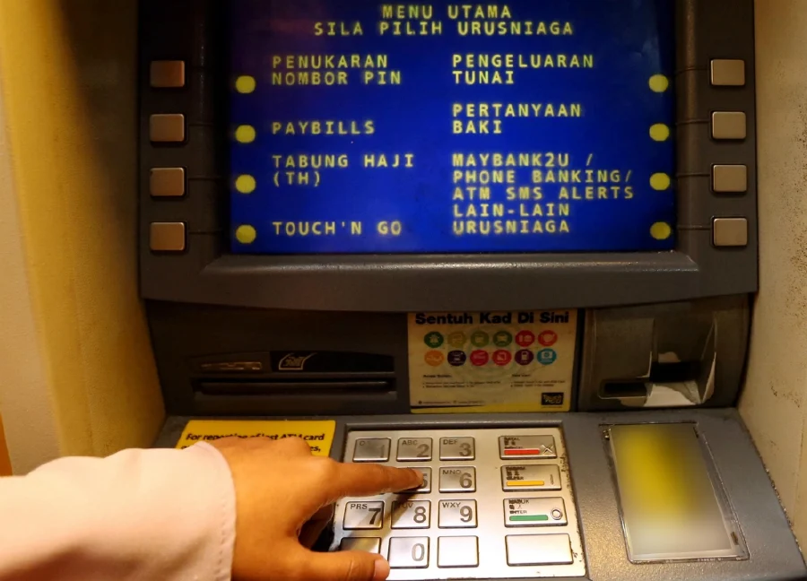
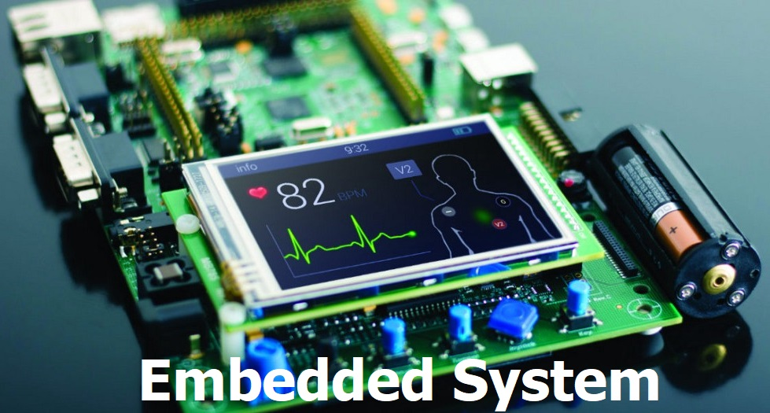
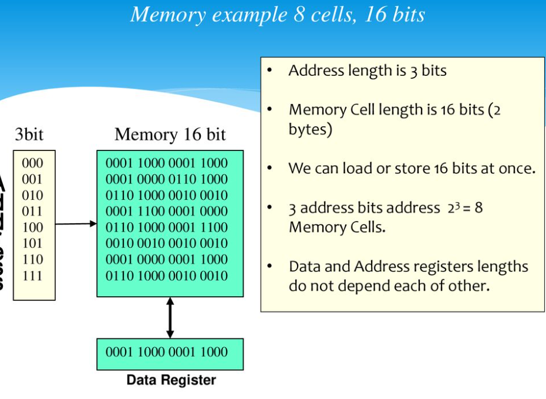
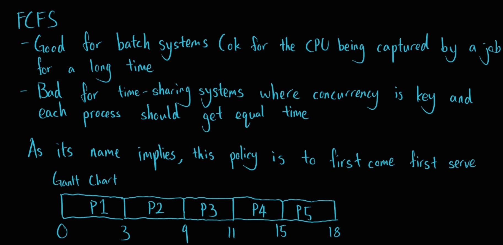
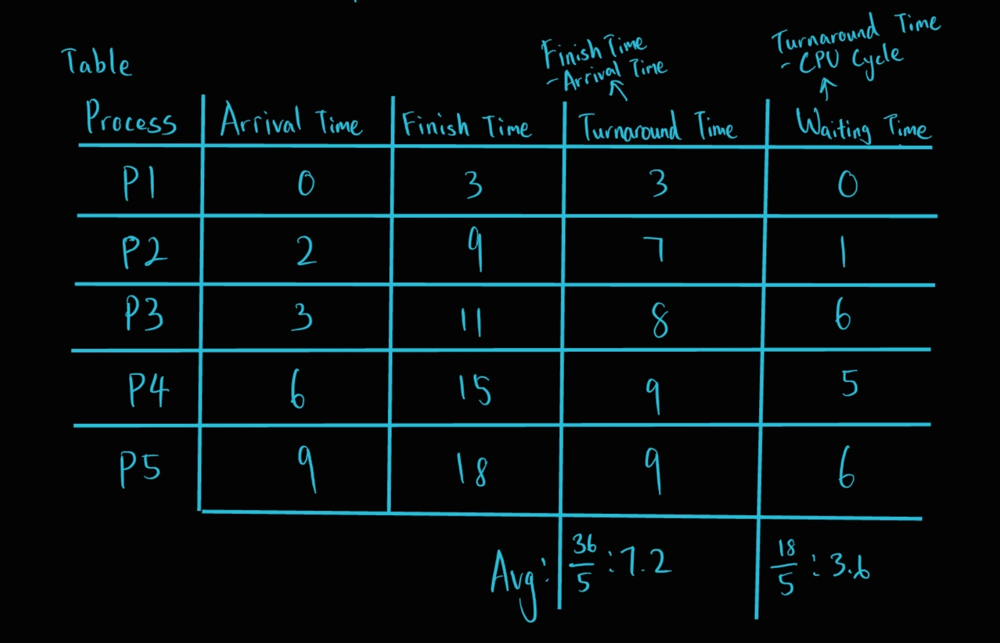
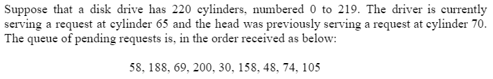
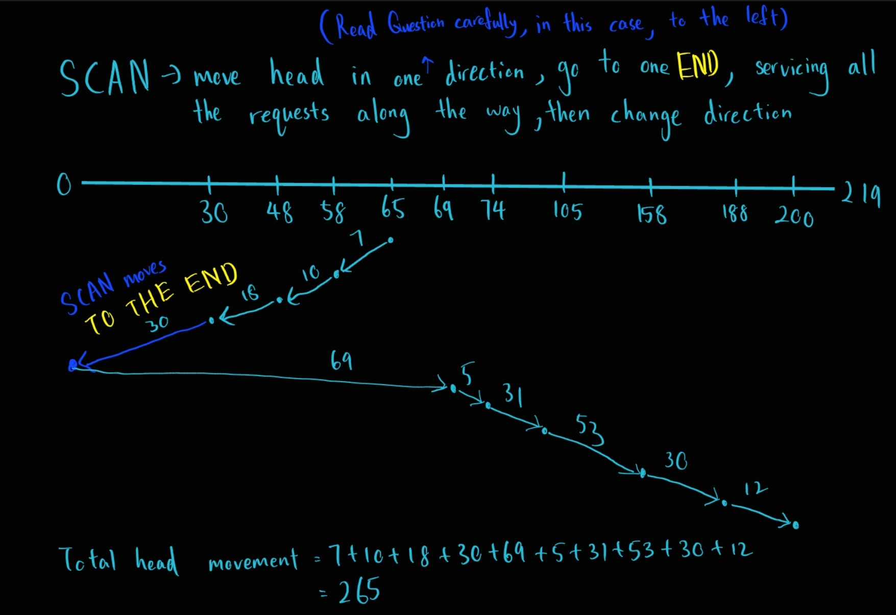
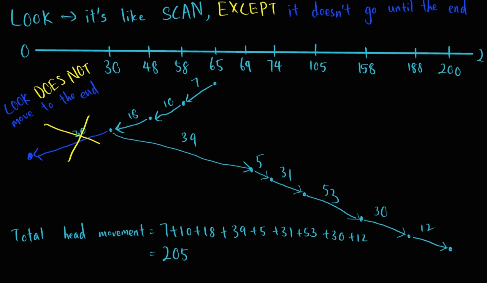

# Intro to Operating System

# Table of Contents
1. [Introduction to Operating System](#c1-introduction-to-operating-system)
2. [Basic Elements of Operating System](#c2-basic-elements-of-an-operating-system)
3. [Processor Management](#c3-processor-management)
4. [Device Management](#c4-device-management)
5. [File Management](#c5-file-management)

# C1 Introduction to Operating System

# Table of Contents
1. [Overview of OS](#overview-of-os)
    - [What is OS](#what-is-os)
    - [Functions](#functions-of-an-os)
2. [Computer System Components](#computer-system-components)
3. [Characteristics of OS](#characteristics-of-an-os)
4. [Essential Managers of OS](#essential-managers-of-os)
    - [General task handled by each managers](#task-performed-by-each-managers-applies-to-all-managers)
    - [Processor Manager](#processor-manager)
    - [Memory Manager](#memory-manager)
    - [Device Manager](#device-manager)
    - [File Manager](#file-manager)
5. [Categories of OS](#characteristics-of-an-os)
    - [Batch Systems](#batch-systems)
    - [Interactive Systems](#interactive-systems)
    - [Real Time Systems](#real-time-systems)
    - [Hybrid Systems](#hybrid-systems)
    - [Embedded Systems](#embedded-systems)
6. [Examples of OS](#examples-of-os)

# Overview of OS

### What is OS?
> A program that acts as an intemediary between the **user** of a computer and the computer's **hardware**
- From the **user** point of view
    - OS should have a GUI (Graphical User Interface)
    - Easy to use but waste CPU cycles
- From the **system** point of view
    - OS should be command based
    - Harder to use but saves CPU cycles and memory

### Functions of an OS
- Makes the computer system easy to use
    - GUI
- Allocate resources
    - Allocate CPU cycles and memory to the program
- Use the computer hardware in an efficient matter
- Controls execution of user programs and I/O (Input/Output) operations
    - Program execution
    - Error Detection
- I/O operations
- File System Manipulation
- Error Detection
- Controls 
    - every file
    - every device
    - every section of the Memory Module
    - every moment of processing time
    - who uses the computer and how

# Computer System Components

### Hardware
> Provides basic computer resouces (CPU, RAM, I/O devices)

### Operating System
> Controls and coordinates the use of computer hardware for various applications for different users

### Application program
> Defines how the computer hardware are used to solve computing problems of the user (Games, Compilers etc)

### Users
> Includes peoples, machines and other computers

# Characteristics of an OS

### Concurrency
- To ensure that two or more processes/applications can run at the same time

> I am quoting this from the speaker's notes of the lecture notes
> > Concurrency addresses the objective of CPU Utilisation. Although this is not a major objective in the design of the to days single-user operating  systems on PC and Workstation platforms, they still are of major importance on General Purpose Operating Systems such as Client –Server Environments, Servers, Real-time Systems such as FIS1 and TPS1 , Multi-access, etc.  In a Concurrent environment, the number of Competing Processes  is always more than the number of the Processors available. Therefore a Single  Processor is Switched among the Competing Runnable 1Processes and each is given a short interval of time called  Time Slice  “TS” or Quantum Run Time “QRT”  to hold the CPU Control and RUN. These time slices are so small that are not sensible by human user. The Switching is in order of 10s of thousands per second and time interval (QRT or TS) is usually a fraction of a second. Because they are switched so fast and in such a sort time, they appear to the end user (who observes their effects in a much longer time interval), that all are running in parallel at the same time. But because there is only one processor, the processes can only  run one-at-a-time.

### Sharing
- To ensure different user can share the same resource (memory, CPU, I/O devices etc)

### Long term storage
- To ensure the files and programs can be stored permanently

### Non-determinacy
- Able to respond to events that are unpredicted

# Essential managers of OS

### Task performed by each managers (applies to ALL managers)
- Monitor it's resources
- Enforce the policies that **who** gets **what**, **when** and **how much**
- Allocate the resources when appropriate
- Deallocate the resources when stuffs are no longer needed (to reclaim it)

### Non-networked OS
- Processor manager
- Device Manager
- File Manager
- Memory Manager
- User Interface

### Networked OS
- Processor manager
- Device Manager
- File Manager
- Memory Manager
- Network Manager

### Processor manager
- Allocate CPU time
- Keep tracks of process status
    - Waiting
    - Running
- Sets up neccessary registers and tables
- Reclaims the processor when job is finished or the time for the job has finished
- Responsibilities
    - Accepts or Rejects the incoming jobs (handled by the job scheduler)
    - Decides which process gets the CPU and how long (handled by the process scheduler)

### Memory manager
- Checks validity of each request for memory space
- If it is a legal request, allocates a portion of memory that isn't in use
- Sets up a table to keep track of who is using which section of memory
- Deallocates memory blocks once the program completes execution
- Protects OS memory space so that it cannot be altered by other programs

### Device manager
- Monitors every device, channel and control unit
- Allocate in the most efficient manner for all of the system's devices based on a scheduling policy chosen by the system's designers
- Deallocate the devices when the job done
- Start the operation of devices

### File Manager
- Keep track of each file in the system
- Allocate resources (opening files)
- Deallocate resources (closing files)
- Uses access policies to enforce who has access to the files
    - Examples:
        - Restrictions:
            - System only
            - User only
            - Group only
            - general access
        - User Restriction:
            - Read only
            - Write only
            - Allowed to create/delete file

# Categories of OS
- [Batch Systems](#batch-systems)
- [Interactive Systems](#interactive-systems)
- [Real Time Systems](#real-time-systems)
- [Hybrid Systems](#hybrid-systems)
- [Embedded Systems](#embedded-systems)

### Batch Systems

- Jobs processed serially without needing user interaction
- Efficiency measured in throughput (the number of jobs finished in a given time)
- Do similar jobs
- Unable to process jobs parallely
- Used for preparation of a weekly payroll
    - Time cards are collected
    - Data entered and processed
    - Paychecks and reports are then printed
- Best for repeating tasks

[Back To Categories of OS](#categories-of-os)

### Interactive Systems

- User interacts directly with the OS with the commands entered from the keyboard
- OS provides immediate feedback to the user
- Response time can be measured in fractions of a second
- User friendly
- Used for ATMS or information kiosks
    - ATMs
        - Provides cash and transaction details almost immediately to it's users when commands are entered
- Best used for interactive environments

[Back To Categories of OS](#categories-of-os)

### Real Time Systems

- Extremely fast response time
- Minimal delay or no delay at all
- Have strict deadline, if it can't finish a job on time, loss will incur
- Used for time critical operations like 
    - Stocks monitoring/trading
    - Missle System

[Back To Categories of OS](#categories-of-os)

### Hybrid Systems
- Low demand times
- Can support most of the CPU architectures in the market
- Can be used in wide variety of devices
- Can take advantage of the free time between high demand usage and low demand times
- Most laptop or desktop operating systems like Windows is hybrid system

[Back To Categories of OS](#categories-of-os)

### Embedded Systems

- Computers placed inside other products to add features and capabilities
- High stability
- Mostly used in electrical appliances

[Back To Categories of OS](#categories-of-os)

# Examples of OS

### Windows
- Widely used in the PC arena
- Provided by Microsoft in various versions

### Mac OS
- Provided by Apple
- Used in Macs and Solaris (Used to be developed by Sun Microsystems, now owned by Oracle)

### Linux
- Developed by Linus Torvalds as a toy project
- Originally developed by computer enthusiasts noncommercially
- Now available through many commercial sources including IBM (International Business Machines)

### Unix
- Popular choice for larger computer systems as well as PCs

# C2 Basic Elements of an Operating System

# Table Of Contents
1. [Basic Unit of Data Representation](#basic-unit-of-data-representation)
2. [Memory](#memory)
    - [Memory Address](#memory-address)
    - [Memory Operations](#operations-of-memory)
    - [Data Transfers](#data-transfers)
    - [Fetch](#fetch)
    - [Store](#store)
    - [Cache Memory](#cache-memory)
3. [Processor](#processor)
    - [Components](#components-of-a-processor)
4. [Input/Output](#inputoutput-io)
5. [Memory Capacity & Processor Speed](#memory-capacity--processor-speed)
    - [Processor Speed](#processor-speed)
    - [Memory Capacity](#memory-capacity)

# Basic unit of Data Representation
- **Bits** grouped together to form **bytes**, which are then grouped together to form **words**
- Bits
    - Representation of computer information, which is encoded in 0s and 1s
    - Just a symbol whose meaning depends on the current application
        - Somtimes patterns of bits can be numeric values
        - Sometimes alphabet characters
        - Sometimes punctuations
        - Sometimes images
        - Sometimes sounds
- Computer memory is organized in a managable unit called **cells** each **cells** are typically 8 bits, so each cells typically has the capacity of 1 byte (8 bits = 1 byte)
- 2 bytes = 1 word

# Memory
- Holds active programs and data
- A program must be stored in memory before it runs
- Data must be stored in memory before the computer can manipulate them
- Memory **Write** -> ***destructive***
- Memory **Read** -> ***not destructive***
- Based on the computer, bytes or words can be the basic addressable units of memory

### Memory Address
- Consists of a number of locations (cells)
- Each location has a number called address (mostly is an unsigned integer (but in programming it's of the "pointer" type which points to the memory address of the variable (some languages (rust, go, C/C++) have this feature, most not)))
- Used to retrieve the data / programs at that memory location
- If a memory has **n** locations (cells), they will have the addresses 0 up to n-1
- All locations have the same number of bits
- Some data items require more than one cell
    - Like an **int** data type -> 4 cells (bytes)
- If a location has **k** bits, it can hold any one of 4 (if k = 4) different bit combinations
    - **k** bits = 2<sup>k</sup> combinations
- An address used to reference the memory need at least 4 bits to express all the numbers from 0 up to 11
- ***Storage Capacity***
    - B (byte) -> 2<sup>3</sup> bits -> 8 bits
    - Kb (Kilo bits) -> 2<sup>10</sup> bits -> 1024 bits
    - Mb (Mega bits) -> 2<sup>20</sup> bits -> 1,048,576 bits
    - Gb (Giga bits) -> 2<sup>30</sup> bits -> 1,073,741,824 bits
    - 1KB (Kilo Byte) = 8Kb (Kilo Bit) (same goes to MB->Mb, GB->Gb)
- 
    - From this picture, we can identify that:
        - Memory address length is 3bit (that means we can go from 0 to 7)
        - Memory Cell Length is 16bits
        - The number of cells of memory is 8

### Operations of Memory
- MAR + MDR -> interface between CPU and memory
- MAR (Memory Address Register)
    - Connected to the address bus
    - Contain the RAM address for the instruction that the CPU needs for the next read/write (fetch/store) operations
    - Address Decoder is needed to decode the address in MAR
- MDR (Memory Data Register)
    - Connected to data bus
    - Holds the data needed to be written to the RAM or has been read from the RAM
- ***Decoding the address in MAR***
    - Put simply, binary address is stored in MAR
    - The job is to convert the binary address into base 10
    - Or the chim way: memory unit translates the N-bit address stored in the MAR into the set of signals needed to access that one specific memory cell

### Data Transfers
- Instructions
    - FETCH: to read the content of a memory location
    - STORE: to write a value to a memory location
- Special Registers
    - MAR: Contains the address of the memory location
    - MDR: Contains the data to be written to / read from the memory
- Decoders are used to select individual cells
    - FETCH/STORE decoder

### Fetch
```go
/// please don't mind the coding style and logic im just writing the steps for the operation in pseudocode (in go smh)
/// Copies the contents at memory location `a` into the MDR, and it can then be read and used in a program
func Fetch(a Addr) {
    marObj := MAR.Load(a)  // load address into MAR
    address := marObj.Decode()  // decode the address
    cell := SelCel(address)  // selects the cell with the decoded address
    MDR.Copy(cell.GetData())  // copy the content retrieved into MDR
}
```

### Store
```go
/// please don't mind the coding style and logic im just writing the steps for the operation in pseudocode (in go smh)
/// Stores the given data `d` into the memory location `a`
func Store(a Addr, d Data) {
    marObj := MAR.Load(a)  // load address into MAR
    MDR.Copy(d)  // copy the data into MDR
    address := marObj.Decode()  // decode the address
    cell := SelCel(address)  // selects the cell with the decoded address
    cell.SetData(MDR.GetContent())  // gets the stored content from MDR and store it on the selected cell
}
```

### Cache Memory
- Quickly accessible memory that stores a copy of the frequently used data in an easily accessible memory area instead of the main memory
- Memory access is slow when compared to processing time
- Fast memory is too expensive to be used for all the memory cells

# Processor
- Manipulates data stored in memory under the control of a program that is also stored in memory
- A program is just a series of instructions
- Each instruction has an operation code and one or more operands
- Example of instruction
    - ADD 100, 104
    - ADD is the operation code
    - 100 and 104 are the operands
- #### Components of a processor
    - ALU
        - Arithmetic Logic Unit
        - Performs calculations and comparisons
    - CU
        - Control Unit
        - Performs fetch/execute cycle
        - Moves data to and from CPU registers and other hardware components
        - Accesses program instructions and issue commands to the ALU
        - Subparts
            - Memory Management Unit
                - Supervises fetching instructions and data
            - I/O Interface
                - Combined with memory management unit into Bus Interface Unit
    - Registers
        - Example
            - Program Counter (PC)
            - Instruction Pointer
                - Determines next instruction for execution
    - Buses
        - Wire connecting up different parts of CPU and CPU to other components

# Input/Output (I/O)
- Application programs issue logical requests to start input or to start output
- #### IOCS (Input/Output Control System)
    - Communicates directly with the computer's peripheral devices (mouse, keyboard, mic etc)
- The IOCS accepts these logical I/O requests and generates the *primitive commands* (commands that are understood by the hardwares) needed to physically control the peripheral devices
- Logical I/O
    - Programmer's view logical record
- Physical I/O
    - Transfer of a physical record between memory and a peripheral device
- *Offtopic*: Command Processor
    - Accepts, interprets and carry out commands

# Memory Capacity & Processor Speed
- On most systems, the internal components are designed around a common word size
- On a 32 bit computer, 
    - The processor manipulates the 32 bit numbers
    - Memory and register store 32 bit words
    - Data and instruction moves move between the components over a 32 bit bus
- A computer's word size affects
    - Processing speed
    - Memory Capacity
    - Precision
    - Instruction set size
    - Cost

### Processor Speed
- A 32 bit bus contains 32 wires and thus can only carry 32 bits at one time
- A 16 bit bus has only 16 wires and can only carry 16bits at one time
- A 32 bit bus moves twice amount of data at the same time when compared with a 16 bit bus, the 32 bit machine is clearly faster
- The bigger the word size, the faster the computer is

### Memory Capacity
- To access memory, the processor must transmit over a bus the address of the desired instruction or data element
- A 32 bit address (approximately 4 billion in decimal terms) can be transmitted on a 32 bit machine
- A 16 bit address (about 64,000) can be transmitted on a 16 bit machine
- The bigger the word size, the more memory a computer can address

# C3 Processor Management

# Table Of Contents
1. [How Processor Manager Works](#how-does-processor-manager-allocate-cpu-to-jobs)
2. [Job Scheduling, Process Scheduling & MISC](#job-scheduling--process-scheduling--misc)
    - [Job Scheduler](#job-scheduler)
    - [Process Scheduler](#process-scheduler)
    - [CPU cycles vs I/O cycles](#cpu-cycles-and-io-cycles)
    - [Middle Level Scheduler](#middle-level-scheduler)
3. [Process State](#process-state)
    - [Job Status](#job-status)
    - [Process Control Block (PCB)](#process-control-block-pcb)
    - [PCB and Queues](#pcb-and-queuing)
    - [Process Scheduling Queues](#process-scheduling-queues)
3. [Interrupt Types](#interrupt-types)
    - [Interrupt Handler](#interrupt-handler)
4. [Process Scheduling Policy](#process-scheduling-policies)
    - [Good Scheduling Policy](#good-scheduling-policy)
    - [Non-preemptive Scheduling Policy](#non-preemptive-scheduling-policy)
    - [Preemptive Scheduling Policy](#preemptive-schedling-policy)
5. [Scheduling Algorithms](#process-scheduling-algorithms)
    - Non-preemptive
        - [First Come First Serve](#first-come-first-serve)
        - [Shortest Job Next](#shortest-job-first)
    - Preemptive
        - [Round Robin](#round-robin)
        - [Shortest Remaining Time First](#shortest-remaining-time-first)
    - Priority Scheduling
        - Can be [preemptive](#preemptive)
        - Can be [non preemptive](#non-preemptive)

# How Does Processor Manager Allocate CPU to Jobs
- Processor Manager performs
    - Job Scheduling
    - Process Scheduling
    - Interrupt Management
- Single user systems
    - Processor busy only when user executing a job
    - Other time is idle
    - Processor management is simple
- Multiprogramming environment
    - Processor must be allocated to each job in a fair and efficient manner
    - Requires scheduling policy (preemptive vs non-preemptive)
    - Requires a scheduling algorithm (FCFS, SRTF etc)
    - Allow execution of more than 1 program, the processor can switch rapidly between them
    - Requires sufficient memory
- Active Multiprogramming
    - Time-sharing (multi tasking) system
    - Allows each program to use a preset slice of each CPU time
    - When time expires, the job is interrupted and another job is allowed to begin
    - More control over interrupts
    - Maximize CPU utilisation
    - Context switching with preemption
- Passive Multiprogramming
    - Allows each program to be serviced in turn
    - One program is serviced after another with an interrupt
    - Ties up CPU time and all other jobs have to wait
    - Without preemptive

# Job Scheduling & Process Scheduling & misc
- Processor Manager has 2 sub-managers
    - Job Scheduler
    - Process Scheduler

### Job Scheduler
- In charge of job scheduling
- High level / long term scheduler
- Selects jobs from a queue of incoming jobs
- Places them in a ready queue (batch(rmb batch system?) or interactive(more I/O operations)), based on each job's characteristics
- Goal: 
    - To put jobs in a sequence that uses all system's resources as fuly as possible
    - Provide a balanced mix of jobs (I/O bound vs processor bound)
    - Tries to keep most system components busy most of time
        - Controls degree of multiprogramming

### Process Scheduler
- In charge of process scheduling
- Low level scheduler / dispatcher
- Assigns the CPU to execute processes of those jobs placed on the ready queue by the job scheduler
- Determines which process will get CPU, when and how long
- Decides when a process should be interrupted
- Determines which queue the process should be moved to during execution
- Recognizes when a process has finished and should be terminated

### CPU Cycles and I/O Cycles
- Process Scheduler uses common trait among most computer programs: alternates between CPU cycles and I/O cycles
- I/O bound jobs
    - Such a printing a series of documents
    - Many brief CPU cycles and long I/O cycles
- CPU bound jobs
    - Such as finding the first 300 prime numbers
    - Have long CPU cycles and shorter I/O cycles

### Middle Level Scheduler
- Also called **swapper**
- Usually found in a highly interactive environment (Time sharing environment)
- Removes active jobs from memory to reduce degree of multiprogramming and allows jobs to be completed faster
- In charge of handling the swapped out processes
- Purpose of swapping
    - Reduce degree of multiprogramming
        - Degree of multiprogramming -> number of processes in the ready queue
    - Improve Mix - jobs completed faster
- Thrashing
    - A problem of swapping
    - Happens when a process is busy swapping pages in and out
    - The page fault rate is high if there is not sufficient physical memory
    - Leads to low CPU utilization

# Process State
- Scheduler dispatch the selected job from the ready queue and send it to the CPU run
- Interrupt is used to force CPU and save PCB(Process Control Block) and put it in ready queue (context switching)

### Job status
- New/Hold: Process is being created
- Ready: Process is waiting to be assigned to a process (waiting for CPU)
- Running: Instructions are executed
- Waiting: The process is waiting for some event to occur (wait for I/O)
- Finish: The process has finished execution

### Process Control Block (PCB)
- Each process in the OS is represented by a PCB repository for information that vary from process to other process
- Contains
    - Process state
    - Program Counter
    - CPU Registers
    - CPU Scheduling Information
    - Memory Management Information
    - Accounting Information
    - I/O Status Information

### PCB and Queuing
- PCB of a job is when Job Scheduler accepts it (PCB is stored in queue)
- The Queues use PCBs to track jobs

### Process Scheduling Queues
- Job Queue
    - Set of all processes in the system
- Ready Queue
    - Set of all processes residing in main memory
    - Generally stored as a linked list with a header node containing pointers to the first and last PCBs
- Device Queue
    - Set of processes waiting for an I/O device
    - Each device has its own device queue

# Interrupt Types
- Page Interrupt (Memory Manager)
    - Accomodate job requests
- Time Quantum
    - Expiration interrupt
- I/O Interrupt
    - Emitted when a READ or WRITE command is issued
    - Have to be emitted as there shouldn't be more than one program opening the same file at once
- Internal Interrupt (synchronous interrupt)
    - Emitted for arithmetic operation or job instruction
- Illegal Arithmetic Operation Interrupt
    - Dividing by zero
    - Bad floating point operation generating an overflow or underflow
- Illegal Job Instruction Interrupt
    - Protected or non-existent storage access attempt
    - Attempts to make system changes
        - Trying to change the size of time quantum

### Interrupt handler
- Controls program
    - Handles interruption event sequence
- Interrupt handler sequence
    - Interrupt type described and stored (passed to user as an error message)
    - Interrupted process state saved (value of the program counter and contents of all registers)
    - Interrupt is processed
        - Non-recoverable interrupt
            - Job processing is terminated
            - Resources allocated to the job are released
            - Error message sent to user
        - Recoverable
            - I/O interrupt: Job moved to the I/O queue
            - Time Quantum Interrupt: Job moved to Ready Queue
            - Processor resumes normal operation

# Process Scheduling Policies
- Three limitations of system must be resolved before operating system can schedule all jobs in a multiprogramming environment
    - Finite number of resources (such as disk drives, printers and tape drivers)
    - Some resources can't be shared once they are allocated (like printers)
    - Some resources require operator intervention (such as tape drives)

### Good Scheduling Policy
- Maximize throughput by running as many jobs as possible in a given amount of time (Batch System)
- Maximize CPU efficiency by keeping CPU busy 100% at all times
- Ensure fairness for all jobs by giving everyone an equal amount of CPU and I/O time
- Minimize response time by quickly turning around interactive requests (Interactive Systems)
- Minimize turnaround time by moving entire jobs in/out of system quickly
- Minimize waiting time by moving jobs out of READY queue as quickly as possible

```
WAITING TIME
= finishTime - arrivalTime - cpuCycle

Turnaround Time
= finishTime - arrivalTime
```

### Preemptive schedling Policy
- Interrupts the processing of a job and transfers the CPU to another job
- Arrival process will interrupt current process
- Algorithms
    - SRT (Shortest Remaining Time First)
    - RR (Round Robin)
    - PS (Priority Scheduling)

### Non-preemptive scheduling policy
- Functions without external interrupts
- Once a job captures the processor and begins execution, it remains RUNNING
- Jobs remain uninterrupted until it issues an I/O request (natural wait) or until it finishes (except for infinite loops)
- Algorithms
    - FCFS (First Come First Served)
    - SJN (Shortest Job Next)

# Process Scheduling Algorithms

### Categories
- Preemptive means jobs can be swapped out halfway and non-preemptive is the other way around
- Non-preemptive
    - [First Come First Serve](#first-come-first-serve)
    - [Shortest Job Next](#shortest-job-first)
- Preemptive
    - [Round Robin](#round-robin)
    - [Shortest Remaining Time First](#shortest-remaining-time-first)
- Priority Scheduling
    - Can be [preemptive](#preemptive)
    - Can be [non preemptive](#non-preemptive)

## All the below algorithms below is based on this example:


### First Come First Serve




### Shortest Job First


### Round Robin


### Shortest Remaining Time First


### Priority Scheduling
- #### Non-preemptive


- #### Preemptive


### Starvation
- Problems with some preemptive algorithms
- Leads to starvation when processes with shorter burst time are kept on added to the queue, other processes with longer burst time might not even get the chance to be ran
    - Shortest Job First
    - Shortest Remaining Time First
- Leads to starvation when processes with higher priority are kept on added to the queue, other processes with lower priority might not even get the chance to be ran
    - Priority Scheduling(Preemptive or Non-preemptive)

# C4 Device Management

# Table Of Contents
1. [Device Management Functions](#device-management-functions)
2. [System Devices](#system-devices)
    - [Dedicated devices](#dedicated-devices)
    - [Shared Devices](#shared-devices)
3. [Sequential Storage Access Media](#sequential-access-storage-media)
4. [Direct Storage Access Devices (DASD)](#direct-random-access-storage-devices)
    - DASD with [Fixed READ/WRITE head](#fixed-head-disks)
    - DASD with [Movable READ/WRITE head](#movable-head-drums-and-disks)
5. [Factors Influencing Access To A File](#factors-influencing-time-required-to-access-a-file)
    - [Seek Time](#seek-time)
    - [Search Time](#search-time)
    - [Transfer Time](#transfer-time)
6. [Device Handler Scheduling Strategies](#device-handler-seek-strategies)
    - [FCFS](#first-come-first-serve-fcfs)
    - [SSTF](#shortest-seek-time-first-sstf)
    - [SCAN](#scan)
    - [CSCAN](#cscan)
    - [LOOK](#look)
7. [Communication Among Devices](#communication-among-devices)
8. [I/O Operation Techniques](#io-operation-techniques)
    - [Polling](#polling)
    - [Interrupt](#interrupt)
    - [Direct Memory Access (DMA)](#direct-memory-access-dma)

# Device Management Functions
- Track usage and status of the devices
- Allocate devices to the processes
- Deallocate the devices when not used
    - When I/O commands are executed and the device is temporarily released (process level)
    - When the process finishes and the device is permanently released
- Use **preset policies** to determine which process gets access to the device for how long

# System Devices

### Differences among System's peripheral devices
- Functions of the devices
- Characeteristics of the devices
- How well they are managed by the **Device Manager**
- Most Important
    - Speed
    - Degree of sharability

### A system's overall efficiency can be improved by minimizing the variance among the devices

### Dedicated Devices
- Assigned to **ONLY ONE** job at a time
- The job is served as long as it is active
- The device will only be released when the job is done
- Examples
    - Tape drives
    - Printers
    - Plotters
- Disadvantages
    - Well, it can only be allocated to one job at a time
    - It is quite a waste of resource especially when the job can't use 100% of the device

### Shared Devices
- Can be assigned for several different tasks
- Examples
    - Disk
    - Any DASD (Direct Access Storage Device)
- The devices are shared between processes by  **interleaving** their requests
- However, this interleaving must be handled by the device manager carefully
- Conflicts like both process A and process B need access to the same device must be resolved using the predetermined policies, deciding which process gains access to the device first

# Sequential Access Storage Media

### Magnetic tapes
- Used for secondary storage on early computer systems
    - Now used for routine archiving and storing backup data
- Records are stored serially (one after another)
- Each record can be found by its position on the tape
- To access a single record, the tape is mounted and is "fast-forwarded" until the desired location is reached
- Usually has nine tracks
    - Eight for storing data bits
    - Ninth track is for storing parity bit
        - Parity bit -> Used for routine error checking
- Number of data that can be recorded is determined by the density of the tape, or BPI (Bits Per Inch)

### Storing Record on Magnetic Tapes
- Records can be stored individually or by block
- IRG (InterRecord Gap)
    - About 1/2 inch long (no care it separate eh data eh length)
    - Used to separate records to prevent one set overwriting another set
    - Used as a marker for end of data
- IBG (InterBlock Gap)
    - Also about 1/2 inch long
    - Used to separate blocks
    - Usually 10 records in a block

### Blocking
- Performed when the file is created
- The process of grouping records into blocks
- Pros
    - Fewer I/O operation is needed
        - One READ command can move the entire block into the main memory
    - Less tape wasted because the physical size of the records are bigger than the gap size
- Cons
    - Overhead and software routine is requires for blocking, deblocking and record keeping
    - Buffer space will be wasted if you only require one logical record but you still need to read in the whole block

### Magnetic Access Time Vary Widely
- Benchmarks
    - Maximum Access Time: 2.5 min
    - Average Access Time: 1.5 min
    - Sequential Access Time: 3ms
- This variable access time make magnetic tapes a poor medium for secondary storage except files with high sequential activity

# Direct (Random) Access Storage Devices
- Devices that can directly read or write to a specific location on the disk
- Categories
    - DASD with [Fixed READ/WRITE head](#fixed-head-disks)
    - DASD with [Movable READ/WRITE head](#movable-head-drums-and-disks)

### Fixed Head Disks
- Covered with magnetic films that are formatted, usually on both sides, into concentric circles (circles with the same center)
- Each circle is a track
- One head for each track
- Data is recorded serially by the fixed read/write head positioned over it
- Used when speed is very important
- Pros
    - Very **FAST**, faster than those with movable head disks
- Cons
    - High cost
    - Smaller storage space
        - Tracks must be positioned further apart to accomodate the width of the read/write heads

### Movable Head Drums And Disks
- Movable head drums have only a few read/write heads that will move from track to track to cover the entire surface of the drum
- One read/write head floating across the surface of the disk
- Disks can be
    - Individual units -> used with many PCs
    - Part of a Disk Pack -> Part of a stack of disks

# Factors Influencing Time Required to Access a File

### Seek Time
- Slowest among the 3 factors
- Time required to move the head to the correct track

### Search Time
- Rotational delay
- Time it takes to rotate the DASD until the requested data is under the head

### Transfer Time
- Fastest among the 3 factors
- Time that the data are actually being transfered from the DASD into the main memory

### seek time + search time + transfer time = access time

# Device Handler Seek Strategies
- The predetermined policy that the device manager uses to allocate access to a device among the processes that requests access
- Purpose is to minimize the seek time
- Commonly used strategies
    - Do not require to know where the head was previously serving
        - [FCFS](#first-come-first-serve-fcfs)
        - [SSTF](#shortest-seek-time-first-sstf)
    - Need to know where the head was previously serving and the direction the head was moving in
        - [SCAN](#scan)
        - [CSCAN](#cscan)
        - [LOOK](#look)

### Below all examples will be using this:



### First Come First Serve (FCFS)


### Shortest Seek Time First (SSTF)


### SCAN



### LOOK



### CSCAN
- CSCAN deserves a different example because the head always only move in one direction, it will directly go back to the first block after reaching the end
- CSCAN almost only serves in the (to the right) direction


# I/O Subsystem

### I/O Subsystem: I/O Channel
- Keeps up with I/O requests from the CPU and pass them down to the I/O Control Units
- Synchronizes the high speed of the CPU with the slow speed of the I/O devices
- Make it possible to overlap I/O operations and processor operations so that CPU and I/O can process concurrently
- Uses **Channel program** to specify the actions to be performed by devices and control data transfer between main memory and control units

### I/O Subsystem: I/O Control Unit
- Interprets the signal sent by the I/O Channel
    - One signal is for one function

### I/O Command Informations
- At start of the I/O command, informations are passed from CPU to channel
    - The command (READ/WRITE/REWIND etc)
    - Channel number
    - Address of physical record to be tranfered (from or to secondary storage)
    - Starting address of a memory buffer for which the data to be read is located or to where the data has to be written

# Communication Among Devices

### Device Manager MUST:
- Know which device is free or busy
    - Solved by **structuring interaction** between units
- Accommodate the incoming requests during heavy I/O traffic times
    - Solved by **Queueing requests**
- Accommodate disparity of speed between the CPU and I/O devices
    - Solved by **Buffering records**

### Hardware Flags
- Used to communicate when a device has finished its operation
- Made up of **3 bits**
    - One for Channel
    - One for Control Unit
    - One for Device
- Each bit is switched on/off to indicate status
    - Changed from 0 to 1 to indicate the device is busy
- Lives in the CSW (Channel Status Word)
    - Channel Status Word
        - A predefined location in memory
        - Contains info about channel status

# I/O Operation Techniques
- [Polling](#polling)
- [Interrupt](#interrupt)
- [Direct Memory Access (DMA)](#direct-memory-access-dma)

### Polling
- Use special machine instruction to test the flag
    - Periodically tests the channel status bit in the CSW
- If polling is used too frequently, CPU waste time to test the flag just to find out that the channel is busy
- If polling is done too seldom, the channel is not utilized fully and can be idle for long periods of time

### Interrupt
- More efficient way to test flag
    - Processor no need to wait long periods of time for the I/O modules
    - Processor don't need to check for the flag frequently
- Every machine instruction executed by the CPU will trigger to test flag
- If channel is busy flag set, the current sequence of instruction will be automatically interrupted
- The control is transferred to the interrupt handler, which lives in a predefined location in the main memory
- NOT suitable for reading sales transaction
    - Every transfer of the data will trigger interrupt
    - Processor time wasted on I/O events
    - Processor time is not used to execute the processes

### Direct Memory Access (DMA)
- A technique that allows a control unit to access the main memory **directly**
- Once reading or writing begins, the transfer of the data to and from main memory can be done without CPU intervention
- To achieve this, the CPU sends enough data to the control unit to initiate transfer of data
- CPU can go to other task while the control unit transfers the data independently
- Once transfer of data ended, an interrupt signal will be sent to the CPU telling it has done its job
- To initiate a DMA, device driver sets up the DMA channel's address and **count registers** together with the direction of the data transfer (read or write)
    - Count registers -> contains the number of bytes to be transferred by the DMA, will be decremented for every byte transferred

# C5 File Management

# Table of Contents
1. [File Manager](#file-manager)
    - [Efficiency](#efficiency-depends-on)
    - [Responsibility](#responsibilities)
2. [Chim Words](#important-definitions-aka-chim-words)
    - [Field](#field)
    - [Record](#record)
    - [File (Flat File)](#file-flat-file)
    - [Database](#database)
    - [Program Files](#program-files)
    - [Data Files](#data-files)
    - [Directory](#directory)
3. [Interacting with File Manager](#interacting-with-file-manager)
    - [Embedded Commands (Programs)](#embedded-commands)
    - [Interactive Commands (User)](#interactive-commands)
    - [Device Independence](#device-independence)
4. [Physical File Organization](#physical-file-organization)
    - [Sequential](#sequential-record-organization)
    - [Direct](#direct-record-organization)
    - [Indexed Sequential](#indexed-sequential-record-organization)
5. [Physical Storage Allocation](#physical-storage-allocation)
    - [Contiguous](#contiguous-storage)
    - [Linked Allocation](#linked-allocation-storage)
    - [Indexed](#indexed-storage)
6. [Free Space Management](#free-space-management)
    - [Bit Vector](#bit-vector)
    - [Linked List](#linked-list)
    - [Grouping](#grouping)
    - [Counting](#counting)

# File Manager
> Controls every file in a system

### Efficiency Depends on:
- How system's files are organized (Sequential/Direct/Indexed Sequential)
- How files are stored (Contiguous/Non-contiguous/Indexed file storage allocation)
- How files are structured (fixed-length/variable length)
- How the files should be accessed (permissions)

### Responsibilities
- Track where each files are stored
- Determine where the file will be stored and how it will be stored
    - Tied to efficiency
        - Use available storage space efficiently
        - Provide efficient access to a file
- Allocate a file when the user has opened it, and record its use
- Deallocate a file when the user closed the file, and the file is returned to the storage
- Communicate the file's availability with other programs that request the file access and are waiting for the file to be available
- (kaki think eh notes dh) Track which permissions a file has

# Important Definitions ~~AKA Chim Words~~
- [Field](#field)
- [Record](#record)
- [File (Flat File)](#file-flat-file)
- [Database](#database)
- [Program Files](#program-files)
- [Data Files](#data-files)
- [Directory](#directory)

### Field
- A group of related bytes that can be identified by the user with name, type and size

### Record
- A group of related field together

### File (Flat File)
- A group of related record together that can be used by some softwares to generate reports

### Database
- Group of related files that are interconnected to give flexible access to users
- Appears to the file manager a type of a file

### Program Files
- Files that contains executable codes or instructions that can be runned

### Data Files
- Files that are only used to store data

### Directory
- Can think of a folder
- Contains a list of the program and data files, with their file name and attributes

### Every piece of computer software **IS** a file
### File manager treats all the files exactly the same, as far as storage is concerned, the usage of the file depends on the operating system

# Interacting With File Manager
- [Embedded Commands (Programs)](#embedded-commands)
- [Interactive Commands (User)](#interactive-commands)
- [Device Independence](#device-independence)

### Embedded Commands
- Issued by programs
- OPEN & CLOSE
    - Gives information of the accessibility of the file to the program invoking it
- READ & WRITE
    - I/O commands (does exactly as it reads)
- MODIFY
    - Special WRITE command that allows the data files to be appended/rewritten with records

### Interactive Commands
- Issued by user
- CREATE & DELETE
    - Deals with the system's knowledge of the file
- SAVE
    - When SAVE is used for the first time, the file is actually created
- OPEN NEW
    - When used within a program, implies that a file MUST be created
- OPEN ... FOR OUTPUT
    - Creates file by 
        - Making space for it in the directory
        - Finding space for it in the secondary storage
- RENAME
    - Allow user to change the file name of an existing file name
- COPY
    - Allow user to duplicate an existing file

### Device Independence
- Interface commands are designed to be device independent and easy to use
    - They do not need to have knowledge about low level stuffs like the physical memory address (cylinders, surface, sectors)
    - They do not need to have knowledge about the device medium (tape, disk, drive etc.)
    - They do not require knowledge about network
- Every logical command can be broken down into a sequence low level signals that
    - Triggers step by step actions performed by a device
    - Supervise progress of operation by testing the device's status
- Eg. READ command
    - MOVE read/write head to the cylinder
    - WAIT for search time (rotation delay)
    - Activate the appropriate head, READ the record
    - Send a flag indicating the device is free for processing another request

# Physical File Organization
- On magnetic disks, files can be organized as
    - [Sequential](#sequential-record-organization)
    - [Direct](#direct-record-organization)
    - [Indexed Sequential](#indexed-sequential-record-organization)
- Characteristics to be in mind when choosing a physical file organization method
    - Volatility of data
        - Number or addition and deletion to a file
    - Activity of file
        - Percentage of records that are being processed in each run
    - Size of file
    - Response time
        - The waiting time the user are willing to wait before the request is done

### Sequential Record Organization
- Easiest to implement
    - Files are stored and retrieved serially (or sequentially), one after another
- Files need to be searched from the beginning until it is found
- Some optimizations may be built in to the system
    - Select key fields from the records and sort them before storing
    - Original order must be preserved everytime the record is rewritten
- Mostly used in batch applications

### Direct Record Organization
- Uses direct access files
    - Only can be implemented on DASDs
- Gives flexibility to access any records on any order
- Record search do not need to be done from the beginning of the file
- Records are identified by their relative addresses
- [Logical Address](#logical-address-physical-address-and-mmu) are computed everytime when a record is stored and computed again when retrieved
- User will identify a field to be used as the key field
- The program that is used to store the data will run a hashing algorithm to generate the record's logical address (ususally a number) based on the key field selected by the user
- The logical address will be passed to the file manager to determine it's [Physical Address](#logical-address-physical-address-and-mmu), preserving the file organization
- Advantages
    - Fast record access
    - Still able to access the files sequentially by starting at the beginning and increment the logical address for the next record
    - Updating records are faster than sequential access
    - No preservation of order
        - Adding, Deleting stuffs are quick
- Disadvantages
    - Hashing Algorithm Collision
        - There are chances that the hashing algorithm will generate tiok the same logical address, causing two records attempt to insert into the same location
        - Colliding records will be stored in the **overflow** area using links
        - When there are too many records in the overflow area, maximum file size is established and created
        - File manager handles the physical allocation of the spaces
        - Programmers must rewrite and reorganize the files

### Logical Address, Physical Address and MMU
- Logical Address
    - Address generated by the CPU
    - Known as virtual address
        - This address doesn't really exist physically
    - Used as a reference by the CPU to access the physical address
- Physical Address
    - Represents the physical location (the actual memory address) of the required data in the main memory, or RAM
    - The memory address represents the real location of the data inside the RAM
    - Computed by the MMU
- Memory Management Unit (MMU)
    - A hardware device
    - Used to translate logical address into physical address and vice versa
    - Limit Register
        - Contains the range of logical addresses
        - Logical Address cannot be bigger than the value in the Limit Register
    - Relocation Register
        - Contains the smallest value of the Physical Address
        - Logical Address + value in the Relocation Register = physical address
    - Used to protect process from 
        - Accessing each other's memory
        - Changing operating system's code and data

### Indexed Sequential Record Organization
> ***TL;DR*** Sequential + Direct Access
- Index Sequential Access Method (ISAM)
    - Creates computer files of data
    - Maintains computer files of data
    - Manipulates computer files of data
    - Allow the records to be accessed
        - Sequentially (one by one)
        - Random Access (Direct Access)
            - With the help of one or more keys
    - No hashing algorithm, no collision will happen
- Divides ordered sequential into blocks of equal size
- Generates a index file
    - The location of the record can be determined by referring to it's index in the index file
    - Each entry of the index file is called **Index** 
        - Index is made up of
            - Key
                - Key in which the record is identified
            - Address
                - The physical data block location of the record
- Search Index file
    - Able to help locate the index and the records faster
- Overflow area
    - Handles the new records
    - Every record in the main file will have a hidden pointer to the overflow file (used when needed)

# Physical Storage Allocation
- File manager works with files as
    - Whole units
    - Logical unit such as **records**
        - Records must have same format
        - Length may vary for the records
- Application Programs will be responsible for managing the structure of the records
- ***File Storage*** -> *Record Storage*
- Three main Physical Storage Allocation
    - [Contiguous](#contiguous-storage)
    - [Linked Allocation](#linked-allocation-storage)
    - [Indexed](#indexed-storage)

### Contiguous Storage
- Records are stored sequentially, one after another (separated by free spaces)
- Advantages
    - The length of the record will be known once the starting address of the record is found
    - Easy Direct Access
- Disadvantages
    - Difficult file expansion
    - Difficult to make room for new records
    - Fragmentation (Waste space)
        - External Fragmentation
            - When free memories are split into small fragments of free memory that cannot be used to store new data
        - Internal Fragementation
            - When the computer allocates too many space for a single record that does not need that much space (abit diff with his notes eh, but according to [wikipedia](https://en.wikipedia.org/wiki/Fragmentation_(computing)#Internal_fragmentation), it is this)
            - Mostly happens because no one can predict how much space will be needed 
- Solution to the disadvantages: Compaction
- Compaction [[Read More](https://www.geeksforgeeks.org/compaction-in-operating-system/)]:
    - Move all the used space to the front of the memory
    - Move all the free space to the other end of the memory

### Linked Allocation Storage
- Records are stored randomly across available spaces, with pointer pointing to the next record
- Records are stored in contiguous manner (IF there is enough space)
- Advantages
    - Eliminates fragmentation
    - Eliminates the need of compaction
    - Good for sequential access
- Disadvantages
    - Bad for direct access
        - The next record can only be read by getting the pointer from the current record, hence there is no way to know the exact location of the record without going though the records one by one

### Indexed Storage
- Allows direct record access
    - It brings pointers together
        - Groups **extent** files into an index block
            - Extent: A disk section
- Each file will have its own index block, which contains
    - Disk sector address (extent) for the file
    - Sectors linked will be listed in the entry
- Supports both sequential access and direct access
    - Again, you can just go to the first record in the index block, and go one by one to the next record to access the records sequentially
- Don't neccessary improve the memory use
    - Additional memory will need to be used to store the index block
- Larger files will experience multiple index levels
    - Becuz the index block is not big enough to contain all the index, the last entry of the higher level index block will contain pointer to the next level of the index block (to another index block)

# Free Space Management
- [Bit Vector](#bit-vector)
- [Linked List](#linked-list)
- [Grouping](#grouping)
- [Counting](#counting)

### Bit Vector
```
[
    0, 1, 0, 
    0, 0, 1, 
    1, 1, 0
]
```
- It's like a bit array
- 1 means free
- 0 means occupied
- Advantage
    - Easy to retrieve contiguous free blocks
    - Quicker file search
- Disadvantage
    - Require extra memory to store the bit vector

### Linked List
- Links all the free blocks together, then cache it to the memory
- A free block contains a pointer to the next free block
- Advantage
    - Easy to track the free storages
- Disadvantages
    - Cannot track contiguous space easily
    - Not efficient
        - Additional I/O needed to traverse the linked list

### Grouping
- The first free block is used to store the address of some *n* free blocks
- There are actually *n-1* free blocks to use as the last block of that *n* free blocks will be used to store the address of the next *n* free blocks
- See the below example, the **bright yellow** blocks represent the free blocks used to store the address of the free blocks (the **dimmed yellow** blocks), and the last block of the bright yellow blocks point to another bright yellow block that contains more address of actually free spaces
- 
- Advantage
    - Large number of free blocks can be found quickly

### Counting
- Keeps track of a free space list
- Every entry of the free space list consists of
    - The address of the first free block
    - The number of contiguous free blocks

### Example of Comparison of ALL the Free Space Management Methods

